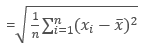

# Data Analysis

## Process Overview

### Step 1: Ask questions (Extract)

Either you're given data and ask questions based on it, or you ask questions first and gather data based on that later. In both cases, great questions help you focus on relevant parts of your data and direct your analysis towards meaningful insights. Obtain the data from a spreadsheet, SQL, the web, etc.

### Step 2: Wrangle data (Clean)

You get the data you need in a form you can work with in three steps: gather, assess, clean. You gather the data you need to answer your questions, assess your data to identify any problems in your data’s quality or structure, and clean your data by modifying, replacing, or removing data to ensure that your dataset is of the highest quality and as well-structured as possible.  
**Here we could use exploratory visuals.**

[Medium article about Data Imputation](https://medium.com/m/global-identity?redirectUrl=https%3A%2F%2Ftowardsdatascience.com%2F6-different-ways-to-compensate-for-missing-values-data-imputation-with-examples-6022d9ca0779)

### Step 3: Perform EDA (Exploratory Data Analysis)

You explore and then augment your data to maximize the potential of your analyses, visualizations, and models. Exploring involves finding patterns in your data, visualizing relationships in your data, and building intuition about what you’re working with. After exploring, you can do things like remove outliers and create better features from your data, also known as feature engineering.  
**Here we use exploratory visuals.**

### Step 4: Draw conclusions (or even make predictions)

This step is typically approached with machine learning or inferential statistics.  
**Here we might use either exploratory or explanatory visuals.**

### Step 5: Communicate your results (Share)

You often need to justify and convey meaning in the insights you’ve found. Or, if your end goal is to build a system, you usually need to share what you’ve built, explain how you reached design decisions, and report how well it performs. There are many ways to communicate your results: reports, slide decks, blog posts, emails, presentations, or even conversations. Data visualization will always be very valuable.  
**Here is where explanatory visuals live.**

## Data Types

There are two types of data Quantitative and Categorical:

### 1. Quantitative data

It takes on numeric values that allow us to perform mathematical operations (like the number of dogs).

We can think of quantitative data as being either continuous or discrete.

- **Continuous** data can be split into smaller and smaller units, and still a smaller unit exists. An example of this is the age of the dog - we can measure the units of the age in years, months, days, hours, seconds, but there are still smaller units that could be associated with the age.
- **Discrete** data only takes on countable values. The number of dogs we interact with is an example of a discrete data type.

#### Continuous vs. Discrete

To consider if we have continuous or discrete data, we should see if we can split our data into smaller and smaller units. Consider **time** - we could measure an event in years, months, days, hours, minutes, or seconds, and even at seconds we know there are smaller units we could measure time in. Therefore, we know this data type is continuous. **Height**, **age**, and **income** are all examples of **_continuous_** data. Alternatively, the number of **pages** in a **book**, **dogs** I count outside a **coffee shop**, or **trees** in a yard are **_discrete_** data. We would not want to split our dogs in half.

### 2. Categorical data

They are used to label a group or set of items (like dog breeds - Collies, Labs, Poodles, etc.).

#### Categorical Ordinal vs. Categorical Nominal

We can divide categorical data further into two types: Ordinal and Nominal.

- **Categorical Ordinal** data take on a ranked ordering (like a ranked interaction on a scale from Very Poor to Very Good with the dogs).
- **Categorical Nominal** data do not have an order or ranking (like the breeds of the dog).

In looking at categorical variables, we found **Gender**, **Marital Status**, **Zip Code** and your **Breakfast items** are **_nominal variables_** where there is no order ranking associated with this type of data. Whether you ate cereal, toast, eggs, or only coffee for breakfast; there is no rank ordering associated with your breakfast.  
Alternatively, the **Letter Grade** or **Survey Ratings** have a rank ordering associated with it, as **_ordinal_** data. If you receive an A, this is higher than an A-. An A- is ranked higher than a B+, and so on... **_Ordinal variables_** frequently occur on rating scales from very poor to very good. In many cases we turn these ordinal variables into numbers, as we can more easily analyze them.

### Quantitative vs. Categorical

Some of these can be a bit tricky - notice even though zip codes are a number, they aren’t really a quantitative variable. If we add two zip codes together, we do not obtain any useful information from this new value. Therefore, this is a categorical variable.

Height, Age, the Number of Pages in a Book and Annual Income all take on values that we can add, subtract and perform other operations with to gain useful insight. Hence, these are quantitative.

Gender, Letter Grade, Breakfast Type, Marital Status, and Zip Code can be thought of as labels for a group of items or individuals. Hence, these are categorical.

| Quantitative | Continuous          | Discrete                                              |
| ------------ | ------------------- | ----------------------------------------------------- |
| Examples     | Height, Age, Income | Pages in a Book, Trees in Yard, Dogs at a Coffee Shop |

| Categorical | Ordinal                     | Nominal                                 |
| ----------- | --------------------------- | --------------------------------------- |
| Examples    | Letter Grade, Survey Rating | Gender, Marital Status, Breakfast Items |

## Summary Statistics

### Analyzing Categorical Data

Categorical data is analyzed usually by looking at the counts or proportion of individuals that fall into each group. For example, if we were looking at the breeds of the dogs, we would care about how many dogs are of each breed, or what proportion of dogs are of each breed type.

**_Inferential Statistics_** is about using our collected data to draw conclusions to a larger population.

#### Terminologies

1. **Population**: our entire group of interest.
2. **Parameter**: numeric summary about a population
3. **Sample**: subset of the population
4. **Statistic**: numeric summary about a sample
5. **Inference**: Drawing conclusions regarding a population using information from a sample.

### Analyzing Quantitative Data

There are four main aspects to analyzing Quantitative data.

1. Measures of Center
2. Measures of Spread
3. The Shape of the data.
4. Outliers

#### 1. Measure of center

There are three measures of center:

1. Mean
2. Median
3. Mode

##### 1.1 The Mean

The mean is often called the average or the expected value in mathematics. We calculate the mean by adding all of our values together and dividing by the number of values in our dataset.

##### 1.2 The Median

The median splits our data so that 50% of our values are lower and 50% are higher.

###### 1.2.1 Median for Odd Values

If we have an odd number of observations, the median is simply the number in the direct middle. For example, if we have 7 observations, the median is the fourth value when our numbers are ordered from smallest to largest. If we have 9 observations, the median is the fifth value.

###### 1.2.2 Median for Even Values

If we have an even number of observations, the median is the average of the two values in the middle. For example, if we have 8 observations, we average the fourth and fifth values together when our numbers are ordered from smallest to largest.

**In order to compute the median, we MUST sort our values first.
Whether we use the mean or median to describe a dataset is largely dependent on the shape of our dataset and if there are any outliers.**

##### 1.3 The Mode

The mode is the most frequently observed value in our dataset.
There might be multiple modes for a particular dataset, or no mode at all.

###### 1.3.1 No Mode

If all observations in our dataset are observed with the same frequency, there is no mode.  
If we have the dataset: 1, 1, 2, 2, 3, 3, 4, 4  
There is no mode, because all observations occur the same number of times.

###### 1.3.2 Many Modes

If two (or more) numbers share the maximum value, then there is more than one mode.  
If we have the dataset: 1, 2, 3, 3, 3, 4, 5, 6, 6, 6, 7, 8, 9  
There are two modes 3 and 6, because these values share the maximum frequencies at 3 times, while all other values only appear once.

#### 2. Measures of Spread

Measures of Spread are used to provide us an idea of how spread out our data are from one another. Common measures of spread include:

1. Range
2. Interquartile Range (IQR)
3. Standard Deviation
4. Variance

##### Calculating the 5 Number Summary

The five-number summary consist of 5 values:

1. Minimum: The smallest number in the dataset.
2. Q1: The value such that 25% of the data fall below.
3. Q2: The value such that 50% of the data fall below.
4. Q3: The value such that 75% of the data fall below.
5. Maximum: The largest value in the dataset.

Calculating each of these values was essentially just finding the median of a bunch of different dataset. Because we are essentially calculating a bunch of medians, the calculation depends on whether we have an odd or even number of values.

##### 2.1 Range

The range is then calculated as the difference between the **maximum** and the **minimum**.

##### 2.2 IQR

The interquartile range is calculated as the difference between Q3 and Q1.

Example1:  
Dataset: 1, 5, 10, 3, 8, 12, 4, 1, 2, 8  
Rearrange: 1, 1, 2, 3, 4, 5, 8, 8, 10, 12

1. Calculate 5 numbers summary

   1. Min: 1
   2. Q1: 2
   3. Q2: 4.5
   4. Q3: 8
   5. Max: 12

2. Measure of center

   1. Mean: 54/10=5.4
   2. Median=Q2: (4+5)/2=4.5
   3. Mode: 8

3. Measure of spread
   1. Range: Max-Min=12-1=11
   2. IQR: Q3-Q1= 8-2=6

Example2:  
Dataset: 5, 10, 3, 8, 12, 4, 1, 2, 8
Rearrange: 1, 2, 3, 4, 5, 8, 8, 10, 12

1. Calculate 5 numbers summary

   1. Min: 1
   2. Q1: 2.5
   3. Q2: 5
   4. Q3: 9
   5. Max: 12

2. Measure of center

   1. Mean: 43/9=4.8
   2. Median=Q2: 5
   3. Mode: 8

3. Measure of spread
   1. Range: Max-Min=12-1=11
   2. IQR: Q3-Q1= 9-2.5=6.5

##### 2.3 Standard Deviation

The standard deviation is one of the most common measures for talking about the spread of data. It is defined as **the average distance of each observation from the mean.**  

##### 2.4 Variance

The variance average squared difference of each observation from the mean.  

Example3:  
For the following set of data provide the value of the variance.  
Dataset: 1, 5, 10, 3, 8, 12, 4
Rearrange: 1, 3, 4, 5, 8, 10, 12

1. Calculate Median: (1+3+4+5+10+12)/7=43/7=6.14
2. Cal. Variance: (26.4+9.9+4.6+1.3+3.5+14.9+34.3)/7=94.9/7=13.55
3. std deviation: √(variance)=√13.55=3.68

###### Important Final Points

1. The variance is used to compare the spread of two different groups. A set of data with higher variance is more spread out than a dataset with lower variance. Be careful though, there might just be an outlier (or outliers) that is increasing the variance, when most of the data are actually very close.
2. When comparing the spread between two datasets, the units of each must be the same.
3. When data are related to money or the economy, higher variance (or standard deviation) is associated with higher risk.
4. The standard deviation is used more often in practice than the variance, because it shares the units of the original dataset.
5. Besides the mean return of an investment, we should also consider the spread associated with the return. But just because the standard deviation associated with each investment is the same, this does not mean the max you could make for each investment is the same.
6. If two datasets have the same variance, they will also have the same standard deviation.
7. If a dataset has a standard deviation of zero, all the data points must be the same.
8. Having the spread measures, does not give measures of center. Additionally, the range isn't directly associated with the standard deviation, so we can't make a claim that is always true like the final option.

#### 3. The Shape of the data

From a histogram we can quickly identify the shape of our data, which helps influence all of the measures we learned in the previous concepts. We learned that the distribution of our data is frequently associated with one of the three shapes:

1. Right-skewed
2. Left-skewed
3. Symmetric (frequently normally distributed)

| Shape              | Mean vs. Median          | Real World                                                                                                        |
| ------------------ | ------------------------ | ----------------------------------------------------------------------------------------------------------------- |
| Symmetric (Normal) | Mean equals Median       | Height, Weight, Errors, Precipitation                                                                             |
| Right-skewed       | Mean greater than Median | Amount of drug remaining in a blood stream, Time between phone calls at a call center, Time until light bulb dies |
| Left-skewed        | Mean less than Median    | Grades as a percentage in many universities, Age of death, Asset price changes                                    |

#### 4. Outliers

Outliers are points that fall very far from the rest of our data points. This influences measures like the mean and standard deviation much more than measures associated with the five-number summary.

##### Common Techniques

When outliers are present we should consider the following points.

1. Noting they exist and the impact on summary statistics.
2. If typo - remove or fix
3. Understanding why they exist, and the impact on questions we are trying to answer about our data.
4. Reporting the 5 number summary values is often a better indication than measures like the mean and standard deviation when we have outliers.
5. Be careful in reporting. Know how to ask the right questions.

##### Outliers Advice

Below are my guidelines for working with any column (random variable) in your dataset.

1. Plot your data to identify if you have outliers.
2. Handle outliers accordingly via the methods above.
3. If no outliers and your data follow a normal distribution - use the mean and standard deviation to describe your dataset, and report that the data are normally distributed.
4. If you have skewed data or outliers, use the five-number summary to summarize your data and report the outliers.

---

Side note
If you aren't sure if your data are normally distributed, there are plots called [normal quantile plots](http://data.library.virginia.edu/understanding-q-q-plots/) and statistical methods like the [Kolmogorov-Smirnov](https://en.wikipedia.org/wiki/Kolmogorov%E2%80%93Smirnov_test) test that are aimed to help you understand whether or not your data are normally distributed. Implementing this test is beyond the scope of this class but can be used as a fun fact.

---

## Descriptive vs. Inferential Statistics

In this section, we learned about how Inferential Statistics differs from Descriptive Statistics.

### Descriptive Statistics

Descriptive statistics is about describing our collected data using the measures discussed throughout this lesson: measures of center, measures of spread, shape of our distribution, and outliers. We can also use plots of our data to gain a better understanding.

### Inferential Statistics

Inferential Statistics is about using our collected data to draw conclusions to a larger population. Performing inferential statistics well requires that we take a sample that accurately represents our population of interest.
A common way to collect data is via a survey. However, surveys may be extremely biased depending on the types of questions that are asked, and the way the questions are asked. This is a topic you should think about when tackling the first project.
We looked at specific examples that allowed us to identify the

1. Population - our entire group of interest.
2. Parameter - numeric summary about a population
3. Sample - subset of the population
4. Statistic numeric summary about a sample

---

### Looking Ahead

Though we will not be diving deep into inferential statistics within this course, you are now aware of the difference between these two avenues of statistics. If you have ever conducted a hypothesis test or built a confidence interval, you have performed inferential statistics. The way we perform inferential statistics is changing as technology evolves. Many career paths involving Machine Learning and Artificial Intelligence are aimed at using collected data to draw conclusions about entire populations at an individual level. It is an exciting to time to be a part of this space, and you are now well on your way to joining the other practitioners!

---

## SQL

### Why SQL

- SQL: Structured Query Language (SQL)
- SQL is a language. Hence, the last word of SQL being language.
- There are some major **advantages** to using **traditional relational databases**, which we interact with using SQL.
  - SQL is easy to understand.
  - Traditional databases allow us to access data directly.
  - Traditional databases allow us to audit and replicate our data.
  - SQL is a great tool for analyzing multiple tables at once.
  - SQL allows you to analyze more complex questions than dashboard tools like Google Analytics.

### Why Businesses Like Databases

1. Data integrity is ensured - only the data you want entered is entered, and only certain users are able to enter data into the database.
2. Data can be accessed quickly - SQL allows you to obtain results very quickly from the data stored in a database. Code can be optimized to quickly pull results.
3. Data is easily shared - multiple individuals can access data stored in a database, and the data is the same for all users allowing for consistent results for anyone with access to your database.

### Types of Databases

There are many different types of SQL databases designed for different purposes.

Some of the most popular databases include:

1. MySQL
2. Access
3. Oracle
4. Microsoft SQL Server
5. Postgres

#### Small Differences

Each of these SQL databases may have subtle differences in syntax and available functions -- for example, MySQL doesn’t have some of the functions for modifying dates as Postgres. Most of what you see with Postgres will be directly applicable to using SQL in other frameworks and database environments. For the differences that do exist, you should check the documentation. Most SQL environments have great documentation online that you can easily access with a quick Google search.

The [article](https://www.digitalocean.com/community/tutorials/sqlite-vs-mysql-vs-postgresql-a-comparison-of-relational-database-management-systems) here compares three of the most common types of SQL: SQLite, PostgreSQL, and MySQL.

---

## Data Visualization

There are two main reasons for creating visuals using data:

   1. **Exploratory** analysis is done when you are searching for insights. These visualizations don't need to be perfect. You are using plots to find insights, but they don't need to be aesthetically appealing. You are the consumer of these plots, and you need to be able to find the answer to your questions from these plots.

   2. **Explanatory** analysis is done when you are providing your results for others. These visualizations need to provide you the emphasis necessary to convey your message. They should be accurate, insightful, and visually appealing.

The five steps of the data analysis process:

 1. **Extract** - Obtain the data from a spreadsheet, SQL, the web, etc.
 2. **Clean** - Here we could use expl**or**atory visuals.
 3. **Explore** - Here we use expl**or**atory visuals.
 4. **Analyze** - Here we might use either expl**or**atory or expl**an**atory visuals.
 5. **Share** - Here is where expl**an**atory visuals live.

What visualization to use, doesn't depend only on the data type but also on how many columns needed to be in a single plot. The key to building great data visualizations is in aiming them at answering the questions you want answered.

### Univariate analysis

When one column will be displayed in the plot.

1. Quantitative data:
   - Histogram:  
     
   It is the most popular and there are rare cases that might not be used.
   - Normal Quantile Plot  
     
   - Stem and Leaf Plot  
     
   - Box and Whisker Plot  
     

2. Categorical data:
   - Bar Chart:
     
    It is like the histogram but the bins are determined based on a set category not on a range that the chart creator can change. Ordinal categorical are better to be used with Bar Chart.
   - Pie Chart
     
   - Pareto Chart: are essentially just bar charts where the bars are in the order from the most frequent to the least frequent.
     

### Bivariate analysis

When comparing two variables to one another.

1. Quantitative data:
   - **Scatter Plot**:
     
      are a common visual for comparing two quantitative variables. A common summary statistic that relates to a scatter plot is the correlation coefficient commonly denoted by r and it ranges from -1 to 1.

      Though there are a [few different](http://www.statisticssolutions.com/correlation-pearson-kendall-spearman/) ways to measure correlation between two variables, the most common way is with [Pearson's correlation coefficient](https://en.wikipedia.org/wiki/Pearson_correlation_coefficient). Pearson's correlation coefficient provides the:

      1. **Strength**: It is the closeness of the points to each other. It considered to be **Strong** (0.7≤∣r∣≤1.0) if the points are close to each other, **Weak** if the points are far from each other (0.0≤∣r∣<0.3), or **Moderate** (0.3≤∣r∣<0.7)
      2. **Direction**: It considered to be Positive (positive values of r), if the both variables are increasing. And to be Negative (negative values of r), if one or both variables are decreasing.

      of a **linear relationship**. [Spearman's Correlation Coefficient](https://en.wikipedia.org/wiki/Spearman%27s_rank_correlation_coefficient) does not measure linear relationships specifically, and it might be more appropriate for certain cases of associating two variables.

      Calculation of the Correlation Coefficient

      

      It can also be calculated in Excel and other spreadsheet applications using `CORREL(col1, col2)`, where col1 and col2 are the two columns you are looking to compare to one another.

   - **Line plot**:  
     Line plots are a common plot for viewing data over time. These plots allow us to quickly identify overall trends, seasonal occurrences, peaks, and valleys in the data. You will commonly see these used in looking at stock prices over time, but really tracking anything over time can be easily viewed using these plots.
     

2. Categorical Data:
   - Side by side bar chart
   

### More than two variables

- Line Plot

- Stacked Line

- Bar Chart

### Helpful resources

1. Visualization Mind Map

## Communicating with data

1. **Understand the context** - this means knowing your audience and conveying a clear message about what you want your audience to know or do with the information you are providing.

2. **Choose an appropriate visual display** - this was covered in the above section.

3. **Eliminate clutter** - you should only provide information to the user that helps convey your message.

4. **Focus attention where you want it** - build visualizations that pull attention to the message you want to highlight.

5. **Think like a designer** - you will learn a number of design principles in this lesson to assist as you start to put together your own data visualizations.

6. **Tell a story** - your visualizations should give the audience a story. The most powerful data visualizations move people to take action.

   1. Start with a Question
   1. Repetition is a Good Thing
   1. Highlight the Answer
   1. Call Your Audience To Action

### Visuals can be bad if

1. Don't convey the message.
2. Misleading.
3. **Chart Junk**: refers to all visual elements in charts and graphs that are not necessary to comprehend the information represented on the graph or that distract the viewer from this information.
   Examples:
   1. Heavy grid lines
   2. Unnecessary text
   3. Pictures surrounding the visual
   4. Shading or 3d components
   5. Ornamented chart axes
4. **Color hue changes** (as are unfortunately commonly used as an additional variable encoding in scatter plots)
5. **Area changes** (as we see in pie charts, which often makes them not the best plot choice).
6. **Lie Factor (Data integrity)**: It is key that when you build plots you maintain integrity for the underlying data. Lie factor depicts the degree to which a visualization distorts or misrepresents the data values being plotted. It is calculated in the following way:
  
The delta symbol (Δ) stands for difference or change. In words, the lie factor is the relative change shown in the graphic divided by the actual relative change in the data. Ideally, the lie factor should be 1: any other value means that there is some mismatch in the ratio of depicted change to actual change.  
[How to spot visualization lies](https://flowingdata.com/2017/02/09/how-to-spot-visualization-lies/)

This seems straightforward, but often visuals are created that do one or both of these unintentionally. There is an entire book that was published aimed at misleading visuals: [How to Lie with Statistics](http://faculty.neu.edu.cn/cc/zhangyf/papers/How-to-Lie-with-Statistics.pdf).

### Visuals can be good if

1. **Positional changes** (differences in x- and y- position as we see with scatter plots).
2. **Length changes** (differences in box heights as we see with bar charts and histograms).
3. **Higher data-ink ratio**, credited to Edward Tufte, is directly related to the idea of chart junk. The more of the ink in your visual that is related to conveying the message in the data, the better.  
Limiting chart junk increases the data-ink ratio.

### Visuals Encoding

In general, color and shape are best for categorical variables, while the size of marker can assist in adding additional quantitative data.

1. Coloring

   Color can both help and hurt a data visualization. Tips for using color effectively.

   1. Before adding color to a visualization, start with black and white.

   2. When using color, use less intense colors - not all the colors of the rainbow, which is the default in many software applications.

   3. Color for communication. Use color to highlight your message and separate groups of interest. Don't add color just to have color in your visualization.

   4. To be sensitive to those with colorblindness, you should use color palettes that do not move from **red to green** without using another element to distinguish this change like shape, position, or lightness.. Instead, use colors on a **blue to orange** palette.

   Only use these additional encodings when absolutely necessary. Often these additional encodings suggest you are providing too much information in a single plot. **Instead, it might be better to break the information into multiple individual messages.**

2. Shapes

3. Size