# Data Analysis

- [Data Analysis](#data-analysis)
  - [Process Overview](#process-overview)
    - [Step 1: Ask questions (Extract)](#step-1-ask-questions-extract)
    - [Step 2: Wrangle data (Clean)](#step-2-wrangle-data-clean)
    - [Step 3: Perform EDA (Exploratory Data Analysis)](#step-3-perform-eda-exploratory-data-analysis)
    - [Step 4: Draw conclusions (or even make predictions)](#step-4-draw-conclusions-or-even-make-predictions)
    - [Step 5: Communicate your results (Share)](#step-5-communicate-your-results-share)
  - [Data Types](#data-types)
    - [1. Quantitative or numeric types](#1-quantitative-or-numeric-types)
      - [Continuous vs. Discrete](#continuous-vs-discrete)
    - [2. Qualitative or categorical types (non-numeric types)](#2-qualitative-or-categorical-types-non-numeric-types)
      - [Categorical Ordinal vs. Categorical Nominal](#categorical-ordinal-vs-categorical-nominal)
    - [Quantitative vs. Categorical](#quantitative-vs-categorical)
  - [Statistical Notations](#statistical-notations)
  - [Descriptive (Summary) Statistics](#descriptive-summary-statistics)
    - [Analyzing Categorical Data](#analyzing-categorical-data)
    - [Analyzing Quantitative Data](#analyzing-quantitative-data)
      - [1. Measure of center](#1-measure-of-center)
        - [1.1 The Mean](#11-the-mean)
        - [1.2 The Median](#12-the-median)
        - [1.3 The Mode](#13-the-mode)
      - [2. Measures of Spread](#2-measures-of-spread)
        - [Calculating the 5 Number Summary](#calculating-the-5-number-summary)
        - [2.1 Range](#21-range)
        - [2.2 IQR](#22-iqr)
        - [2.3 Standard Deviation](#23-standard-deviation)
        - [2.4 Variance](#24-variance)
        - [Important Final Points](#important-final-points)
      - [3. The Shape of the data](#3-the-shape-of-the-data)
      - [4. Outliers](#4-outliers)
        - [Common Techniques](#common-techniques)
        - [Outliers Advice](#outliers-advice)
  - [Descriptive vs. Inferential Statistics](#descriptive-vs-inferential-statistics)
  - [Inferential Statistics](#inferential-statistics)
    - [Sampling Distribution](#sampling-distribution)
      - [Proportions (or Means) Characteristic](#proportions-or-means-characteristic)
      - [Important mathematical theorems](#important-mathematical-theorems)
    - [Bootstrapping](#bootstrapping)
    - [Confidence Interval](#confidence-interval)
      - [Confidence Intervals (& Hypothesis Testing) vs. Machine Learning](#confidence-intervals--hypothesis-testing-vs-machine-learning)
      - [Confidence Interval Applications](#confidence-interval-applications)
    - [Hypothesis Testing](#hypothesis-testing)
      - [Hypothesis Testing Rules](#hypothesis-testing-rules)
      - [Hypothesis Testing Case Studies](#hypothesis-testing-case-studies)
      - [Hypothesis Testing Errors Types](#hypothesis-testing-errors-types)
      - [Common hypothesis tests include](#common-hypothesis-tests-include)
      - [How to calculate Hypothesis](#how-to-calculate-hypothesis)
      - [Hypothesis Testing Types](#hypothesis-testing-types)
      - [Hypothesis Testing Correction Methods](#hypothesis-testing-correction-methods)
      - [How Hypothesis Testing and Confidence Intervals related are](#how-hypothesis-testing-and-confidence-intervals-related-are)
      - [Hypothesis Testing vs. Machine Learning](#hypothesis-testing-vs-machine-learning)
      - [Statistical vs Practical Significance](#statistical-vs-practical-significance)
    - [A/B Testing](#ab-testing)
      - [Uses and value of A/B Testing](#uses-and-value-of-ab-testing)
      - [Defining metrics for experiments](#defining-metrics-for-experiments)
      - [Analyzing results with Hypothesis testing](#analyzing-results-with-hypothesis-testing)
      - [Drawbacks](#drawbacks)
      - [Evaluating multiple metrics](#evaluating-multiple-metrics)
      - [Difficulties in A/B Testing](#difficulties-in-ab-testing)
  - [Probability](#probability)
    - [Probability Notations](#probability-notations)
    - [Probability Rules](#probability-rules)
    - [Probability Terminologies](#probability-terminologies)
    - [Probability Methods](#probability-methods)
      - [1. Unconditional Probability (Independent)](#1-unconditional-probability-independent)
        - [Binomial Distribution](#binomial-distribution)
      - [2. Conditional Probability (Dependent)](#2-conditional-probability-dependent)
        - [Bayes Rule](#bayes-rule)
      - [3. Normal Distribution](#3-normal-distribution)
  - [Machine Learning](#machine-learning)
    - [1. Supervised Machine Learning](#1-supervised-machine-learning)
      - [1.1 Simple Linear Regression](#11-simple-linear-regression)
        - [Scatter plots](#scatter-plots)
        - [Correlation Coefficient](#correlation-coefficient)
        - [Linear Regression Line](#linear-regression-line)
        - [Hypothesis P-Values](#hypothesis-p-values)
        - [R-Squared](#r-squared)
        - [Least-Squares regression algorithm](#least-squares-regression-algorithm)
      - [1.2 Multiple Linear Regression](#12-multiple-linear-regression)
        - [Adding Categorical variables to Linear Regression](#adding-categorical-variables-to-linear-regression)
        - [Model Assumptions And How To Address Each](#model-assumptions-and-how-to-address-each)
        - [Higher Order Terms](#higher-order-terms)
          - [Interaction Terms](#interaction-terms)
        - [Resources](#resources)
      - [1.3 Logistic Regression](#13-logistic-regression)
        - [Interpreting the coefficients](#interpreting-the-coefficients)
        - [Confusion Matrix](#confusion-matrix)
    - [2. Unsupervised Machine Learning](#2-unsupervised-machine-learning)
  - [SQL](#sql)
    - [Why SQL](#why-sql)
    - [Why Businesses Like Databases](#why-businesses-like-databases)
    - [Types of Databases](#types-of-databases)
      - [Small Differences](#small-differences)
  - [Data Visualization](#data-visualization)
    - [Summary Statistics vs. Visualizations](#summary-statistics-vs-visualizations)
    - [Exploratory vs Explanatory](#exploratory-vs-explanatory)
    - [The Four Levels of Measurement](#the-four-levels-of-measurement)
    - [Univariate analysis](#univariate-analysis)
      - [1. Univariate Quantitative data](#1-univariate-quantitative-data)
        - [Histogram](#histogram)
        - [Kernel Density Estimation](#kernel-density-estimation)
        - [Normal Quantile Plot](#normal-quantile-plot)
        - [Stem and Leaf Plot](#stem-and-leaf-plot)
        - [Box and Whisker Plot](#box-and-whisker-plot)
      - [2. Univariate Categorical data](#2-univariate-categorical-data)
        - [Bar Chart (Ordinal/Nominal)](#bar-chart-ordinalnominal)
        - [Pie Chart (relative frequencies)](#pie-chart-relative-frequencies)
        - [Waffle Plot (precise assessments of relative frequencies)](#waffle-plot-precise-assessments-of-relative-frequencies)
        - [Pareto Chart](#pareto-chart)
    - [Bivariate analysis](#bivariate-analysis)
      - [1. Bivariate Quantitative data](#1-bivariate-quantitative-data)
        - [Scatter Plot (Two Quantitative)](#scatter-plot-two-quantitative)
        - [Heat Map (Two Quantitative)](#heat-map-two-quantitative)
        - [Line plot (Over Time OR Two Quantitative)](#line-plot-over-time-or-two-quantitative)
      - [2. Bivariate Categorical Data](#2-bivariate-categorical-data)
        - [Violin Plot (Quantitative with Qualitative variables)](#violin-plot-quantitative-with-qualitative-variables)
        - [Box Plot (Quantitative with Qualitative variables) (Summarization)](#box-plot-quantitative-with-qualitative-variables-summarization)
        - [Clustered Bar Charts (Side by side bar chart) (Two Qualitative Variables)](#clustered-bar-charts-side-by-side-bar-chart-two-qualitative-variables)
        - [Adapted Bar charts (Qualitative and Summarized Quantitative)](#adapted-bar-charts-qualitative-and-summarized-quantitative)
        - [Point Plot (Qualitative and Summarized Quantitative)](#point-plot-qualitative-and-summarized-quantitative)
      - [Bivariate Techniques](#bivariate-techniques)
        - [Overplotting, Transparency, and Jitter](#overplotting-transparency-and-jitter)
    - [Multivariate (More than two variables)](#multivariate-more-than-two-variables)
      - [Non-Positional Encodings for Third Variables (At Least Two Quantitative)](#non-positional-encodings-for-third-variables-at-least-two-quantitative)
        - [Encoding via Shape](#encoding-via-shape)
        - [Encoding via Size](#encoding-via-size)
        - [A Warning on Combining Encodings](#a-warning-on-combining-encodings)
        - [Encoding via Color](#encoding-via-color)
      - [Faceting in Two Directions (Two Quantitative and One Qualtiative)](#faceting-in-two-directions-two-quantitative-and-one-qualtiative)
      - [2-d histogram (Three Quantitative)](#2-d-histogram-three-quantitative)
      - [2-d bar chart (Two Qualtiative and One Summarized Quantitative)](#2-d-bar-chart-two-qualtiative-and-one-summarized-quantitative)
      - [Clustered Plots (Two Qualtiative and One Quantitative)](#clustered-plots-two-qualtiative-and-one-quantitative)
      - [Plot Matrices (many pairs of variables)](#plot-matrices-many-pairs-of-variables)
        - [Correlation Matrices (Correlation HeatMap for numeric variables)](#correlation-matrices-correlation-heatmap-for-numeric-variables)
    - [Visualization Techniques](#visualization-techniques)
      - [Absolute vs. Relative Frequency](#absolute-vs-relative-frequency)
      - [Counting Missing Data](#counting-missing-data)
      - [Descriptive Statistics, Outliers, and Axis Limits](#descriptive-statistics-outliers-and-axis-limits)
      - [Scales and Transformations](#scales-and-transformations)
      - [Faceting](#faceting)
      - [Feature Engineering](#feature-engineering)
      - [Polishing Plots](#polishing-plots)
        - [Using Matplotlib to Polish Plots](#using-matplotlib-to-polish-plots)
    - [Helpful resources](#helpful-resources)
  - [Communicating with data (Explantory Visualization)](#communicating-with-data-explantory-visualization)
    - [Visuals can be bad if](#visuals-can-be-bad-if)
    - [Visuals can be good if](#visuals-can-be-good-if)
    - [Visuals Encoding](#visuals-encoding)
  - [Tips](#tips)
    - [Simpson's Paradox](#simpsons-paradox)
    - [How much is too much](#how-much-is-too-much)

## Process Overview

### Step 1: Ask questions (Extract)

Either you're given data and ask questions based on it, or you ask questions first and gather data based on that later. In both cases, great questions help you focus on relevant parts of your data and direct your analysis towards meaningful insights. Obtain the data from a spreadsheet, SQL, the web, etc.

### Step 2: Wrangle data (Clean)

You get the data you need in a form you can work with in three steps: gather, assess, clean. You gather the data you need to answer your questions, assess your data to identify any problems in your data’s quality or structure, and clean your data by modifying, replacing, or removing data to ensure that your dataset is of the highest quality and as well-structured as possible.  
**Here we could use exploratory visuals.**

[Medium article about Data Imputation](https://medium.com/m/global-identity?redirectUrl=https%3A%2F%2Ftowardsdatascience.com%2F6-different-ways-to-compensate-for-missing-values-data-imputation-with-examples-6022d9ca0779)

### Step 3: Perform EDA (Exploratory Data Analysis)

You explore and then augment your data to maximize the potential of your analyses, visualizations, and models. Exploring involves finding patterns in your data, visualizing relationships in your data, and building intuition about what you’re working with. After exploring, you can do things like remove outliers and create better features from your data, also known as feature engineering.  
**Here we use exploratory visuals.**

### Step 4: Draw conclusions (or even make predictions)

This step is typically approached with machine learning or inferential statistics.  
**Here we might use either exploratory or explanatory visuals.**

### Step 5: Communicate your results (Share)

You often need to justify and convey meaning in the insights you’ve found. Or, if your end goal is to build a system, you usually need to share what you’ve built, explain how you reached design decisions, and report how well it performs. There are many ways to communicate your results: reports, slide decks, blog posts, emails, presentations, or even conversations. Data visualization will always be very valuable.  
**Here is where explanatory visuals live.**

## Data Types

There are two types of data, Quantitative and Categorical:

### 1. Quantitative or numeric types

It takes on numeric values that allow us to perform mathematical operations (like the number of dogs).

- **Interval data**: numeric values where absolute differences are meaningful (addition and subtraction operations can be made)
- **Ratio data**: numeric values where relative differences are meaningful (multiplication and division operations can be made)

- All quantitative-type variables also come in one of two varieties: discrete and continuous.

  - **Continuous** data can be split into smaller and smaller units, and still a smaller unit exists. An example of this is the age of the dog - we can measure the units of the age in years, months, days, hours, seconds, but there are still smaller units that could be associated with the age.
  - **Discrete** data only takes on countable values. The number of dogs we interact with is an example of a discrete data type.

#### Continuous vs. Discrete

To consider if we have continuous or discrete data, we should see if we can split our data into smaller and smaller units. Consider **time** - we could measure an event in years, months, days, hours, minutes, or seconds, and even at seconds we know there are smaller units we could measure time in. Therefore, we know this data type is continuous. **Height**, **age**, and **income** are all examples of **_continuous_** data. Alternatively, the number of **pages** in a **book**, **dogs** I count outside a **coffee shop**, or **trees** in a yard are **_discrete_** data. We would not want to split our dogs in half.

### 2. Qualitative or categorical types (non-numeric types)

They are used to label a group or set of items (like dog breeds - Collies, Labs, Poodles, etc.).

#### Categorical Ordinal vs. Categorical Nominal

We can divide categorical data further into two types: Ordinal and Nominal.

- **Categorical Ordinal** labels with an intrinsic order or ranking (comparison operations can be made between values, but the magnitude of differences are not be well-defined). Data take on a ranked ordering (like a ranked interaction on a scale from Very Poor to Very Good with the dogs).
- **Categorical Nominal** pure labels without inherent order (no label is intrinsically greater or less than any other). Data do not have an order or ranking (like the breeds of the dog).

In looking at categorical variables, we found **Gender**, **Marital Status**, **Zip Code** and your **Breakfast items** are **_nominal variables_** where there is no order ranking associated with this type of data. Whether you ate cereal, toast, eggs, or only coffee for breakfast; there is no rank ordering associated with your breakfast.  
Alternatively, the **Letter Grade** or **Survey Ratings** have a rank ordering associated with it, as **_ordinal_** data. If you receive an A, this is higher than an A-. An A- is ranked higher than a B+, and so on... **_Ordinal variables_** frequently occur on rating scales from very poor to very good. In many cases we turn these ordinal variables into numbers, as we can more easily analyze them.

### Quantitative vs. Categorical

Some of these can be a bit tricky - notice even though zip codes are a number, they aren’t really a quantitative variable. If we add two zip codes together, we do not obtain any useful information from this new value. Therefore, this is a categorical variable.

Height, Age, the Number of Pages in a Book and Annual Income all take on values that we can add, subtract and perform other operations with to gain useful insight. Hence, these are quantitative.

Gender, Letter Grade, Breakfast Type, Marital Status, and Zip Code can be thought of as labels for a group of items or individuals. Hence, these are categorical.

| Quantitative | Continuous          | Discrete                                              |
| ------------ | ------------------- | ----------------------------------------------------- |
| Examples     | Height, Age, Income | Pages in a Book, Trees in Yard, Dogs at a Coffee Shop |

| Categorical | Ordinal                     | Nominal                                 |
| ----------- | --------------------------- | --------------------------------------- |
| Examples    | Letter Grade, Survey Rating | Gender, Marital Status, Breakfast Items |

## Statistical Notations

It is commonly to use Greek symbols as parameters and lowercase letters as the corresponding statistics. Sometimes in the literature, you might also see the same Greek symbols with a "hat" to represent that this is an estimate of the corresponding parameter.

Below is a table that provides some of the most common parameters and corresponding statistics.

All **parameters** pertain to a population, while all **statistics** pertain to a sample.


## Descriptive (Summary) Statistics

### Analyzing Categorical Data

Categorical data is analyzed usually by looking at the counts or proportion of individuals that fall into each group. For example, if we were looking at the breeds of the dogs, we would care about how many dogs are of each breed, or what proportion of dogs are of each breed type.

### Analyzing Quantitative Data

There are four main aspects to analyzing Quantitative data.

1. Measures of Center
2. Measures of Spread
3. The Shape of the data.
4. Outliers

#### 1. Measure of center

There are three measures of center:

1. Mean
2. Median
3. Mode

##### 1.1 The Mean

The mean is often called the average or the expected value in mathematics. We calculate the mean by adding all of our values together and dividing by the number of values in our dataset.

##### 1.2 The Median

The median splits our data so that 50% of our values are lower and 50% are higher.

- Median for Odd Values

  If we have an odd number of observations, the median is simply the number in the direct middle. For example, if we have 7 observations, the median is the fourth value when our numbers are ordered from smallest to largest. If we have 9 observations, the median is the fifth value.

- 1.2.2 Median for Even Values

  If we have an even number of observations, the median is the average of the two values in the middle. For example, if we have 8 observations, we average the fourth and fifth values together when our numbers are ordered from smallest to largest.

**In order to compute the median, we MUST sort our values first.
Whether we use the mean or median to describe a dataset is largely dependent on the shape of our dataset and if there are any outliers.**

##### 1.3 The Mode

The mode is the most frequently observed value in our dataset.
There might be multiple modes for a particular dataset, or no mode at all.

- 1.3.1 No Mode

  If all observations in our dataset are observed with the same frequency, there is no mode.  
  If we have the dataset: 1, 1, 2, 2, 3, 3, 4, 4  
  There is no mode, because all observations occur the same number of times.

- 1.3.2 Many Modes

  If two (or more) numbers share the maximum value, then there is more than one mode.  
  If we have the dataset: 1, 2, 3, 3, 3, 4, 5, 6, 6, 6, 7, 8, 9  
  There are two modes 3 and 6, because these values share the maximum frequencies at 3 times, while all other values only appear once.

#### 2. Measures of Spread

Measures of Spread are used to provide us an idea of how spread out our data are from one another. Common measures of spread include:

1. Range
2. Interquartile Range (IQR)
3. Standard Deviation
4. Variance

##### Calculating the 5 Number Summary

The five-number summary consist of 5 values:

1. Minimum: The smallest number in the dataset.
2. Q1: The value such that 25% of the data fall below.
3. Q2: The value such that 50% of the data fall below.
4. Q3: The value such that 75% of the data fall below.
5. Maximum: The largest value in the dataset.

Calculating each of these values was essentially just finding the median of a bunch of different dataset. Because we are essentially calculating a bunch of medians, the calculation depends on whether we have an odd or even number of values.

##### 2.1 Range

The range is the difference between the **maximum** and the **minimum**.

##### 2.2 IQR

The interquartile range is calculated as the difference between Q3 and Q1.

Example1:  
Dataset: 1, 5, 10, 3, 8, 12, 4, 1, 2, 8  
Rearrange: 1, 1, 2, 3, 4, 5, 8, 8, 10, 12

1. Calculate 5 numbers summary

   1. Min: 1
   2. Q1: 2
   3. Q2: 4.5
   4. Q3: 8
   5. Max: 12

2. Measure of center

   1. Mean: 54/10=5.4
   2. Median=Q2: (4+5)/2=4.5
   3. Mode: 1,8

3. Measure of spread
   1. Range: Max-Min=12-1=11
   2. IQR: Q3-Q1= 8-2=6

Example2:  
Dataset: 5, 10, 3, 8, 12, 4, 1, 2, 8
Rearrange: 1, 2, 3, 4, 5, 8, 8, 10, 12

1. Calculate 5 numbers summary

   1. Min: 1
   2. Q1: 2.5
   3. Q2: 5
   4. Q3: 9
   5. Max: 12

2. Measure of center

   1. Mean: 43/9=4.8
   2. Median=Q2: 5
   3. Mode: 8

3. Measure of spread
   1. Range: Max-Min=12-1=11
   2. IQR: Q3-Q1= 9-2.5=6.5

##### 2.3 Standard Deviation

- The standard deviation is one of the most common measures for talking about the spread of data. It is defined as **the average distance of each observation from the mean.**
$\sqrt{\frac{1}{n}\sum_{i=1}^n(x_i - \bar{x})^2}$
<!--  -->

##### 2.4 Variance

- The variance average squared difference of each observation from the mean.
- ${\frac{1}{n}\sum_{i=1}^n(x_i - \bar{x})^2}$
<!--  -->

Example3:  
For the following set of data provide the value of the variance.  
Dataset: 1, 5, 10, 3, 8, 12, 4
Rearrange: 1, 3, 4, 5, 8, 10, 12

1. Calculate Median: (1+3+4+5+10+12)/7=43/7=6.14
2. Cal. Variance: (26.4+9.9+4.6+1.3+3.5+14.9+34.3)/7=94.9/7=13.55
3. std deviation: √(variance)=√13.55=3.68

##### Important Final Points

1. The variance is used to compare the spread of two different groups. A set of data with higher variance is more spread out than a dataset with lower variance. Be careful though, there might just be an outlier (or outliers) that is increasing the variance, when most of the data are actually very close.
2. When comparing the spread between two datasets, the units of each must be the same.
3. When data are related to money or the economy, higher variance (or standard deviation) is associated with higher risk.
4. The standard deviation is used more often in practice than the variance, because it shares the units of the original dataset.
5. Besides the mean return of an investment, we should also consider the spread associated with the return. But just because the standard deviation associated with each investment is the same, this does not mean the max you could make for each investment is the same.
6. If two datasets have the same variance, they will also have the same standard deviation.
7. If a dataset has a standard deviation of zero, all the data points must be the same.
8. Having the spread measures, does not give measures of center. Additionally, the range isn't directly associated with the standard deviation, so we can't make a claim that is always true like the final option.

#### 3. The Shape of the data

From a histogram we can quickly identify the shape of our data, which helps influence all of the measures we learned in the previous concepts. We learned that the distribution of our data is frequently associated with one of the three shapes:

1. Right-skewed
2. Left-skewed
3. Symmetric (frequently normally distributed)

| Shape              | Mean vs. Median          | Real World                                                                                                        |
| ------------------ | ------------------------ | ----------------------------------------------------------------------------------------------------------------- |
| Symmetric (Normal) | Mean equals Median       | Height, Weight, Errors, Precipitation                                                                             |
| Right-skewed       | Mean greater than Median | Amount of drug remaining in a blood stream, Time between phone calls at a call center, Time until light bulb dies |
| Left-skewed        | Mean less than Median    | Grades as a percentage in many universities, Age of death, Asset price changes                                    |

#### 4. Outliers

Outliers are points that fall very far from the rest of our data points. This influences measures like the mean and standard deviation much more than measures associated with the five-number summary.

##### Common Techniques

When outliers are present we should consider the following points.

1. Noting they exist and the impact on summary statistics.
2. If typo - remove or fix
3. Understanding why they exist, and the impact on questions we are trying to answer about our data.
4. Reporting the 5 number summary values is often a better indication than measures like the mean and standard deviation when we have outliers.
5. Be careful in reporting. Know how to ask the right questions.

##### Outliers Advice

Below are my guidelines for working with any column (random variable) in your dataset.

1. Plot your data to identify if you have outliers.
2. Handle outliers accordingly via the methods above.
3. If no outliers and your data follow a normal distribution - use the mean and standard deviation to describe your dataset, and report that the data are normally distributed.
4. If you have skewed data or outliers, use the five-number summary to summarize your data and report the outliers.

---

**Side note**:
If you aren't sure if your data are normally distributed, there are plots called [normal quantile plots](http://data.library.virginia.edu/understanding-q-q-plots/) and statistical methods like the [Kolmogorov-Smirnov](https://en.wikipedia.org/wiki/Kolmogorov%E2%80%93Smirnov_test) test that are aimed to help you understand whether or not your data are normally distributed. Implementing this test is beyond the scope of this class but can be used as a fun fact.

---

## Descriptive vs. Inferential Statistics

How Inferential Statistics differs from Descriptive Statistics.

- **Population**: our entire group of interest.
- **Sample**: Subset of the population.
- **Statistic**: Numeric summary about a sample.
- **Parameter**: Numeric summary about a population. Frequently we do not know this value, so we must try and estimate.
- **Inference**: Drawing conclusions regarding a population using information from a sample.

1. Descriptive Statistics

    Descriptive statistics is about describing our collected data using the measures: measures of center, measures of spread, shape of our distribution, and outliers. We can also use plots of our data to gain a better understanding.

2. Inferential Statistics

    Inferential Statistics is about using our collected data to draw conclusions to a larger population. Performing inferential statistics will require that we take a sample that accurately represents our population of interest.

    A common way to collect data is via a survey. However, surveys may be extremely biased depending on the types of questions that are asked, and the way the questions are asked. This is a topic you should think about when tackling the first project.

## Inferential Statistics

Inferential Statistics is about using our collected data to draw conclusions to a larger population. Performing inferential statistics well requires that we take a sample that accurately represents our population of interest.

### Sampling Distribution

- A sampling distribution is the distribution of a statistic when we look at the distributions of the proportions of all samples of same size.

- **Use case**
  - In the below image, let the green cups are for persons who drink coffee and the red ones are for who don't.
  - If we took a sample of size 5 cups, the statistic will be different for each group of 5.
    - For example, the 5 cups at the top right corner, contains 4 red cups and 1 green cup. So the statistic for persons who drink coffee is 20%.
    - While for the 5 cups at the mid bottom, that contains 2 red cups and 3 green cups, have statistic of 60% for persons who drink coffee.

    

  - So if we look at the distribution of the proportions across all samples of size 5, as in the below image, this is known as sampling distribution.

      

- Notations:
  - $P$: The mean of the sampling distribution.
  - $P*(1-P)$: The variance of the original 1,0 values.
  - $P*(1-P)/n$: The variance of the proportions calculated from n randomly selected values iterated x times. It is commonly called the **variance of the sampling distribution**

#### Proportions (or Means) Characteristic

1. The sampling distribution is centered on the original parameter value.
2. The sampling distribution decreases its variance depending on the sample size used. Specifically, the variance of the sampling distribution is equal to the variance of the original data divided by the sample size used. This is always true for the variance of a sample mean!

In notation, we say if we have a random variable, **X**, with variance of $σ^2$, then the distribution of $\bar{X}$ (the sampling distribution of the sample mean) has a variance of $σ^2/n$.

#### Important mathematical theorems

Two important mathematical theorems for working with sampling distributions include:

1. Law of Large Numbers:
  
    The **Law of Large Numbers** says that as our **sample size increases**, the **sample mean gets closer to the population mean**, but how did we determine that the sample mean would estimate a population mean in the first place? How would we identify another relationship between parameter and statistic like this in the future?

    Three of the most common ways are with the following estimation techniques:

     - [Maximum Likelihood Estimation](https://en.wikipedia.org/wiki/Maximum_likelihood_estimation)
     - [Method of Moments Estimation](https://en.wikipedia.org/wiki/Method_of_moments)
     - [Bayesian Estimation](https://en.wikipedia.org/wiki/Bayes_estimator)

    These are techniques that should be well understood for Data Scientist's that may need to understand how to estimate some value that isn't as common as a mean or variance. Using one of these methods to determine a "best estimate", would be a necessity.

2. Central Limit Theorem:

    The **Central Limit Theorem** states that with a **large enough sample size**,**the sampling distribution of the mean will be normally distributed**.

    Facts:
    1. It applies for additional statistics, but it doesn't apply for all statistics!
       Ex: In case of a population size of 3000 with a right-skewed distribution; the Central Limit Theorem applies to a sample mean of 100 draws. However, it doesn't apply to a sample size of 3 draws from this same distribution.
    2. With large sample sizes the sampling distribution of certain statistics will never become normally distributed. So how do we know which statistics will follow normal distributions, and which will not?
    3. The Central Limit Theorem applies for these statistics:
       1. Sample means ($\bar{x}$)
       2. Sample proportions ($p$)
       3. Difference in sample means ($\bar{x}_1−\bar{x}_2$​)
       4. Difference in sample proportions ($p_1−p_2$)
    4. However it doesn't apply to:
       1. Sampling distribution for the variance ($S^2$)
       2. Correlation coefficient ($r$)
       3. Sampling distribution of sampling value in dataset ($x(n)$)

### Bootstrapping

- Bootstrapping is a technique where we sample from a group with replacement.
- Bootstrapping is sampling with replacement. Using `random.choice` in python actually samples in this way. Where the probability of any number in our set stays the same regardless of how many times it has been chosen. Flipping a coin and rolling a die are kind of like bootstrap sampling as well, as rolling a 6 in one scenario doesn't mean that 6 is less likely later.
- We can use bootstrapping to simulate the creation of sampling distribution.
- By bootstrapping and then calculating repeated values of our statistics, we can gain an understanding of the sampling distribution of our statistics.
- No more data needed to gain a better understanding of the parameter.
- Bootstrapping has been using in leading machine learning algorithms. Additional notes on why bootstrapping works as a technique for inference can be found [here](https://stats.stackexchange.com/questions/26088/explaining-to-laypeople-why-bootstrapping-works)

### Confidence Interval

- Confidence Interval is a range of values that helps to gain confidence in capturing a population parameter, ex: mean of population. Instead of guessing the mean of the entire population by calculating the mean of a sample of this population
- We can use bootstrapping and sampling distributions to build confidence intervals for our parameters of interest.
- By finding the statistic that best estimates our parameter(s) of interest (say the sample mean to estimate the population mean or the difference in sample means to estimate the difference in population means), we can easily build confidence intervals for the parameter of interest.


It is important to understand the way that your sample size and confidence level relate to the confidence interval you achieve at the end of your analysis.

- Assuming you control all other items of your analysis:
   1. Increasing your sample size will decrease the width of your confidence interval.
   2. Increasing your confidence level (say 95% to 99%) will increase the width of your confidence interval.
- We can compute:
   1. The confidence interval width as the difference between your upper and lower bounds of your confidence interval.
   2. The margin of error is half the confidence interval width, and the value that you add and subtract from your sample estimate to achieve your confidence interval final results.

#### Confidence Intervals (& Hypothesis Testing) vs. Machine Learning

- Confidence intervals take an aggregate approach towards the conclusions made based on data, as these tests are aimed at understanding population parameters (which are aggregate population values). It cannot talk about individual users with confidence intervals. Confidence intervals are for an aggregate about a population like a proportion or average.
- Alternatively, machine learning techniques take an individual approach towards making conclusions, as they attempt to predict an outcome for each specific data point.

#### Confidence Interval Applications

- The effectiveness of two groups of drugs.
- Comparing two different ways of teaching the same topic and see which way improves retention.
- A/B testing: where comparing two different webpages to one another and determine which web design drives the largest amount of traffic. A/B testing is one of the most important to businesses around the world. In this technique, you are changing something about your web layout to understand how it impacts users. You ideally want to provide a page that leads to more clicks, higher revenue, and/or higher customer satisfaction.

### Hypothesis Testing

- Hypothesis Testing and Confidence Intervals allow us to use only sample data to draw conclusions about an entire population.
- You are always performing hypothesis tests on population parameters, never on statistics. Statistics are values that you already have from the data, so it does not make sense to perform hypothesis tests on these values.
- Hypothesis testing is used on aggregates - population parameters.

#### Hypothesis Testing Rules

- First thing, translate a question into two competing hypotheses, $H_0$: Null Hypothesis, $H_1$: Alternative Hypothesis.
- The $H_0​$ is true before you collect any data.
- The $H_0​$ usually states there is no effect or that two groups are equal.
- The $H_0$​ and $H_1$​ are competing, non-overlapping hypotheses.
- $H_1$​ is what we would like to prove to be true.
- $H_0$ contains an equal sign of some kind - either =, ≤, or ≥.
- $H_1$​​ contains the opposition of the null - either ≠, >, or <.

#### Hypothesis Testing Case Studies

- Case Study #1:
  - The statement, "Innocent until proven guilty" is one that suggests the following hypotheses are true:
    - $H_0$​​: Innocent
    - $H_1$​​: Guilty
  - We can relate this to the idea that "innocent" is true before we collect any data. Then the alternative must be a competing, non-overlapping hypothesis. Hence, the alternative hypothesis is that an individual is guilty.

- Case Study #2:
  - We wanted to test if a new page was better than an existing page, we set that up in the alternative. Two indicators are that the null should hold the equality, and the statement we would like to be true should be in the alternative. Therefore, it would look like this:
  - $H_0​​:μ1​≤μ2​$
  - $H_1​​:μ1​>μ2$
  - Here μ1​ represents the population mean return from the new page. Similarly, μ2​ represents the population mean return from the old page.
  - Depending on your question of interest, you would change your null and alternative hypotheses to match.

#### Hypothesis Testing Errors Types

- **Type I**:
  1. You should set up your null and alternative hypotheses, so that the worse of your errors is the type I error.
  2. They are denoted by the symbol α.
  3. The definition of a type I error is: Deciding the alternative ($H_1$​​) is true, when actually ($H_0$​) is true.
  4. Type I errors are often called false positives.
- **Type II**:
  1. They are denoted by the symbol β.
  2. The definition of a type II error is: Deciding the null ($H_0$​) is true, when actually ($H_1$​​) is true.
  3. Type II errors are often called false negatives.

 In the most extreme case, we can always choose one hypothesis (say always choosing the null) to ensure that a particular error never occurs (never a type I error assuming we always choose the null). However, more generally, there is a relationship where with a single set of data decreasing your chance of one type of error, increases the chance of the other error occurring.

#### Common hypothesis tests include

1. Testing a population mean [(One sample t-test)](http://sites.utexas.edu/sos/guided/inferential/numeric/claim/one-sample-t/).
2. Testing the difference in means [(Two sample t-test)](https://www.isixsigma.com/tools-templates/hypothesis-testing/making-sense-two-sample-t-test/).
3. Testing the difference before and after some treatment on the same individual [(Paired t-test)](http://www.statstutor.ac.uk/resources/uploaded/paired-t-test.pdf).
4. Testing a population proportion [(One sample z-test)](http://stattrek.com/statistics/dictionary.aspx?definition=one-sample%20z-test).
5. Testing the difference between population proportions [(Two sample z-test)](https://onlinecourses.science.psu.edu/stat414/node/268).

- You can use one of these sites to provide a t-table or z-table to support one of the above approaches:
  - [t-table](https://s3.amazonaws.com/udacity-hosted-downloads/t-table.jpg)
  - [t-table or z-table](http://www.z-table.com/t-value-table.html)

There are literally hundreds of different hypothesis tests! However, instead of memorizing how to perform all of these tests, you can find the statistic(s) that best estimates the parameter(s) you want to estimate, you can bootstrap to simulate the sampling distribution. Then you can use your sampling distribution to assist in choosing the appropriate hypothesis.

#### How to calculate Hypothesis

1. Using Confidence Interval:
   1. First we need to bootstrap a sample set of data and compute the sample mean again and again.
   2. Build the sampling distribution
   3. Calculate the confidence Intervals to determine what are the reasonable values for the population mean with some level of confidence.
   4. Using your confidence interval, you can simply look at if the interval falls in the null hypothesis space or in the alternative hypothesis space to choose which hypothesis you believe to be true.
2. Using Normal Distribution
   1. We assume the Null Hypothesis $H_0$ is True and we can imagine how the sampling distribution would look like if we were to simulate from the closest value under the Null Hypothesis to the Alternative Hypothesis $H_1$. This probability is called `p-value`
   2. Use the standard deviation of the sampling distribution to determine what the sampling distribution would look like, if it came from the Null Hypothesis.
   3. By applying Central Limit Theorem we know that the means would follow a normal distribution.
   4. Using NumPy.random.normal library in Python, we can simulate draws from the normal using hypothesized mean and standard deviation of our sampling distribution. By setting the center to be the closest value under the Null Hypothesis to the Alternative Hypothesis $H_1$.
   5. Each of the simulated draws will represent a mean from the Null Hypothesis.
   6. Compare the actual sample  mean to this distribution, tells us the likelihood of our statistic coming from.

#### Hypothesis Testing Types

1. p-value:
   - The definition of a p-value is the probability of observing your statistic (or one more extreme in favor of the alternative) if the null hypothesis is true.
   - Finding p-value involves about, Sampling Distribution and Conditional Probability
   - To calculate this value. The more extreme in favor of the alternative portion of this statement determines the shading associated with your p-value. Therefore, you have the following cases:
      1. If your parameter is greater than some value in the alternative hypothesis, your shading would look like this to obtain your p-value:  
      
      2. If your parameter is less than some value in the alternative hypothesis, your shading would look like this to obtain your p-value:  
      
      3. If your parameter is not equal to some value in the alternative hypothesis, your shading would look like this to obtain your p-value:  
      
   - decision about which hypothesis we will choose.
      - small p-values suggest our null is not true. Rather, our statistic is likely to have come from a different distribution than the null.
      - When the p-value is large, we have evidence that our statistic was likely to come from the null hypothesis. Therefore, we do not have evidence to reject the null.
      - By comparing our p-value to our type I error threshold $(α)$, we can make our decision about which hypothesis we will choose.
      - $pval≤α⇒$ Reject $H_0$
      - $pval>α⇒$ Fail to Reject $H_0​$
   - There are two ways to be calculated in python as below:
    1. Graphically:

        ```py
        sample_means = []
        for _ in range(1000):
          sample_mean.append(full_data.sample(5).height.mean())

        null_mean = 67.60
        null_vals = np.random.normal(67.6,np.std(sample_means),10000);
        sample_mean = sample1.height.mean()
        upper_bound = sample_mean
        lower_bound = null_mean - (sample_mean - null_mean)
        plt.hist(null_vals);
        plt.axvline(x=lower_bound, color='r')
        plt.axvline(x=upper_bound, color='r')
        # p-value is the shaded area according to the above graphs
        ```

    2. Theoretically

        ```py
        null_mean = 67.60  
        # this is another way to compute the standard deviation of the sampling     distribution    theoretically  
        std_sampling_dist = full_data.height.std()/np.sqrt(5)  
        num_sims = 10000

        null_sims = np.random.normal(null_mean, std_sampling_dist, num_sims)  
        low_ext = (null_mean - (sample1.height.mean() - null_mean))  
        high_ext = sample1.height.mean()  

        pval = (null_sims > high_ext).mean() + (null_sims < low_ext).mean()
        ```

#### Hypothesis Testing Correction Methods

When performing more than one hypothesis test, your type I error compounds. In order to correct for this, there are common techniques as below:

1. Bonferroni correction:
   - This correction is very conservative, but says that your new type I error rate should be the error rate you actually want divided by the number of tests you are performing.
   - Therefore, if you would like to hold a type I error rate of 1% for each of 20 hypothesis tests, the Bonferroni corrected rate would be 0.01/20 = 0.0005. This would be the new rate you should use as your comparison to the p-value for each of the 20 tests to make your decision.
2. [Tukey correction](http://www.itl.nist.gov/div898/handbook/prc/section4/prc471.htm)
3. [Q-values](http://www.nonlinear.com/support/progenesis/comet/faq/v2.0/pq-values.aspx)

#### How Hypothesis Testing and Confidence Intervals related are

A two-sided hypothesis test (that is a test involving a ≠ in the alternative) is the same in terms of the conclusions made as a confidence interval as long as:

$$ 1−CI=α $$

For example, a 95% confidence interval will draw the same conclusions as a hypothesis test with a type I error rate of 0.05 in terms of which hypothesis to choose, because:

$$ 1−0.95=0.05 $$

assuming that the alternative hypothesis is a two sided test.

Video on [effect size here](https://www.youtube.com/watch?v=z98xODInLCQ).

#### Hypothesis Testing vs. Machine Learning

One of the most important aspects of interpreting any statistical results (and one that is frequently overlooked) is assuring that your sample is truly representative of your population of interest.

With large sample sizes, hypothesis testing leads to even the smallest of findings as statistically significant. However, these findings might not be practically significant at all.

For example, imagine you find that statistically more people prefer beverage 1 to beverage 2 in a study of more than one million people. Based on this you decide to open a shop to sell beverage 1. You then find out that beverage 1 is only more popular than beverage 2 by 0.0002% (but a statistically significant amount with your large sample size). Practically, maybe you should have opened a store that sold both.

Hypothesis testing takes an aggregate approach towards the conclusions made based on data, as these tests are aimed at understanding population parameters (which are aggregate population values).

Alternatively, machine learning techniques take an individual approach towards making conclusions, as they attempt to predict an outcome for each specific data point.

#### Statistical vs Practical Significance

- Using **confidence intervals** and **hypothesis testing**, you are able to provide **statistical significance** in making decisions.
- However, it is also important to take into consideration **practical significance** in making decisions. **Practical significance** takes into consideration other factors of your situation that might not be considered directly in the results of your hypothesis test or confidence interval. Constraints like **space**, **time**, or **money** are important in business decisions. However, they might not be accounted for directly in a statistical test.
- For example the comparison between two ads, one of them has a higher statistical significance but it costs more money.

### A/B Testing

#### Uses and value of A/B Testing

- A/B tests are used to test changes on a web page by running an experiment where a **control group** sees the old version, while the **experiment group** sees the new version.

#### Defining metrics for experiments

- **A metric** is then chosen to measure the level of engagement from users in each group.
- These results are then used to judge whether one version is more effective than the other.

#### Analyzing results with Hypothesis testing

- A/B testing is very much like hypothesis testing with the following hypotheses:
  - **Null Hypothesis**: The new version is no better, or even worse, than the old version
  - **Alternative Hypothesis**: The new version is better than the old version
- If we fail to reject the null hypothesis, the results would suggest keeping the old version. If we reject the null hypothesis, the results would suggest launching the change. These tests can be used for a wide variety of changes, from large feature additions to small adjustments in color, to see what change maximizes your metric the most.

#### Drawbacks

- A/B testing also has its drawbacks. It can help you compare two options, but it can't tell you about an option you haven’t considered. It can also produce bias results when tested on existing users, due to factors like change aversion and novelty effect.
  - **Change Aversion**: Existing users may give an unfair advantage to the old version, simply because they are unhappy with change, even if it’s ultimately for the better.
  - **Novelty Effect**: Existing users may give an unfair advantage to the new version, because they’re excited or drawn to the change, even if it isn’t any better in the long run.

#### Evaluating multiple metrics

- The more metrics you evaluate, the more likely you are to observe significant differences just by chance. Luckily, this [multiple comparisons problem](https://en.wikipedia.org/wiki/Multiple_comparisons_problem) can be handled in several ways.
  - The [Bonferroni Correction](http://en.wikipedia.org/wiki/Bonferroni_correction) is one way we could handle experiments with multiple tests, or metrics in this case.
  - Since the Bonferroni method is too conservative when we expect correlation among metrics, we can better approach this problem with more sophisticated methods, such as the [closed testing procedure](http://en.wikipedia.org/wiki/Closed_testing_procedure), [Boole-Bonferroni bound](http://en.wikipedia.org/wiki/Bonferroni_bound), and the [Holm-Bonferroni method](http://en.wikipedia.org/wiki/Holm%E2%80%93Bonferroni_method). These are less conservative and take this correlation into account.
  - If you do choose to use a less conservative method, just make sure the assumptions of that method are truly met in your situation, and that you're not just trying to [cheat on a p-value](http://freakonometrics.hypotheses.org/19817). Choosing a poorly suited test just to get significant results will only lead to misguided decisions that harm your company's performance in the long run.

#### Difficulties in A/B Testing

Being able to determine the statistical significance of performance differences in A/B test results is valuable. However, there are many other factors to consider to ensure your A/B tests are successful. In the real world, designing, running, and drawing conclusions from an A/B test to lead you to the right decisions can be tricky.

There are many factors to consider when designing an A/B test and drawing conclusions based on its results.

- Novelty effect and change aversion when existing users first experience a change
- Sufficient traffic and conversions to have significant and repeatable results
- Best metric choice for making the ultimate decision (eg. measuring revenue vs. clicks)
- Long enough run time for the experiment to account for changes in behavior based on time of day/week or seasonal events.
- Practical significance of a conversion rate (the cost of launching a new feature vs. the gain from the increase in conversion)
- Consistency among test subjects in the control and experiment group (imbalance in the population represented in each group can lead to situations like [Simpson's Paradox](#simpsons-paradox))

## Probability

- **Statistics** and **Probability** are different but strongly related fields of mathematics.
- In probability, we make _predictions_ of future events based on models or causes that we assume.
- In statistics, we _analyze_ the past events to infer what those models or causes could be.


### Probability Notations

**P**: Probability of event  
**1-P**: Probability of opposite event  
**P(H)**: Probability of output H  
**P\*P\*P**: Probability of composite event

### Probability Rules

1. The probability of any event must be between 0 and 1, inclusive.
2. The probability of the complement event is 1 minus the probability of an event. That is the probability of all other possible events is 1 minus the probability an event itself. Therefore, the sum of all possible events is equal to 1.
3. If our events are independent, then the probability of the string of possible events is the product of those events. That is the probability of one event AND the next AND the next event, is the product of those events.

### Probability Terminologies

1. [Sensitivity vs Specificity](https://www.differencebetween.com/difference-between-sensitivity-and-vs-specificity/)

   - Sensitivity: It measures the probability of actual positives.  
  Sensitivity = Number of true positives /[ Number of true positives + Number of false negatives]
   - Specificity: It measures the probability of actual negatives.  
  Specificity = Number of true negatives / [Number of true negatives+ Number of false positives]  
  

### Probability Methods

#### 1. Unconditional Probability (Independent)

- **Notations**:
  - $n$: is the number of "events"
  - $x$: is the number of "successes"
  - $p$: is the probability of "successes"

- **Formulas**:
  - No. of successful occurrences:
  $$\frac{n!}{x!(n-x)!}$$
  - No. of iterations or Truth table length:
  $$P^x$$
  - [Probability mass function](https://en.wikipedia.org/wiki/Probability_mass_function):  
  $$ P(X = x) = \frac{n!}{x!(n-x)!} . P^x . (1-P)^{n-x}$$
    - This term is maximized when $x$ is exactly the half of $n$.

- **Use Cases**:  
We can now use this distribution to determine the probability of things like:
  - The probability of 3 heads occurring in 10 flips.
  - The probability of observing 8 or more heads occurring in 10 flips.
  - The probability of not observing any heads in 20 flips.

Some Facts:

The truth is that in practice, you will commonly be working with data, which might follow a binomial distribution. So it is less important to calculate these probabilities (though this can be useful in some cases), and it is more important that you understand what the Binomial Distribution is used for, as it shows up in a lot of modeling techniques in machine learning, and it can sneak up in our datasets with tracking any outcome with two possible events.

One of the most popular places you see the Binomial distribution is in logistic regression.

##### Binomial Distribution

The Binomial Distribution helps us determine the probability of a string of independent events with exactly two outcomes 'coin flip like events'.

#### 2. Conditional Probability (Dependent)

- Often events are not independent like with coin flips and dice rolling. Instead, the outcome of one event depends on an earlier event.
- For example, the probability of obtaining a positive test result is dependent on whether or not you have a particular condition. If you have a condition, it is more likely that a test result is positive.

- **Notations**:
  - $A,B$: Events
  - $|$ : Given
  - $\cap$: Set intersection
  - $P(A|B)$: It is a conditional probability. The likelihood of event A occurring given that B is true.
  - $P(A \cap B)$: The likelihood of event A and B are occurring at the same time.
  - $P(A), P(B)$: They are known as the marginal probability. They are the probabilities of observing A and B respectively.

- **Formulas**:
  - Conditional probabilities for any two events:
  $$P(A∣B) = \frac{P(B)}{P(A \cap B)}​$$

##### Bayes Rule

It describes the probability of an event, based on prior knowledge of conditions that might be related to the event.

- **[Bayes Rule Formula](https://en.wikipedia.org/wiki/Bayes'_theorem)**:
$$P(A|B) = \frac{P(B|A)P(A)}{P(B)}$$
$$P(A|B) = \frac{P(B|A)P(A)}{P(B|A)P(A) + P(B|\neg A)P(\neg A)}$$
  - where $A$ and $B$ are events and $P(B) \neq 0$.

Prior Probability . Test Evidence -> Posterior probability

- **Case Study**:
  _1% of the population has cancer. Given that there is a 90% chance that you will test positive if you have cancer and that there is a 90% chance you will test negative if you don't have cancer, what is the probability that you have cancer if you test positive?_

  Prior:  
  P(C) = 0.01 = 1%  
  P(¬ C) = 0.99 = 99%

  P(Pos | C) = 0.9  
  P(Neg | C) = 0.1

  P(Neg | ¬C) = 0.9  
  P(Pos | ¬C) = 0.1

  Joint:  
  P(C,Pos) = P(C) . P(Pos | C) = 0.01 . 0.9 = 0.09  
  P(¬C,Pos) = P(¬C) . P(Pos | ¬C) = 0.99 . 0.1 = 0.099

  Normalizer:  
  P(C,Pos) + P(¬C,Pos) = 0.09 + 0.099 = 0.108

  Posterior:  
  P(C,Pos) = 0.09 / 0.108 = 0.083
  P(¬C,Pos) = 0.099 / 0.108 = 0.9166

#### 3. Normal Distribution

- It is the basis of statistics in such that all of the testing and confidence intervals are defined through the normal distribution.

- **Notation**:
  - $N$: Number of event $x$
  - $\mu$: Mean
  - $\sigma ^2$: Variance

- **Formula**:
  - Normal Distribution:
  $$N(x;\mu , \sigma ^2) = \frac{1}{\sqrt{2\pi \sigma ^2}}e^{-\frac{1}{2} \frac{(x - \mu)^2}{\sigma^2}}$$


- $(x-μ)^2$: makes the formula quadratic.
- $σ^2$: the division by variance flattens the curve in direct proportion relationship.
- $-1/2$: the negative sign inverses the curve and multiplication by 1/2 increases the flatness.
- The maximum value for this term is when x equals μ which leads to $e^0=1$
- The minimum value will be when x equals to ±∞ which leads to $(e^{-∞})$.
- The area underneath the formula curve doesn't add to 1 it adds to $\sqrt{(2πσ^2)}$ that is why it has to be normalized with this value.

## Machine Learning

### 1. Supervised Machine Learning

In supervised machine learning, you are interested in predicting a label for your data. Commonly, you might want to predict fraud, customers that will buy a product, or home values in an area.

#### 1.1 Simple Linear Regression

In simple linear regression, we compare two quantitative variables to one another.

The response variable is what you want to predict, while the explanatory variable is the variable you use to predict the response. A common way to visualize the relationship between two variables in linear regression is using a scatterplot.

##### Scatter plots

Scatter plots are a common visual for comparing two quantitative variables. A common summary statistic that relates to a scatter plot is the correlation coefficient commonly denoted by r.

##### Correlation Coefficient

Correlation coefficients provide a measure of the **strength** and **direction** of a **linear** relationship.

Though there are a [few different](http://www.statisticssolutions.com/correlation-pearson-kendall-spearman/) ways to measure correlation between two variables, the most common way is with [Pearson's correlation coefficient](https://en.wikipedia.org/wiki/Pearson_correlation_coefficient).  
Pearson's correlation coefficient provides the:

  1. Strength
  2. Direction

of a linear relationship. [Spearman's Correlation Coefficient](https://en.wikipedia.org/wiki/Spearman%27s_rank_correlation_coefficient) does not measure linear relationships specifically, and it might be more appropriate for certain cases of associating two variables.

We can tell the direction based on whether the correlation is positive or negative.  
A rule of thumb for judging the strength:

- Strong: $0.7≤∣r∣≤1.0$
- Moderate: $0.3≤∣r∣<0.7$
- Weak: $0.0≤∣r∣<0.3$

##### Linear Regression Line

- A line is commonly identified by an intercept and a slope.
- The intercept is defined as the predicted value of the response when the x-variable is zero.
- The slope is defined as the predicted change in the response for every one unit increase in the x-variable.
- We notate the line in linear regression in the following way:  
  - $\hat{y}​=b_0​+b_1​x_1​$

  where
  - $\hat{y}$ is the predicted value of the response from the line.
  - $b_0​$ is the intercept. The predicted value of the response when the explanatory variable is zero.
  - $b_1$​ is the slope. The predicted change in the response for every one unit increase in the explanatory variable.
  - $x_1​$ is the explanatory variable.
  - $y$ is an actual response value for a data point in our dataset (not a prediction from our line).

- We notate the actual values as below:
  - $y$ is the actual value of the response.
  - $\beta_0$ is the actual average response value for the population when the explanatory variable is zero.
  - $\beta_1$ is the actual average change in the response for the population with every one unit increase in the explanatory variable.

- [Here](https://stats.stackexchange.com/questions/7948/when-is-it-ok-to-remove-the-intercept-in-a-linear-regression-model) a Post on the need of an intercept in nearly all cases of regression. Although, there are very few cases where you do not need to include an intercept in a linear model.
- The units need to be consistent in every column or you will create an ineffective model.

##### Hypothesis P-Values

In Regression, p-vales are always given for testing if the parameter the intercept or the slope are equal to zero in the Null Hypothesis. Then in the alternative, Python and other software compute 'P' values using a not equal to.

These tests help us determine if there is a statistically significant linear relationship between a particular variable and the response. The hypothesis test for the intercept isn't useful in most cases. However, the hypothesis test for each x-variable is a test of if that population slope is equal to zero vs. an alternative where the parameter differs from zero. Therefore, if the slope is different than zero (the alternative is true), we have evidence that the x-variable attached to that coefficient has a statistically significant linear relationship with the response. This in turn suggests that the x-variable should help us in predicting the response (or at least be better than not having it in the model).

##### R-Squared

The Rsquared value is the square of the correlation coefficient.

A common definition for the Rsquared variable is that it is the amount of variability in the response variable that can be explained by the x-variable in our model. In general, the closer this value is to 1, the better our model fits the data.

Many feel that Rsquared isn't a great measure (which is possibly true), but I would argue that using cross-validation can assist us with validating any measure that helps us understand the fit of a model to our data. [Here](http://data.library.virginia.edu/is-r-squared-useless/), you can find one such argument explaining why one individual doesn't care for Rsquared.

##### Least-Squares regression algorithm

In bi-variate case, we need to find a line that best allows us to predict the response variable using explanatory variable.

It minimizes the sum of squared vertical distances between our fitted line and each of the actual points.

Though the steps needed to calculate this line can be achieved by computers. [Here](https://www.youtube.com/watch?v=zPG4NjIkCjc), a step by step solution in Excel

#### 1.2 Multiple Linear Regression

It uses both quantitative and categorical x-variables to predict a quantitative response. That is, you will be creating equations that like this to predict your response:  
$y^​=b_0​+b_1​x_1​+b_2​x_2​+b_3​x_3​+b_4​x_4​$

The coefficients might have positive and negative values. Therefore, we can interpret each coefficient as the predicted increase or decrease in the response for every one unit increase in the explanatory variable, holding all other variables in the model constant.

##### Adding Categorical variables to Linear Regression

- The way that we add categorical variables into our multiple linear regression models is by using dummy variables.
  - 1,0 Encoding:
    - The most common way dummy variables are added is through 1, 0 encoding. In this encoding method, you create a new column for each level of a category (in this case A, B, or C). Then our new columns either hold a 1 or 0 depending on the presence of the level in the original column.  
    
    - When we add these dummy variables to our multiple linear regression models, we always drop one of the columns to make the matrices [full rank(all of the columns of X must be linearly independent)](https://www.cds.caltech.edu/~murray/amwiki/index.php/FAQ:_What_does_it_mean_for_a_non-square_matrix_to_be_full_rank%3F). The column you drop is called the baseline. The coefficients you obtain from the output of your multiple linear regression models are then an indication of how the encoded levels compare to the baseline level (the dropped level).
    - If you do not drop one of the columns (from the model, not from the dataframe) when creating the dummy variables, your solution is unstable and results from Python are unreliable.

##### Model Assumptions And How To Address Each

1. Non-linearity of the response-predictor relationships:

   The assumption of linearity is that a linear model is the relationship that truly exists between your response and predictor variables. If this isn't true, then your predictions will not be very accurate. Additionally, the linear relationships associated with your coefficients really aren't useful either.

   In order to assess if a linear relationship is reasonable, a plot of the residuals $(y - \hat{y})$ by the predicted values $(\hat{y})$ is often useful. If there are curvature patterns in this plot, it suggests that a linear model might not actually fit the data, and some other relationship exists between the predictor variables and response. There are many ways to create non-linear models (even using the linear model form), and you will be introduced to a few of these later in this lesson.

   In the image at the bottom of this section, these are considered the biased models. Ideally, we want to see a random scatter of points like the top left residual plot in the image.

2. Correlation of error terms:

   Correlated errors frequently occur when our data are collected over time (like in forecasting stock prices or interest rates in the future) or data are spatially related (like predicting flood or drought regions). We can often improve our predictions by using information from the past data points (for time) or the points nearby (for space).

   The main problem with not accounting for correlated errors is that you can often use this correlation to your advantage to better predict future events or events spatially close to one another.

   One of the most common ways to identify if you have correlated errors is based on the domain from which the data were collected. If you are unsure, there is a test known as a [Durbin-Watson](https://en.wikipedia.org/wiki/Durbin%E2%80%93Watson_statistic) test that is commonly used to assess whether correlation of the errors is an issue. Then [ARIMA or ARMA](http://www.statsref.com/HTML/index.html?arima.html) models are commonly implemented to use this correlation to make better predictions.

3. Non-constant Variance and Normally Distributed Errors:

   Non-constant variance is when the spread of your predicted values differs depending on which value you are trying to predict. This isn't a huge problem in terms of predicting well. However, it does lead to confidence intervals and p-values that are inaccurate. Confidence intervals for the coefficients will be too wide for areas where the actual values are closer to the predicted values, but too narrow for areas where the actual values are more spread out from the predicted values.

   Commonly, a log (or some other transformation of the response variable is done) in order to "get rid" of the non-constant variance. In order to choose the transformation, a [Box-Cox](http://www.statisticshowto.com/box-cox-transformation/) is commonly used.

   Non-constant variance can be assessed again using a plot of the residuals by the predicted values. In the image at the bottom of the page, non-constant variance is labeled as heteroscedastic. Ideally, we want an unbiased model with homoscedastic residuals (consistent across the range of values).

   Though the text does not discuss normality of the residuals, this is an important assumption of regression if you are interested in creating reliable confidence intervals. More on this topic is provided [here](http://www.itl.nist.gov/div898/handbook/pri/section2/pri24.htm).

4. Outliers/Leverage Points:

   Outliers and leverage points are points that lie far away from the regular trends of your data. These points can have a large influence on your solution. In practice, these points might even be typos. If you are aggregating data from multiple sources, it is possible that some of the data values were carried over incorrectly or aggregated incorrectly.

   Other times outliers are accurate and true data points, not necessarily measurement or data entry errors. In these cases, 'fixing' is more subjective. Often the strategy for working with these points is dependent on the goal of your analysis. Linear models using ordinary least squares, in particular, are not very robust. That is, large outliers may greatly change our results. There are techniques to combat this - largely known as regularization techniques. These are beyond the scope of this class, but they are quickly discussed in the [free course on machine learning](https://classroom.udacity.com/courses/ud120).

5. Multi-collinearity

   Multicollinearity is when we have predictor variables that are correlated with one another. One of the main concerns of multicollinearity is that it can lead to coefficients being flipped from the direction we expect from simple linear regression. We want our predictor variables to be correlated with our response but not with one another.

   The most common ways to identify multicollinearity are:
    1. Bivariate plots:
       - We can look at the correlation of each explanatory variable with each other explanatory variable (with a plot or the correlation coefficient).
       - One of the side effects is when the bivariate plots shows positive relationship between the variables, we might find that the interpretation of the coefficient of one of the variables is counter-intuitive to the relationship we would expect.
       - In python, we can plot using pairplot function in seaborn
    2. [Variance inflation factors](https://etav.github.io/python/vif_factor_python.html) (or VIFs).
       - When VIFs are greater than 10, this suggests that multicollinearity is certainly a problem in your model. Some experts even suggest that VIFs of greater than 5 can be problematic. In most cases, not just one VIF is high, but rather many VIFs are high, as these are measures of how related variables are with one another.
       - In Python, we can use dmatrices from patsy library to create an equation for x and y which returns matrices. These matrices will be used in VIF function.

          ```py
          from patsy import dmatrices
          from statsmodels.stats.outliers_influence import variance_inflation_factor

          y, X = dmatrices('price ~ area + bedrooms + bathrooms', df, return_type='dataframe')
          vif = pd.DataFrame()
          vif['VIF Factor'] = [variance_inflation_factor(X.values, i) for i in range(X.shape[1])]
          vif['features'] = X.columns
          ```

   There are two potential negative impacts:
    1. The expected relationships between your x-variables and the response may not hold when multicollinearity is present. That is, you may expect a positive relationship between the explanatory variables and the response (based on the bivariate relationships), but in the multiple linear regression case, it turns out the relationship is negative.
    2. Our hypothesis testing results may not be reliable. It turns out that having correlated explanatory variables means that our coefficient estimates are less stable. That is, standard deviations (often called standard errors) associated with your regression coefficients are quite large. Therefore, a particular variable might be useful for predicting the response, but because of the relationship it has with other x-variables, you will no longer see this association.

   The most common way of working with correlated explanatory variables in a multiple linear regression model is simply to remove one of the variables that is most related to the other variables. Choosing an explanatory variable that you aren't interested in, or isn't as important to you, is a common choice.


##### Higher Order Terms

Higher order terms in linear models are created when multiplying two or more x-variables by one another. Common higher order terms include quadratics ($x_1^2$​) and cubics ($x_1^3$​) , where an x-variable is multiplied by itself, as well as interactions ($x_1x_2$​) , where two or more x-variables are multiplied by one another.


In a model with no higher order terms, you might have an equation like:

$$\hat{y}​=b_0​+b_1​x_1​+b_2​x_2$$

Then we might decide the linear model can be improved with higher order terms. The equation might change to:

$$\hat{y}​=b_0​+b_1​x_1​+b_2​x_1^2+b_3​x_2​+b_4​x_1​x_2​$$

Here, we have introduced a quadratic ($b_2x_1^2$​) and an interaction ($b_4x_1x_2$​) term into the model.

In general, these terms can help you fit more complex relationships in your data. However, they also take away from the ease of interpreting coefficients, as we have seen so far. You might be wondering: "How do I identify if I need one of these higher order terms?"

When creating models with quadratic, cubic, or even higher orders of a variable, we are essentially looking at how many curves there are in the relationship between the explanatory and response variables.

If there is one curve, like in the plot below, then you will want to add a quadratic. Clearly, we can see a line isn't the best fit for this relationship.


Then, if we want to add a cubic relationship, it is because we see two curves in the relationship between the explanatory and response variable. An example of this is shown in the plot below.


###### Interaction Terms

Mathematically, an interaction is created by multiplying two variables by one another and adding this term to our linear regression model.

If the slope of these two variables ($x_1, x_2$) are equal, meaning the way that $x_1$ is related to $y$ is the same regardless of $x_2$ and the way that $x_2$ is related to $y$ is the same regardless of $x_1$. When these statements are true, we do not need an interaction term in our model.

However, we need an interaction when the way that $x_1$ is related to $y$ is different depending on the $x_2$.

##### Resources

1. Free supplementary book: [Introduction to Statistical Learning](http://www-bcf.usc.edu/~gareth/ISL/ISLR%20First%20Printing.pdf). This is an absolutely spectacular book for getting started with machine learning, and Chapter 3 discusses many of the ideas in this lesson. and [Here](https://www.reddit.com/r/learnpython/comments/6rkh3u/introduction_to_statistical_learning_with_python/) a resource that provides Jupyter Notebooks in Python with notes and answers to nearly all the questions from the book.

#### 1.3 Logistic Regression

- Unlike ordinary linear regression in its most basic form, logistic repressions target value is a binary variable instead of a continuous value.
- Using Logistic Regression as opposed to linear regression, bounds our response to a probability between zero and one.

##### Interpreting the coefficients

- For every one unit increase in $x_1$, we expect a multiplicative change in the odds of a 1 of $e^{b_1}$
- The way to encode the dummy variables in Logistic Regression is exactly the same as in Multiple Linear Regression. However, interpreting the dummy variable coefficient is by exponentiating the coefficient.
- When in category $x_1$, we expect a multiplicative change in the odds of a 1 of $e^{b_1}$ compared to the baseline.

Example:

- $b_0 = 9.8709$ , $b_1 = -1.4637$, $b_2 = 2.5465$
- To interpret the coefficients, then exponentiating the coefficients is required. As to be $e^{b_1}= 0.23$ and $e^{b_2} = 12.76$
- If the multiplicative changes is less than one, like in the case of $e^{b_1}$, then it often useful to compute the reciprocal $\frac{1}{e^{b_1}}$. This Changes the direction for the unit increase, to a unit decrease. So it could be said, for every one unit decrease in the duration on the page, response is likely $\frac{1}{e^{b_1} increase, if all else hold constant.

##### Confusion Matrix

To determine how well is the Logistic Model, the are some some metrics:

Most common to use is called **Accuracy**: Accuracy is the proportion of correctly labeled rows divided by the total number of rows in data set. There are some cases when Accuracy won't work well, when there are large class imbalances in the dataset.

**Recall**: True Positive / (True Positive + False Negative). Out of all the items that are truly positive, how many were correctly classified as positive. Or simply, how many positive items were 'recalled' from the dataset.

**Precision**: True Positive / (True Positive + False Positive). Out of all the items labeled as positive, how many truly belong to the positive class.

### 2. Unsupervised Machine Learning

In unsupervised machine learning, you are interested in clustering data together that isn't already labeled.

## SQL

### Why SQL

- SQL: Structured Query Language (SQL)
- SQL is a language. Hence, the last word of SQL being language.
- There are some major **advantages** to using **traditional relational databases**, which we interact with using SQL.
  - SQL is easy to understand.
  - Traditional databases allow us to access data directly.
  - Traditional databases allow us to audit and replicate our data.
  - SQL is a great tool for analyzing multiple tables at once.
  - SQL allows you to analyze more complex questions than dashboard tools like Google Analytics.

### Why Businesses Like Databases

1. Data integrity is ensured - only the data you want entered is entered, and only certain users are able to enter data into the database.
2. Data can be accessed quickly - SQL allows you to obtain results very quickly from the data stored in a database. Code can be optimized to quickly pull results.
3. Data is easily shared - multiple individuals can access data stored in a database, and the data is the same for all users allowing for consistent results for anyone with access to your database.

### Types of Databases

There are many different types of SQL databases designed for different purposes.

Some of the most popular databases include:

1. MySQL
2. Access
3. Oracle
4. Microsoft SQL Server
5. Postgres

#### Small Differences

Each of these SQL databases may have subtle differences in syntax and available functions -- for example, MySQL doesn’t have some of the functions for modifying dates as Postgres. Most of what you see with Postgres will be directly applicable to using SQL in other frameworks and database environments. For the differences that do exist, you should check the documentation. Most SQL environments have great documentation online that you can easily access with a quick Google search.

The [article](https://www.digitalocean.com/community/tutorials/sqlite-vs-mysql-vs-postgresql-a-comparison-of-relational-database-management-systems) here compares three of the most common types of SQL: SQLite, PostgreSQL, and MySQL.

---

## Data Visualization

It is expected that the data is organized in some kind of tidy format. In short, a [tidy dataset](https://cran.r-project.org/web/packages/tidyr/vignettes/tidy-data.html) is a tabular dataset where:

- Each variable is a column
- Each observation is a row
- Each type of observational unit is a table

This is also not to say that tidy data is the only useful form that data can take. In fact, as you work with a dataset, you might need to summarize it in a non-tidy form in order to generate appropriate visualizations.

### Summary Statistics vs. Visualizations

- Summary statistics like the mean and standard deviation can be great for attempting to quickly understand aspects of a dataset, but they can also be misleading if you make too many assumptions about how the data distribution looks.
- Anscombe's Quartet demonstrates that datasets can be identical in mean, vairance, correlation and the line of the line of best fit, however, they will differ a lot when plotted. So, depending only on Sumarry Statistics can be misleading, that is why it is important to plot the data to find pattern and outliers of the dataset.
- More recently [Alberto Cairo](http://albertocairo.com/) created the [Datasaurus](https://www.autodeskresearch.com/publications/samestats) dataset, which is amazingly insightful and artistic, but is built on the same idea.

### Exploratory vs Explanatory

There are two main reasons for creating visuals using data:

   1. **Exploratory** analysis is done when you are searching for insights. These visualizations don't need to be perfect. You are using plots to find insights, but they don't need to be aesthetically appealing. You are the consumer of these plots, and you need to be able to find the answer to your questions from these plots.

   2. **Explanatory** analysis is done when you are providing your results for others. These visualizations need to provide you the emphasis necessary to convey your message. They should be accurate, insightful, and visually appealing.

The five steps of the data analysis process:

 1. **Extract** - Obtain the data from a spreadsheet, SQL, the web, etc.
 2. **Clean** - Here we could use expl**or**atory visuals.
 3. **Explore** - Here we use expl**or**atory visuals.
 4. **Analyze** - Here we might use either expl**or**atory or expl**an**atory visuals.
 5. **Share** - Here is where expl**an**atory visuals live.

What visualization to use, doesn't depend only on the data type but also on how many columns needed to be in a single plot. The key to building great data visualizations is in aiming them at answering the questions you want answered.

### The Four Levels of Measurement

In order to choose an appropriate plot type or method of analysis for your data, you need to understand the types of data you have. One common method divides the data into four levels of measurement:

Qualitative or categorical types (non-numeric types):

- 1.**Nominal data**: pure labels without inherent order (no label is intrinsically greater or less than any other).
- 2.**Ordinal data**: labels with an intrinsic order or ranking (comparison operations can be made between values, but the magnitude of differences are not be well-defined)

Quantitative or numeric types:

- 3.**Interval data**: numeric values where absolute differences are meaningful (addition and subtraction operations can be made)
- 4.**Ratio data**: numeric values where relative differences are meaningful (multiplication and division operations can be made)

  All quantitative-type variables also come in one of two varieties: discrete and continuous.

  - **Discrete** quantitative variables can only take on a specific set values at some maximum level of precision.
  - **Continuous** quantitative variables can (hypothetically) take on values to any level of precision.

Distinguishing between continuous and discrete can be a little tricky – a rule of thumb is if there are few levels, and values can't be subdivided into further units, then it's discrete. Otherwise, it's continuous.

### Univariate analysis

When one column/variable will be displayed in the plot.

#### 1. Univariate Quantitative data

##### Histogram


- It is the most popular and there are rare cases that might not be used.
- A histogram is used to plot the distribution of a numeric variable. It's the quantitative version of the bar chart. However, rather than plot one bar for each unique numeric value, values are grouped into continuous bins, and one bar for each bin is plotted depicting the number.
- For instance, using the default settings for `matplotlib`'s `hist` function. The direct adjacency of the bars in the histogram, in contrast to the separated bars in a bar chart, emphasize the fact that the data takes on a continuous range of values.
- When a data value is on a bin edge, it is counted in the bin to its right. The exception is the rightmost bin edge, which places data values equal to the uppermost limit into the right-most bin (to the upper limit's left).
- You can use descriptive statistics (e.g. via `df['num_var'].describe()`) to gauge what minimum and maximum bin limits might be appropriate for the plot. These bin edges can be set using numpy's `arange` function:

    ```py
    bin_edges = np.arange(0, df['num_var'].max()+1, 1)
    plt.hist(data = df, x = 'num_var', bins = bin_edges)
    ```

    The first argument to `arange` is the leftmost bin edge, the second argument the upper limit, and the third argument the bin width. Note that even though I've specified the "max" value in the second argument, I've added a "+1" (the bin width). That is because `arange` will only return values that are strictly less than the upper limit. Adding in "+1" is a safety measure to ensure that the rightmost bin edge is at least the maximum data value, so that all of the data points are plotted.

- When creating histograms, it's useful to play around with different bin widths to see what represents the data best.
- Since data points fall on set values, it can help to reduce ambiguity by **putting bin edges between the actual values** taken by the data.
- It can also possible to add gaps between bars. By adding `rwidth` parameter to set the proportion of the bin widths that will be filled by each histogram bar. With `rwidth` set to 0.7, the bars will take up 70% of the space allocated by each bin, with 30% of the space left empty. `plt.hist(die_rolls, bins = bin_edges, rwidth = 0.7`. **For continuous numeric data, you should not make use of the "rwidth" parameter, since the gaps imply discreteness of value**.
- `countplot` shouldn't be used to plot discrete values, since each unique numeric value will get a bar, regardless of the spacing in values between bars. (For example, if the unique values were {1, 2, 4, 5}, missing 3, countplot would only plot four bars, with the bars for 2 and 4 right next to one another.)

##### Kernel Density Estimation

KDE is one way of estimating the probability density function of a variable. In a KDE plot, you can think of each observation as replaced by a small ‘lump’ of area. Stacking these lumps all together produces the final density curve. The default settings use a normal-distribution kernel, but most software that can produce KDE plots also include other kernel function options.

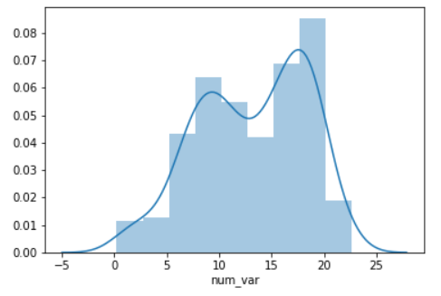

```py
data = [0.0, 3.0, 4.5, 8.0]
plt.figure(figsize = [12, 5])

# left plot: showing kde lumps with the default settings
plt.subplot(1, 3, 1)
sb.distplot(data, hist = False, rug = True, rug_kws = {'color' : 'r'})

# central plot: kde with narrow bandwidth to show individual probability lumps
plt.subplot(1, 3, 2)
sb.distplot(data, hist = False, rug = True, rug_kws = {'color' : 'r'}, kde_kws = {'bw' : 1})

# right plot: choosing a different, triangular kernel function (lump shape)
plt.subplot(1, 3, 3)
sb.distplot(data, hist = False, rug = True, rug_kws = {'color' : 'r'}, kde_kws = {'bw' : 1.5, 'kernel' : 'tri'})
```

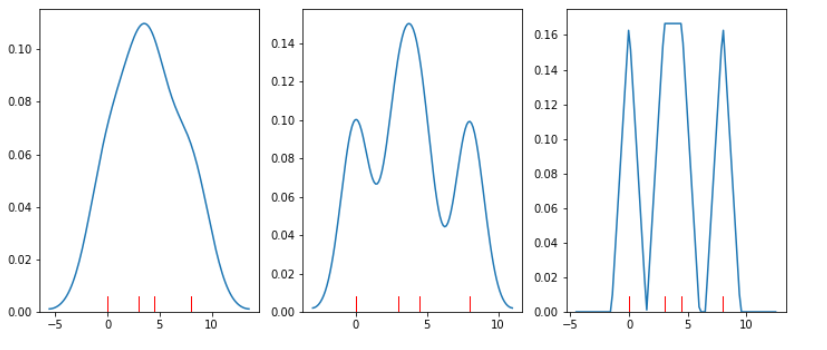

Despite the fact that making specific probability judgments are not as intuitive with KDE plots as histograms, there are still reasons to use kernel density estimation. If there are relatively few data points available, KDE provides a smooth estimate of the overall distribution of data. These ideas may not be so easily conveyed through histograms, in which the large discreteness of jumps may end up misleading.

It should also be noted that there is a bandwidth parameter in KDE that specifies how wide the density lumps are. Similar to bin width for histograms, we need to choose a bandwidth size that best shows the signal in the data. A too-small bandwidth can make the data look noisier than it really is, and a too-large bandwidth can smooth out useful features that we could use to make inferences about the data.

##### Normal Quantile Plot


##### Stem and Leaf Plot


##### Box and Whisker Plot


#### 2. Univariate Categorical data

##### Bar Chart (Ordinal/Nominal)

  

- It is like the histogram but the bins are determined based on a set category not on a range that the chart creator can change.
- **Ordinal** categorical are better to be used with Bar Chart.
- A basic bar chart of frequencies can be created through the use of seaborn's `countplot` function. By default, each category is given a different color. Otherwise, it's a good idea to simplify the plot and reduce unnecessary distractions by plotting all bars in the same color.  
This can be set using the "color" parameter:

  ```py
  base_color = sb.color_palette()[0]
  col_order = df['col_name'].value_counts().index
  sb.countplot(data = df, x = 'col_name', color = base_color, order = col_order)
  ```

- For **nominal-type** data, it is common to sort the data in terms of frequency. While, for **ordinal-type** data, it is sorted in order of the variables.
- The best thing for us to do in this case is to convert the column into an ordered categorical data type. By default, pandas reads in string data as object types, and will plot the bars in the order in which the unique values were seen. By converting the data into an ordered type, the order of categories becomes innate to the feature, and we won't need to specify an "order" parameter each time it's required in a plot.

  ```py
  # this method requires pandas v0.21 or later
  ordinal_var_dict = {'cut': ['Fair','Good','Very Good','Premium','Ideal'],
                      'color': ['J', 'I', 'H', 'G', 'F', 'E', 'D'],
                      'clarity': ['I1', 'SI2', 'SI1', 'VS2', 'VS1', 'VVS2', 'VVS1', 'IF']}

  for var in ordinal_var_dict:
      pd_ver = pd.__version__.split(".")
      if (int(pd_ver[0]) > 0) or (int(pd_ver[1]) >= 21): # v0.21 or later
          ordered_var = pd.api.types.CategoricalDtype(ordered = True,
                                                      categories = ordinal_var_dict[var])
          diamonds[var] = diamonds[var].astype(ordered_var)
      else: #  use this method if you have pandas v0.20.3 or earlier
          diamonds[var] = diamonds[var].astype('category', ordered = True,
                                              categories = ordinal_var_dict[var])

  base_color = sb.color_palette()[0]
  sb.countplot(data = df, x = 'cat_var', color = base_color)
  ```

- If you have a lot of category levels, or the category names are long, then you might end up with overcrowding of the tick labels. One way to address this is through creation of a horizontal bar chart.
- In a horizontal bar chart, it is the length of each bar that indicates frequency, rather than the height.
- In the code, instead of setting the data or variable on the "x" parameter, you can set the variable to be plotted on the parameter "y":

  ```py
  base_color = sb.color_palette()[0]
  sb.countplot(data = df, y = 'cat_var', color = base_color)
  ```

- Alternatively, you can use matplotlib's `xticks` function and its "rotation" parameter to change the orientation in which the labels will be depicted (as degrees counter-clockwise from horizontal):

  ```py
  base_color = sb.color_palette()[0]
  sb.countplot(data = df, x = 'cat_var', color = base_color)
  plt.xticks(rotation = 90)
  ```

##### Pie Chart (relative frequencies)


- A pie chart is a common univariate plot type that is used to depict **relative frequencies** for levels of a categorical variable.
- Pie charts are a fairly limited plot type in the range of scenarios where they can be used.
- There are certain guidelines for using Pie Chart:
  - Make sure that your interest is in relative frequencies.
  - Areas should represent parts of a whole, rather than measurements on a second variable (unless that second variable can logically be summed up into some whole).
  - A pie chart works best with two or three slices, though it's also possible to plot with four or five slices as long as the wedge sizes can be distinguished.
  - Plot the data systematically. One typical method of plotting a pie chart is to start from the top of the circle, then plot each categorical level clockwise from most frequent to least frequent.
  - If you have three categories and are interested in the comparison of two of them, a common plotting method is to place the two categories of interest on either side of the 12 o'clock direction, with the third category filling in the remaining space at the bottom.
- You can create a pie chart with matplotlib's `pie` function. This function requires that the data be in a summarized form: the primary argument to the function will be the wedge sizes.

  ```py
  sorted_counts = df['cat_var'].value_counts()
  plt.pie(sorted_counts, labels = sorted_counts.index, startangle = 90, counterclock = False);
  plt.axis('square')
  ```

  The axis function call and 'square' argument makes it so that the scaling of the plot is equal on both the x- and y-axes. Without this call, the pie could end up looking oval-shaped, rather than a circle.

- To create a donut plot, you can add a "wedgeprops" argument to the `pie` function call.

  ```py
  sorted_counts = df['cat_var'].value_counts()
  plt.pie(sorted_counts,
          labels = sorted_counts.index,
          startangle = 90,
          counterclock = False,
          wedgeprops = {'width' : 0.4});
  plt.axis('square')
  ```

##### Waffle Plot (precise assessments of relative frequencies)

- Waffle plot, also known as the square pie chart is plotted onto a square divided into a 10x10 grid.
- Each small square in the grid represents one percent of the data, and a number of squares are colored by category to indicate total proportions.
- Compared to a pie chart, it is much easier to make precise assessments of relative frequencies.

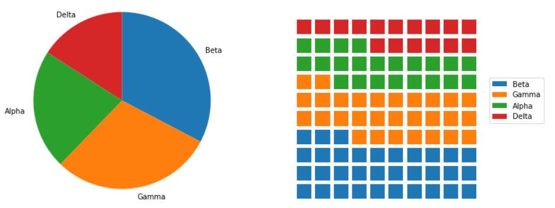

- There's no built-in function for waffle plots in `Matplotlib` or `Seaborn`, so we'll need to take some additional steps in order to build one with the tools available.
  - First, we need to create a function to decide how many blocks to allocate to each category.
  - The function below, `percentage_blocks`, uses a rule where each category gets a number of blocks equal to the number of full percentage points it covers.
  - The remaining blocks to get to the full one hundred are assigned to the categories with the largest fractional parts.

  ```py
  def percentage_blocks(df, var):
  """
  Take as input a dataframe and variable, and return a Pandas series with
  approximate percentage values for filling out a waffle plot.
  """
  # compute base quotas
  percentages = 100 * df[var].value_counts() / df.shape[0]
  counts = np.floor(percentages).astype(int) # integer part = minimum quota
  decimal = (percentages - counts).sort_values(ascending = False)

  # add in additional counts to reach 100
  rem = 100 - counts.sum()
  for cat in decimal.index[:rem]:
      counts[cat] += 1

  return counts
  ```

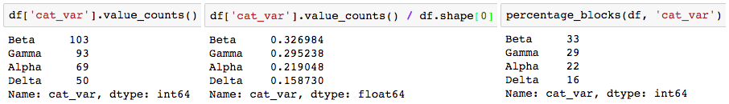

Note that if we just rounded the proportions (center), we would round all of them up, ending up with a total of 101 blocks.

Now it's time to actually plot those counts as boxes in the waffle plot form. To do this, we'll make use of Matplotlib's `bar` function. We could have used this function earlier in the lesson to create our bar charts instead of Seaborn's countplot, but it would have required us to aggregate the data first to get the height of each bar. For the case of the waffle plot, we're going to specify the x- and y- coordinates of the boxes, and set their widths and heights to be equal, to create squares. The initial plotting code looks like this:

```py
waffle_counts = percentage_blocks(df, 'cat_var')

prev_count = 0
# for each category,
for cat in range(waffle_counts.shape[0]):
    # get the block indices
    blocks = np.arange(prev_count, prev_count + waffle_counts[cat])
    # and put a block at each index's location
    x = blocks % 10 # use mod operation to get ones digit
    y = blocks // 10 # use floor division to get tens digit
    plt.bar(x = x, height = 0.8, width = 0.8, bottom = y)
    prev_count += waffle_counts[cat]
```

The blocks are drawn from left to right, bottom to top, using the ones and tens digits for numbers from 0 to 99 to specify the x- and y- positions, respectively. A loop is used to call the bar function once for each category; each time it is called, the plotted bars are assigned a different color.

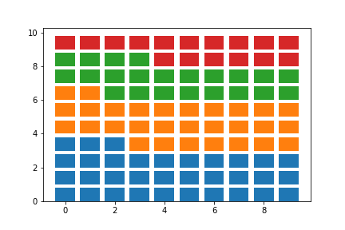

The last steps that we need to do involve aesthetic cleaning to polish it up for interpretability. We can take away the plot border and ticks, since they're arbitrary, but we should change the limits so that the boxes are square. We should also add a legend so that the mapping from colors to category levels is clear.

```py
waffle_counts = percentage_blocks(df, 'cat_var')

prev_count = 0
# for each category,
for cat in range(waffle_counts.shape[0]):
    # get the block indices
    blocks = np.arange(prev_count, prev_count + waffle_counts[cat])
    # and put a block at each index's location
    x = blocks % 10 # use mod operation to get ones digit
    y = blocks // 10 # use floor division to get tens digit
    plt.bar(x = x, height = 0.8, width = 0.8, bottom = y)
    prev_count += waffle_counts[cat]

# aesthetic wrangling
plt.legend(waffle_counts.index, bbox_to_anchor = (1, 0.5), loc = 6)
plt.axis('off')
plt.axis('square')
```

The two calls to Matplotlib's axis function make use of two convenience strings for arguments: 'off' removes the axis lines, ticks, and labels, while 'square' ensures that the scaling on each axis is equal within a square bounding box. As for the legend call, the first argument is a list of categories as obtained from the sorted waffle_counts Series variable. This will match each category to each bar call, in order. The "bbox_to_anchor" argument sets an anchor for the legend to the right side of the plot, and "loc = 6" positions the anchor to the center left of the legend. The final plot is as it looks at the top of the page:

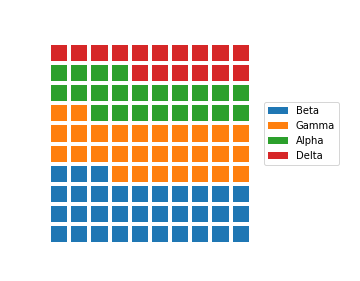

Other variants of the waffle plot exist to extend it beyond just displaying probabilities. By associating each square with an amount rather than a percentage, we can use waffle plots to show absolute frequencies instead. This might cause us to end up with something other than 100 squares.

```py
# each box represents five full counts
waffle_counts = (df['cat_var'].value_counts() / 5).astype(int)

prev_count = 0
# for each category,
for cat in range(waffle_counts.shape[0]):
    # get the block indices
    blocks = np.arange(prev_count, prev_count + waffle_counts[cat])
    # and put a block at each index's location
    x = blocks % 10
    y = blocks // 10
    plt.bar(y, 0.8, 0.8, x)
    prev_count += waffle_counts[cat]

# box size legend
plt.bar(7.5, 0.8, 0.8, 2, color = 'white', edgecolor = 'black', lw = 2)
plt.text(8.1, 2.4,'= 5 data points', va = 'center')

# aesthetic wrangling
plt.legend(waffle_counts.index, bbox_to_anchor = (0.8, 0.5), loc = 6)
plt.axis('off')
plt.axis('square')
```

In the above code, waffle_counts has been adjusted so that each box represents 5 data points. Most of the code is the same as before, though it should be noted that the x and y variables have been swapped in the bar function so that the boxes are plotted in columns from left to right. Additional bar and text calls have been added to the plot to act as an ad hoc legend. The positions of these elements, and the legend, have been adjusted manually through some trial and error to improve the aesthetic appeal. Note that this constitutes more of an explanatory polishing than it is a part of exploration!

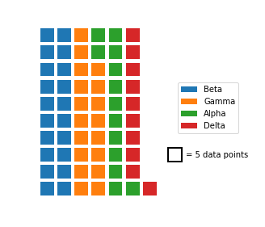

As a further extension, there's no restriction against us using icons for each tally, rather than just squares. Infographics often take this approach, by having each icon represent some number of units (e.g. one person icon representing one million people). But while it can be tempting to use icons to represent values as a bit of visual flair, an icon-based plot contains more chart junk than a bar chart that conveys the same information. There’s a larger cognitive challenge in having to count a number of icons to understand the scale of a value, compared to just referencing a box's endpoint on a labeled axis.

One other downside of the waffle plot is that it is not commonly supported out of the box for most visualization libraries, including Matplotlib and Seaborn. The length of the demonstration code presented above is a testament to that. The effort required to create a meaningful and useful waffle plot means that it is best employed carefully as a part of explanatory visualizations. During the exploratory phase, you're better off using more traditional plots like the bar chart to more rapidly build your understanding of the data.

You don't actually need to go through all of the code wrangling shown above to create waffle plots in Python. The [PyWaffle](https://github.com/ligyxy/PyWaffle) package can be used with Matplotlib's figure function to create waffle plots, with a few options for the orientation and order of icons, but you'll need to install it separately since it's not a major package.

##### Pareto Chart

Pareto Chart are essentially just bar charts where the bars are in the order from the most frequent to the least frequent.


### Bivariate analysis

When comparing two variables to one another.

#### 1. Bivariate Quantitative data

##### Scatter Plot (Two Quantitative)


- Scatter Plots are a common visual for comparing two quantitative variables.
- Pearson's correlation coefficient:
  - A common summary statistic that relates to a scatter plot is the correlation coefficient commonly denoted by r and it ranges from -1 to 1.
  - Though there are a [few different](http://www.statisticssolutions.com/correlation-pearson-kendall-spearman/) ways to measure correlation between two variables, the most common way is with [Pearson's correlation coefficient](https://en.wikipedia.org/wiki/Pearson_correlation_coefficient). Pearson's correlation coefficient provides the:
    1. **Strength**: It is the closeness of the points to each other. It considered to be **Strong** (0.7≤∣r∣≤1.0) if the points are close to each other, **Weak** if the points are far from each other (0.0≤∣r∣<0.3), or **Moderate** (0.3≤∣r∣<0.7)
    2. **Direction**: It considered to be Positive (positive values of r), if the both variables are increasing. And to be Negative (negative values of r), if one or both variables are decreasing.

    of a **linear relationship**. [Spearman's Correlation Coefficient](https://en.wikipedia.org/wiki/Spearman%27s_rank_correlation_coefficient) does not measure linear relationships specifically, and it might be more appropriate for certain cases of associating two variables.

  - Calculation of the Correlation Coefficient

    

  - It can also be calculated in Excel and other spreadsheet applications using `CORREL(col1, col2)`, where col1 and col2 are the two columns you are looking to compare to one another.

- One basic way of creating a scatterplot is through Matplotlib's `scatter` function:
  
  ```py
  plt.scatter(data = df, x = 'num_var1', y = 'num_var2')
  ```

- As an alternative approach, `Seaborn`'s `regplot` function combines scatterplot creation with regression function fitting:

  ```py
  sb.regplot(data = df, x = 'num_var1', y = 'num_var2')
  ```

  - By default, the regression function is linear, and includes a shaded confidence region for the regression estimate.

##### Heat Map (Two Quantitative)

- A heat map is a 2-d version of the `histogram` that can be used as an alternative to a `scatterplot`.
- Like a `scatterplot`, the values of the two numeric variables to be plotted are placed on the plot axes.
- Similar to a `histogram`, the plotting area is divided into a grid and the number of points in each grid rectangle is added up. Since there won't be room for bar heights, counts are indicated instead by grid cell color.
- A heat map can be implemented with Matplotlib's `hist2d` function.

  ```py
  plt.figure(figsize = [12, 5])

  # left plot: scatterplot of discrete data with jitter and transparency
  plt.subplot(1, 2, 1)
  sb.regplot(data = df, x = 'disc_var1', y = 'disc_var2', fit_reg = False,
            x_jitter = 0.2, y_jitter = 0.2, scatter_kws = {'alpha' : 1/3})

  # right plot: heat map with bin edges between values
  plt.subplot(1, 2, 2)
  bins_x = np.arange(0.5, 10.5+1, 1)
  bins_y = np.arange(-0.5, 10.5+1, 1)
  plt.hist2d(data = df, x = 'disc_var1', y = 'disc_var2',
            bins = [bins_x, bins_y])
  plt.colorbar();
  ```

  Notice that since we have two variables, the "bins" parameter takes a list of two bin edge specifications, one for each dimension. We add a `colorbar` function call to add a colorbar to the side of the plot, showing the mapping from counts to colors.

  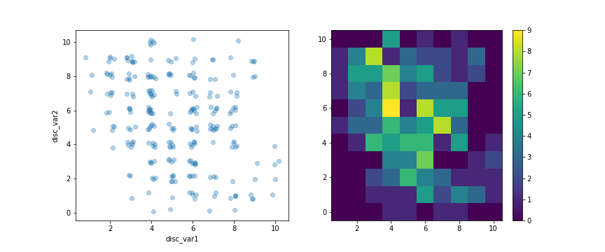

  As the color in the heatmap gets brighter and moves from blue to yellow, the higher the count of points in the corresponding cell.

  To select a different color palette, you can set the "cmap" parameter in `hist2d`. A list of valid strings can be found on [this part](https://matplotlib.org/api/pyplot_summary.html#colors-in-matplotlib) of the Pyplot API documentation. For example of reversing the default "viridis" color palette, by setting cmap = 'viridis_r'.

- Furthermore, I would like to distinguish cells with zero counts from those with non-zero counts. The "cmin" parameter specifies the minimum value in a cell before it will be plotted. By adding a `cmin = 0.5` parameter to the `hist2d` call, this means that a cell will only get colored if it contains at least one point.

  ```py
  bins_x = np.arange(0.5, 10.5+1, 1)
  bins_y = np.arange(-0.5, 10.5+1, 1)
  plt.hist2d(data = df, x = 'disc_var1', y = 'disc_var2',
            bins = [bins_x, bins_y], cmap = 'viridis_r', cmin = 0.5)
  plt.colorbar()
  ```

  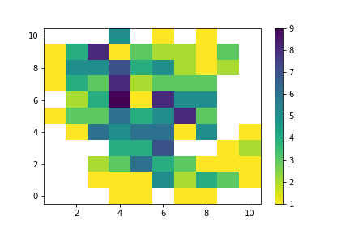

- If you have a lot of data, you might want to add annotations to cells in the plot indicating the count of points in each cell. From `hist2d`, this requires the addition of text elements one by one. We can get the counts to annotate directly from what is returned by hist2d, which includes not just the plotting object, but an array of counts and two vectors of bin edges.

  ```py
  # hist2d returns a number of different variables, including an array of counts
  bins_x = np.arange(0.5, 10.5+1, 1)
  bins_y = np.arange(-0.5, 10.5+1, 1)
  h2d = plt.hist2d(data = df, x = 'disc_var1', y = 'disc_var2',
                bins = [bins_x, bins_y], cmap = 'viridis_r', cmin = 0.5)
  counts = h2d[0]

  # loop through the cell counts and add text annotations for each
  for i in range(counts.shape[0]):
      for j in range(counts.shape[1]):
          c = counts[i,j]
          if c >= 7: # increase visibility on darkest cells
              plt.text(bins_x[i]+0.5, bins_y[j]+0.5, int(c),
                      ha = 'center', va = 'center', color = 'white')
          elif c > 0:
              plt.text(bins_x[i]+0.5, bins_y[j]+0.5, int(c),
                      ha = 'center', va = 'center', color = 'black')
  ```

  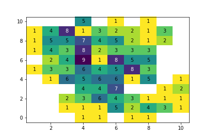

  If you have too many cells in your heat map, then the annotations will end up being too overwhelming, too much to attend to. In cases like that, it's best to leave off the annotations and let the data and `colorbar` speak for themselves.

##### Line plot (Over Time OR Two Quantitative)

- Line plots are a common plot for viewing data over time or one numeric variable against values of a second variable.
- These plots allow us to quickly identify overall trends, seasonal occurrences, peaks, and valleys in the data. You will commonly see these used in looking at stock prices over time, but really tracking anything over time can be easily viewed using these plots.


- In contrast to a scatterplot, where all data points are plotted, in a line plot, only one point is plotted for every unique x-value or bin of x-values (like a histogram).
- If there are **multiple observations** in an **x-bin**, then the **y-valu**e of the point plotted in the line plot will be a **summary statistic** (like mean or median) of the data in the bin.
- The plotted points are connected with a line that emphasizes the sequential or connected nature of the x-values.

- If the x-variable represents time, then a line plot of the data is frequently known as a **time series plot**.

- We will make use of Matplotlib's `errorbar` function, performing some processing on the data in order to get it into its necessary form.

  ```py
  plt.errorbar(data = df, x = 'num_var1', y = 'num_var2')
  ```

  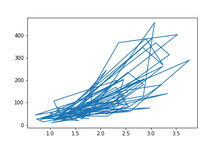

  - If we just blindly stick a dataframe into the function without considering its structure, we might end up with a mess like the above.
  - The function just plots all the data points as a line, connecting values from the first row of the dataframe to the last row. In order to create the line plot as intended, we need to do additional work to summarize the data.

    ```py
    # set bin edges, compute centers
    bin_size = 0.25
    xbin_edges = np.arange(0.5, df['num_var1'].max()+bin_size, bin_size)
    xbin_centers = (xbin_edges + bin_size/2)[:-1]

    # compute statistics in each bin
    data_xbins = pd.cut(df['num_var1'], xbin_edges, right = False, include_lowest = True)
    y_means = df['num_var2'].groupby(data_xbins).mean()
    y_sems = df['num_var2'].groupby(data_xbins).sem()

    # plot the summarized data
    plt.errorbar(x = xbin_centers, y = y_means, yerr = y_sems)
    plt.xlabel('num_var1')
    plt.ylabel('num_var2')
    ```

  - Since the x-variable ('num_var1') is continuous, we first set a number of bins into which the data will be grouped.
  - In addition to the usual edges, the center of each bin is also computed for later plotting.
  - For the points in each bin, we compute the `mean` and `standard error of the mean`. Note that the `cut` function call is simple here, since we don't need to compute individual point weights.

    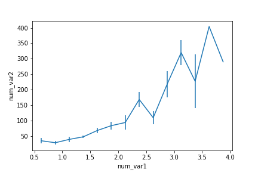

  - An interesting part of the above summarization of the data is that the uncertainty in the mean generally increases with increasing x-values. But for the largest two points, there are no error bars.
  - Looking at the default `errorbar` plot (or the scatterplot below), we can see this is due to there only being one point in each of the last two bins.

- Alternate Variation #1:

  - Instead of computing summary statistics on fixed bins, you can also make computations on a rolling window through use of pandas' rolling method.
  - Since the rolling window will make computations on sequential rows of the dataframe, we should use `sort_values` to put the x-values in ascending order first.

  ```py
  # compute statistics in a rolling window
  df_window = df.sort_values('num_var1').rolling(15)
  x_winmean = df_window.mean()['num_var1']
  y_median = df_window.median()['num_var2']
  y_q1 = df_window.quantile(.25)['num_var2']
  y_q3 = df_window.quantile(.75)['num_var2']

  # plot the summarized data
  base_color = sb.color_palette()[0]
  line_color = sb.color_palette('dark')[0]
  plt.scatter(data = df, x = 'num_var1', y = 'num_var2')
  plt.errorbar(x = x_winmean, y = y_median, c = line_color)
  plt.errorbar(x = x_winmean, y = y_q1, c = line_color, linestyle = '--')
  plt.errorbar(x = x_winmean, y = y_q3, c = line_color, linestyle = '--')

  plt.xlabel('num_var1')
  plt.ylabel('num_var2')
  ```

  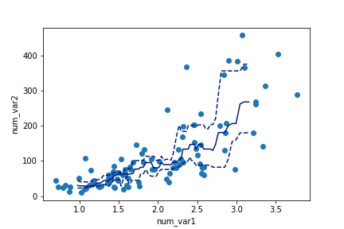

- Alternate Variation #2:

  - Another bivariate application of line plots is to plot the distribution of a numeric variable for different levels of a categorical variable.
  - This is another alternative to using violin plots, box plots, and faceted histograms.
  - With the line plot, one line is plotted for each category level, like overlapping the histograms on top of one another.
  - This can be accomplished through multiple `errorbar` calls using the methods above, or by performing multiple hist calls, setting the "histtype = step" parameter so that the bars are depicted as unfilled lines.

    ```py
    bin_edges = np.arange(-3, df['num_var'].max()+1/3, 1/3)
    g = sb.FacetGrid(data = df, hue = 'cat_var', size = 5)
    g.map(plt.hist, "num_var", bins = bin_edges, histtype = 'step')
    g.add_legend()
    ```

  - Note that I'm performing the multiple hist calls through the use of `FacetGrid`, setting the categorical variable on the "hue" parameter rather than the "col" parameter.
  - I've also added an `add_legend` method call so that we can identify which level is associated with each curve.

    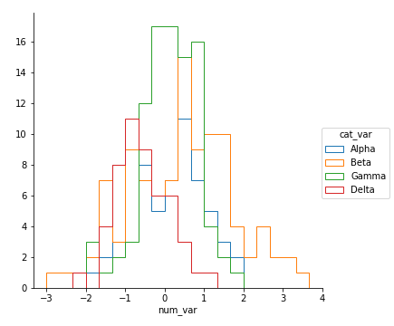

  - Unfortunately, the "Alpha" curve seems to be pretty lost behind the other three curves since the relatively low number of counts is causing a lot of overlap. Perhaps connecting the centers of the bars with a line, like what was seen in the first errorbar example, would be better.

  - Functions you provide to the map method of `FacetGrid` objects do not need to be built-ins. Below, I've written a function to perform the summarization operations seen above to plot an `errorbar` line for each level of the categorical variable, then fed that function (freq_poly) to map.

    ```py
    def freq_poly(x, bins = 10, **kwargs):
      """ Custom frequency polygon / line plot code. """
      # set bin edges if none or int specified
      if type(bins) == int:
          bins = np.linspace(x.min(), x.max(), bins+1)
      bin_centers = (bin_edges[1:] + bin_edges[:-1]) / 2

      # compute counts
      data_bins = pd.cut(x, bins, right = False,
                        include_lowest = True)
      counts = x.groupby(data_bins).count()

      # create plot
      plt.errorbar(x = bin_centers, y = counts, **kwargs)

    bin_edges = np.arange(-3, df['num_var'].max()+1/3, 1/3)
    g = sb.FacetGrid(data = df, hue = 'cat_var', size = 5)
    g.map(freq_poly, "num_var", bins = bin_edges)
    g.add_legend()
    ```

  - **kwargs is used to allow additional keyword arguments to be set for the `errorbar` function.

    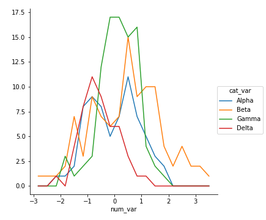

#### 2. Bivariate Categorical Data

There are a few ways of plotting the relationship between one quantitative and one qualitative variable, that demonstrate the data at different levels of abstraction.

##### Violin Plot (Quantitative with Qualitative variables)

- The violin plot is on the lower level of abstraction.
- For each level of the categorical variable, a distribution of the values on the numeric variable is plotted. The distribution is plotted as a `kernel density estimate`, something like a smoothed `histogram`.
- `Seaborn`'s `violinplot` function can be used to create violin plots combined with box plots.

  ```py
  sb.violinplot(data = df, x = 'cat_var', y = 'num_var')
  ```

  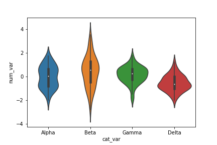

  Here, you can see that the numeric data takes on a different shape in each categorical level: Some bimodality is suggested in group Alpha, a relatively high variance is observed in Beta, and Gamma and Delta are skewed negatively and positively, respectively.

  Inside each curve, there is a black shape with a white dot inside. This is the miniature box plot. You can set the `inner = None` parameter in the `violinplot` call to remove the box plot.

- The violin plot can also be rendered horizontally. `Seaborn` is smart enough to make an appropriate inference on which orientation is requested, depending on whether "x" or "y" receives the categorical variable. But if both variables are numeric (e.g., one is discretely-valued) then the "orient" parameter can be used to specify the plot orientation.

  ```py
  base_color = sb.color_palette()[0]
  sb.violinplot(data = df, x = 'num_var', y = 'cat_var', color = base_color, inner = None)
  ```

  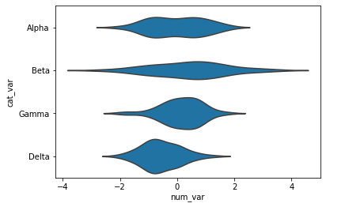

  By setting `inner = 'quartile'`, three lines will be plotted within each violin area for the three middle quartiles. The line with thick dashes indicates the median, and the two lines with shorter dashes on either side the first and third quartiles.

  ```py
  base_color = sb.color_palette()[0]
  sb.violinplot(data = df, x = 'cat_var', y = 'num_var', color = base_color, inner = 'quartile')
  ```

  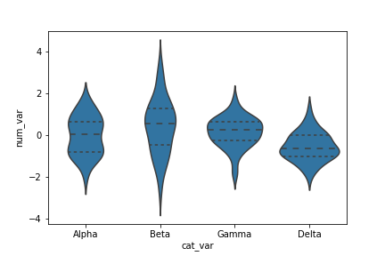

##### Box Plot (Quantitative with Qualitative variables) (Summarization)

- A box plot is another way of showing the relationship between a numeric variable and a categorical variable.
- Compared to the violin plot, the box plot leans more on **summarization** of the data, primarily just reporting a set of descriptive statistics for the numeric values on each categorical level. A box plot can be created using seaborn's `boxplot` function.

  ```py
  plt.figure(figsize = [10, 5])
  base_color = sb.color_palette()[0]

  # left plot: violin plot
  plt.subplot(1, 2, 1)
  ax1 = sb.violinplot(data = df, x = 'cat_var', y = 'num_var', color = base_color)

  # right plot: box plot
  plt.subplot(1, 2, 2)
  sb.boxplot(data = df, x = 'cat_var', y = 'num_var', color = base_color)
  plt.ylim(ax1.get_ylim()) # set y-axis limits to be same as left plot
  ```

  In order to provide a better comparison of the violin and box plots, a `ylim` expression has been added to the second plot to match the two plots' y-axis limits. The Axes object returned by violinplot is assigned to a variable, ax1 is used to programmatically obtain those limit values.

  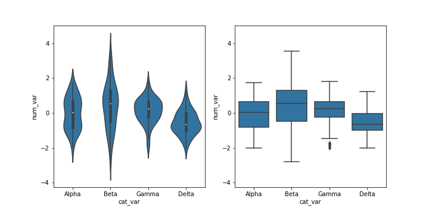

  - The inner boxes and lines in the violin plot match up with the boxes and whiskers in the box plot.
  - In a box plot:
    - The **central line** in the box indicates the **median** of the distribution,
    - While the **top** and **bottom** of the box represent the **third** and **first quartiles** of the data, respectively.
    - Thus, the **height** of the box is the interquartile range (**IQR**).
    - From the **top** and **bottom** of the box, the whiskers indicate the range from the **first** or **third** quartiles to the **minimum** or **maximum** value in the distribution.
    - Typically, a **maximum range** is set on whisker length; by default this is **1.5 times the IQR**.
    - For the Gamma level, there are points below the lower whisker that indicate individual outlier points that are more than 1.5 times the IQR below the first quartile.

  - Comparing the two plots:
    - The box plot is a cleaner summary of the data than the violin plot.
    - It's easier to compare statistics between the groups with a box plot. This makes a box plot worth more consideration if you have a lot of groups to compare, or if you are building explanatory plots.
    - You can clearly see from the box plot that the Delta group has the lowest median.
    - On the other hand, the box plot lacks as nuanced a depiction of distributions as the violin plot: you can't see the slight bimodality present in the Alpha level values.
    - The violin plot may be a better option for exploration, especially since `seaborn`'s implementation also includes the box plot by default.

- `boxplot` can also render horizontal box plots by setting the numeric and categorical features to the appropriate arguments.

  ```py
  base_color = sb.color_palette()[0]
  sb.boxplot(data = df, x = 'num_var', y = 'cat_var', color = base_color)
  ```

  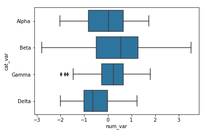

##### Clustered Bar Charts (Side by side bar chart) (Two Qualitative Variables)


- In a clustered bar chart, bars are organized into clusters based on levels of the first variable, and then bars are ordered consistently across the second variable within each cluster.
- This is easiest to see with an example, using `seaborn`'s `countplot` function.
- To take the plot from univariate to bivariate, we add the second variable to be plotted under the "hue" argument:

  ```py
  sb.countplot(data = df, x = 'cat_var1', hue = 'cat_var2')
  ```

  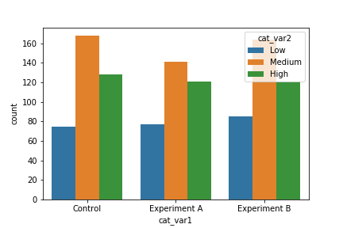

  - The first categorical variable is depicted by broad x-position (Control, Experiment A, Experiment B). Within each of these groups, three bars are plotted, one for each level of the second categorical variable (Low, Medium, High).

  - The legend position in this example is a bit distracting, however. We can use an Axes method to set the legend properties on the Axes object returned from countplot.

  ```py
  ax = sb.countplot(data = df, x = 'cat_var1', hue = 'cat_var2')
  ax.legend(loc = 8, ncol = 3, framealpha = 1, title = 'cat_var2')
  ```

  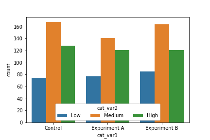

##### Adapted Bar charts (Qualitative and Summarized Quantitative)

- These plots can be adapted for use as bivariate plots by, instead of indicating count by height, indicating a mean or other statistic on a second variable.
- For example, we could plot a numeric variable against a categorical variable by adapting a bar chart so that its bar heights indicate the mean of the numeric variable.
- This is the purpose of seaborn's `barplot` function:

  ```py
  base_color = sb.color_palette()[0]
  sb.barplot(data = df, x = 'cat_var', y = 'num_var', color = base_color)
  ```

  - Different hues are automatically assigned to each category level unless a fixed color is set in the "color" parameter, like in `countplot` and `violinplot`.

  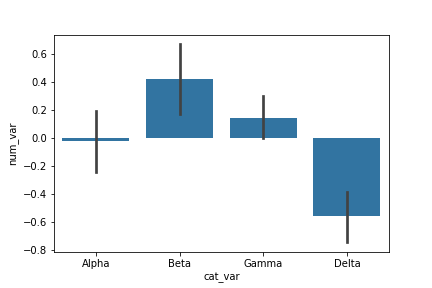

  The bar heights indicate the mean value on the numeric variable, with error bars plotted to show the uncertainty in the mean based on variance and sample size. The Delta bar dips below the 0 axis due to the negative mean.

##### Point Plot (Qualitative and Summarized Quantitative)

- The `pointplot` function can be used to plot the averages as points rather than bars. This can be useful if having bars in reference to a 0 baseline aren't important or would be confusing.

  - As an alternative, the pointplot function can be used to plot the averages as points rather than bars. This can be useful if having bars in reference to a 0 baseline aren't important or would be confusing.

    ```py
    sb.pointplot(data = df, x = 'cat_var', y = 'num_var', linestyles = "")
    plt.ylabel('Avg. value of num_var')
    ```

  - By default, `pointplot` will connect values by a line. This is fine if the categorical variable is ordinal in nature, but it can be a good idea to remove the line via linestyles = "" for nominal data.

  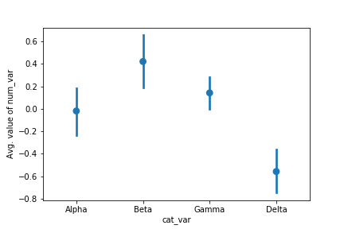

  The above plots can be useful alternatives to the box plot and violin plot if the data is not conducive to either of those plot types. For example, if the numeric variable is binary in nature, taking values only of 0 or 1, then a box plot or violin plot will not be informative, leaving the adapted bar chart as the best choice for displaying the data.

  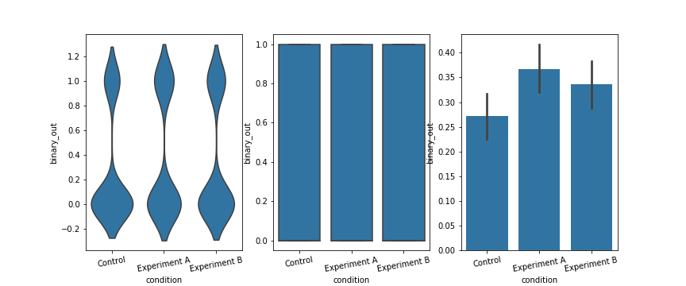

#### Bivariate Techniques

##### Overplotting, Transparency, and Jitter

If we have a very large number of points to plot or our numeric variables are discrete-valued, then it is possible that using a scatterplot straightforwardly will not be informative. The visualization will suffer from overplotting, where the high amount of overlap in points makes it difficult to see the actual relationship between the plotted variables.

```py
plt.scatter(data = df, x = 'disc_var1', y = 'disc_var2')
```

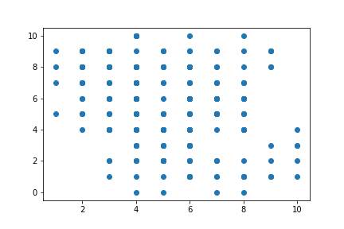

In the above plot, we can infer some kind of negative relationship between the two variables, but the degree of variability in the data and strength of relationship are fairly unclear. In cases like this, we may want to employ transparency and jitter to make the scatterplot more informative. Transparency can be added to a scatter call by adding the "alpha" parameter set to a value between 0 (fully transparent, not visible) and 1 (fully opaque).

```py
plt.scatter(data = df, x = 'disc_var1', y = 'disc_var2', alpha = 1/5)
```

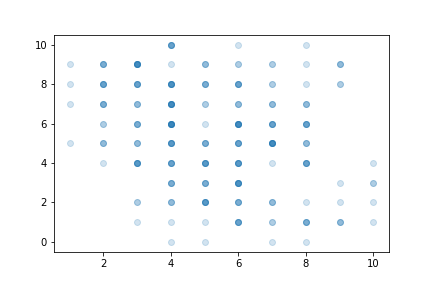

Where more points overlap, the darker the image will be. Here, we can now see that there is a moderate negative relationship between the two numeric variables. Values of 0 and 10 on the x-axis are much rarer than the central values.

As an alternative or companion to transparency, we can also add jitter to move the position of each point slightly from its true value. This is not a direct option in matplotlib's scatter function, but is a built-in option with seaborn's regplot function. x- and y- jitter can be added independently, and won't affect the fit of any regression function, if made:

```py
sb.regplot(data = df, x = 'disc_var1', y = 'disc_var2', fit_reg = False,
           x_jitter = 0.2, y_jitter = 0.2, scatter_kws = {'alpha' : 1/3})
```

The jitter settings will cause each point to be plotted in a uniform ±0.2 range of their true values. Note that transparency has been changed to be a dictionary assigned to the "scatter_kws" parameter. This is necessary so that transparency is specifically associated with the scatter component of the regplot function.

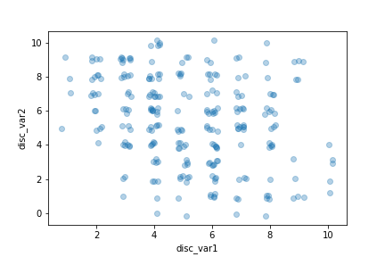

### Multivariate (More than two variables)

- There are four major cases to consider when we want to plot three variables together:
  - Three numeric variables
  - Two numeric variables and one categorical variable
  - One numeric variable and two categorical variables
  - Three categorical variables

Scatter plot is used in case of multivariate plot with at least two of them are numeric, then using a non-positional encoding on the points to convey the value on the third variable, whether numeric or categorical.

#### Non-Positional Encodings for Third Variables (At Least Two Quantitative)

- Three main non-positional encodings stand out: shape, size, and color.
- For Matplotlib and Seaborn, color is the easiest of these three encodings to apply for a third variable.
- Color can be used to encode both qualitative and quantitative data.

##### Encoding via Shape

- Shape is a good encoding for categorical variables, using one shape for each level of the categorical variable.
- There is no built-in way to automatically assign different shapes in a single call of the scatter or regplot function. Instead, we need to write a loop to call our plotting function multiple times, isolating data points by categorical level and setting a different "marker" argument value for each one.

  ```py
  cat_markers = [['A', 'o'],
                ['B', 's']]

  for cat, marker in cat_markers:
      df_cat = df[df['cat_var1'] == cat]
      plt.scatter(data = df_cat, x = 'num_var1', y = 'num_var2', marker = marker)
  plt.legend(['A','B'])
  ```

  - The 'o' string specifies circular markers for members of category 'A', while the 's' string specifies square markers for members of category 'B'. The legend function adds a legend to the plot, with one marker for every scatter call made. The function argument sets the labels for those points.

  - If we wanted the points to have the same color as well, we could do that through the "c" parameter in `scatter` or "color" in `regplot`.

(Documentation: [matplotlib built-in markers](https://matplotlib.org/api/markers_api.html), [marker reference example](https://matplotlib.org/examples/lines_bars_and_markers/marker_reference.html))

##### Encoding via Size

- Point size is a good encoding for numeric variables.
- We want the numeric values to be proportional to the area of the point markers; this is the default functionality of the "s" parameter in `scatter`. (You need to refer to "s" through a dictionary assigned to the "scatter_kws" parameter when working with `regplot`.)

  ```py
  plt.scatter(data = df, x = 'num_var1', y = 'num_var2', s = 'num_var3')

  # dummy series for adding legend
  sizes = [20, 35, 50]
  base_color = sb.color_palette()[0]
  legend_obj = []
  for s in sizes:
      legend_obj.append(plt.scatter([], [], s = s, color = base_color))
  plt.legend(legend_obj, sizes)
  ```

  - You might need to apply a scaling factor (e.g., multiplying or dividing all values by 2) or shift in order to make the size encoding interpretable. In particular, if the values in your third numeric variable include negative values, then you might want to choose a color encoding instead.

##### A Warning on Combining Encodings

- It might seem plausible to combine both size and shape encodings into the same plot, to depict the trend in four variables at once. Technically, this may be true, but there are some cautions to be taken with this approach. One surface issue is that the code to depict the plot and a reasonable legend gets complicated. A more important issue is that point areas won't all be the same even with the same value, depending on the shape of the marker.

##### Encoding via Color

- Color is a very common encoding for variables, for both qualitative and quantitative variables.
- If you have a qualitative variable, you can set different colors for different levels of a categorical variable through the "hue" parameter on seaborn's [FacetGrid](https://seaborn.pydata.org/generated/seaborn.FacetGrid.html) class.

  ```py
  g = sb.FacetGrid(data = df, hue = 'cat_var1', size = 5)
  g.map(plt.scatter, 'num_var1', 'num_var2')
  g.add_legend()
  ```

- For quantitative variables, we should not take the same approach, since FacetGrid expects any variable input for subsetting to be categorical. Instead, we can set color based on numeric value in the scatter function through the "c" parameter, much like how we set up marker sizes through "s".

  ```py
  plt.scatter(data = df, x = 'num_var1', y = 'num_var2', c = 'num_var3')
  plt.colorbar()
  ```

- Color Palettes:
  
  Depending on the type of data you have, you may want to change the type of color palette that you use to depict your data. There are three major classes of color palette to consider: **qualitative**, **sequential**, and **diverging**.
  
  - **Qualitative** palette:
    - **Qualitative** palettes are built for nominal-type data. This is the palette class taken by the default palette.
  
      ```py
      sb.palplot(sb.color_palette(n_colors=9))
      ```

      In a qualitative palette, consecutive color values are distinct so that there is no inherent ordering of levels implied. Colors in a good qualitative palette should also try and avoid drastic changes in brightness and saturation that would cause a reader to interpret one category as being more important than the others - unless that emphasis is deliberate and purposeful.

      (Documentation: [seaborn palplot](https://seaborn.pydata.org/generated/seaborn.palplot.html), [color_palette](https://seaborn.pydata.org/generated/seaborn.color_palette.html))

      

  - **Sequential** palette
    - In a **sequential** palette, consecutive color values should follow each other systematically.
    - Typically, this follows a light-to-dark trend across a single or small range of hues, where light colors indicate low values and dark colors indicate high values.
    - **Sequential** palette will depict ordinal or numeric data just fine. However, if there is a meaningful zero or center value for the variable, you may want to consider using a **diverging** palette.
    - The default sequential color map, "viridis", takes the opposite approach, with dark colors indicating low values, and light values indicating high.

      ```py
      sb.palplot(sb.color_palette('viridis', 9))
      ```

      

  - **Diverging** palette
    - In a diverging palette, two sequential palettes with different hues are put back to back, with a common color (usually white or gray) connecting them.
    - One hue indicates values greater than the center point, while the other indicates values smaller than the center.
    - When using a diverging color palette, you will likely need to specify the "vmin" and "vmax" parameters in order to have the neutral point in the palette meet the center point in the scale. Alternatively, solutions that create a different normalization function like the one posted in this [Stack Overflow thread](https://stackoverflow.com/questions/20144529/shifted-colorbar-matplotlib) can be used for finer control over the color map. Diverging color scales are common enough for the `heatmap` type that there is a "center" parameter for setting the central value.

      ```py
      sb.palplot(sb.color_palette('vlag', 9))
      ```

      

- Selecting Color Palettes:

  - If you want to change the color map for your plot, the easiest way of doing so is by using one of the built-ins from Matplotlib or Seaborn. [This part](https://matplotlib.org/api/pyplot_summary.html#colors-in-matplotlib) of the Matplotlib documentation has a list of strings that can be understood for color mappings.
  - For most of your purposes, stick with the palettes noted in the top few tables as built-in for Matplotlib ('viridis', etc.) or from ColorBrewer.
  - Seaborn also adds in a number of its own palettes:
    - **Qualitative** (all up to 6 colors): 'deep', 'pastel', 'dark', 'muted', 'bright', 'colorblind'.
    - **Sequential**: 'rocket' (white-orange-red-purple-black), 'mako' (mint-green-blue-purple-black)
    - **Diverging**: 'vlag' (blue-white-red), 'icefire' (blue-black-orange)

    For all of these strings, appending '_r' reverses the palette, which is useful if a sequential or diverging palette is rendered counter to your expectations.
  - A color palette can be set in `FacetGrid` through the "palette" parameter, and in `scatter` through the "cmap" parameter.

- Warnings on Color:
  1. Consider color blindness when selecting color for your plots. the built-in color palettes highlighted in the previous section should minimize these concerns. For a different, or custom palette, it might be worth checking your visualization's interpretability through a color blindness sim like [this one](http://www.color-blindness.com/coblis-color-blindness-simulator/).
  2. Be aware of the effect of transparency and overlap on interpretability. If points of different color on a qualitative scale overlap, the result may be a third color that cannot be matched to something in the palette. If multiple points on a quantitative scale overlap, then the result may be a value that does not actually exist in the data. To be safe here, avoid or minimize transparency in plots with color. You may need to plot only a sample of your points in order to make sure that the effect of the third variable is clearly visible.

- Further Reading:
  - Matplotlib tutorial: [Colormaps in Matplotlib](https://matplotlib.org/tutorials/colors/colormaps.html)
  - Seaborn tutorial: [Choosing color palettes](https://seaborn.pydata.org/tutorial/color_palettes.html)
  - Eager Eyes: [How The Rainbow Color Map Misleads](https://eagereyes.org/basics/rainbow-color-map) - seaborn will refuse to accept the 'jet' palette string, which corresponds with a rainbow-colored palette that covers the entire range of hues. This, and the next link, will tell you why it's been forbidden.
  - Agile Scientific: [No more rainbows!](https://agilescientific.com/blog/2017/12/14/no-more-rainbows)
  - Datawrapper: [How to Choose a Color Palette for Choropleth Maps](https://blog.datawrapper.de/how-to-choose-a-color-palette-for-choropleth-maps/) - Though this article discusses color in the context of maps and for a specific software tool, it's a useful reference if you want to create a non-linear normalization function.

#### Faceting in Two Directions (Two Quantitative and One Qualtiative)

Refer to [Faceting](#faceting) in [Visualization techniques](#visualization-techniques)

#### 2-d histogram (Three Quantitative)

If we want to depict the mean of a third variable in a 2-d histogram, we need to change the weights of points in the `hist2d` function similar to how we changed the weights in the 1-d histogram.

```py
xbin_edges = np.arange(0.25, df['num_var1'].max()+0.5, 0.5)
ybin_edges = np.arange(7,    df['num_var2'].max()+0.5, 0.5)

# count number of points in each bin
xbin_idxs = pd.cut(df['num_var1'], xbin_edges, right = False,
                    include_lowest = True, labels = False).astype(int)
ybin_idxs = pd.cut(df['num_var2'], ybin_edges, right = False,
                    include_lowest = True, labels = False).astype(int)

pts_per_bin = df.groupby([xbin_idxs, ybin_idxs]).size()
pts_per_bin = pts_per_bin.reset_index()
pts_per_bin = pts_per_bin.pivot(index = 'num_var1', columns = 'num_var2').values

z_wts = df['num_var3'] / pts_per_bin[xbin_idxs, ybin_idxs]

# plot the data using the calculated weights
plt.hist2d(data = df, x = 'num_var1', y = 'num_var2', weights = z_wts,
           bins = [xbin_edges, ybin_edges], cmap = 'viridis_r', cmin = 0.5);
plt.xlabel('num_var1')
plt.ylabel('num_var2');
plt.colorbar(label = 'mean(num_var3)');
```

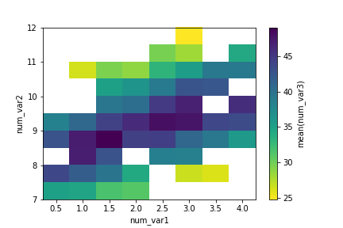

#### 2-d bar chart (Two Qualtiative and One Summarized Quantitative)

It is more likely to use the heat map if there is a lot of data to be aggregated.

The code for the **2-d bar chart** doesn't actually change much. The actual `heatmap` call is still the same, only the aggregation of values changes. Instead of taking `size` after the groupby `operation`, we compute the `mean` across dataframe columns and isolate the column of interest.

```py
cat_means = df.groupby(['cat_var1', 'cat_var2']).mean()['num_var2']
cat_means = cat_means.reset_index(name = 'num_var2_avg')
cat_means = cat_means.pivot(index = 'cat_var2', columns = 'cat_var1',
                            values = 'num_var2_avg')
sb.heatmap(cat_means, annot = True, fmt = '.3f',
           cbar_kws = {'label' : 'mean(num_var2)'})
```

Note how the "cbar_kws" provides an additional argument to the colorbar component of the heat map call.

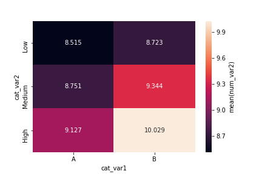

#### Clustered Plots (Two Qualtiative and One Quantitative)

- Bar Chart
  
  - For two categorical variables and one numeric variable.
  - clustered bar chart using the barplot function instead of the countplot function:

    ```py
    ax = sb.barplot(data = df, x = 'cat_var1', y = 'num_var2', hue = 'cat_var2')
    ax.legend(loc = 8, ncol = 3, framealpha = 1, title = 'cat_var2')
    ```

    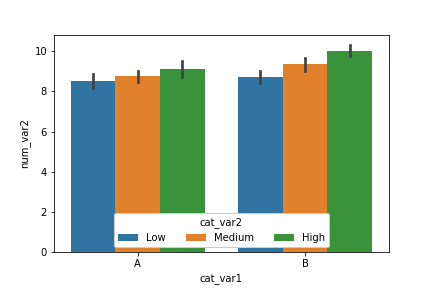

- Boxplot, violinplot, and pointplot
  - The "hue" parameter can also be used in a similar fashion in the boxplot, violinplot, and pointplot functions to add a categorical third variable to those plots in a clustered fashion. As a special note for `pointplot`, the default rendering aligns all levels of the "hue" categorical variable vertically. Use the "dodge" parameter to shift the levels in a clustered fashion:

    ```py
    ax = sb.pointplot(data = df, x = 'cat_var1', y = 'num_var2', hue = 'cat_var2', dodge = 0.3, linestyles = "")
    ```

    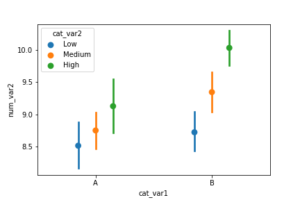

- Line Plot
  - line plot can be adapted from previous code showing how to create frequency polygons for levels of a categorical variable. In this case as well, we create a custom function to send to a FacetGrid object's map function that computes the means in each bin, then plots them as lines via errorbar.
  
  ```py
  def mean_poly(x, y, bins = 10, **kwargs):
      """ Custom adapted line plot code. """
      # set bin edges if none or int specified
      if type(bins) == int:
          bins = np.linspace(x.min(), x.max(), bins+1)
      bin_centers = (bin_edges[1:] + bin_edges[:-1]) / 2

      # compute counts
      data_bins = pd.cut(x, bins, right = False,
                        include_lowest = True)
      means = y.groupby(data_bins).mean()

      # create plot
      plt.errorbar(x = bin_centers, y = means, **kwargs)

  bin_edges = np.arange(0.25, df['num_var1'].max()+0.5, 0.5)
  g = sb.FacetGrid(data = df, hue = 'cat_var2', size = 5)
  g.map(mean_poly, "num_var1", "num_var2", bins = bin_edges)
  g.set_ylabels('mean(num_var2)')
  g.add_legend()
  ```

  
  
  
- Stacked Line


#### Plot Matrices (many pairs of variables)

- In a plot matrix, a matrix of plots is generated.
- Each row and column represents a different variable, and a subplot against those variables is generated in each plot matrix cell.
- This contrasts with faceting, where rows and columns will subset the data, and the same variables are depicted in each subplot.
- `Seaborn`'s [PairGrid](https://seaborn.pydata.org/generated/seaborn.PairGrid.html) class facilitates the creation of this kind of plot matrix.

    ```py
    g = sb.PairGrid(data = df, vars = ['num_var1', 'num_var2', 'num_var3'])
    g.map_diag(plt.hist)
    g.map_offdiag(plt.scatter)
    ```

  - By default, PairGrid only expects to depict numeric variables; a typical invocation of PairGrid plots the same variables on the horizontal and vertical axes.
  - On the diagonals, where the row and column variables match, a histogram is plotted.
  - Off the diagonals, a scatterplot between the two variables is created.

    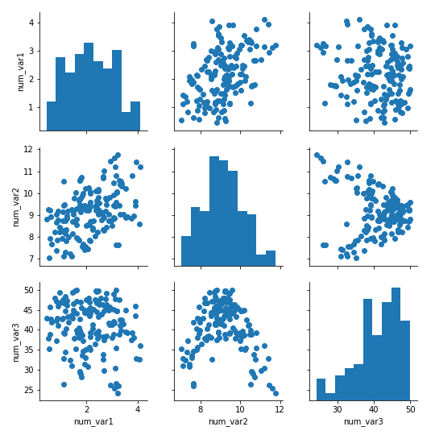

- The [pairplot](https://seaborn.pydata.org/generated/seaborn.pairplot.html) function can also be used to render this common use case in a single call.
- For other relationships, the flexibility of PairGrid shines. For example, if we want to look at the relationship between the numeric and categorical variables in the data, we need to set the different variable types on the rows and columns, then use an appropriate plot type for all matrix cells.
  
    ```py
    g = sb.PairGrid(data = df, x_vars = ['num_var1', 'num_var2', 'num_var3'],
                y_vars = ['cat_var1','cat_var2'])
    g.map(sb.violinplot, inner = 'quartile')
    ```

    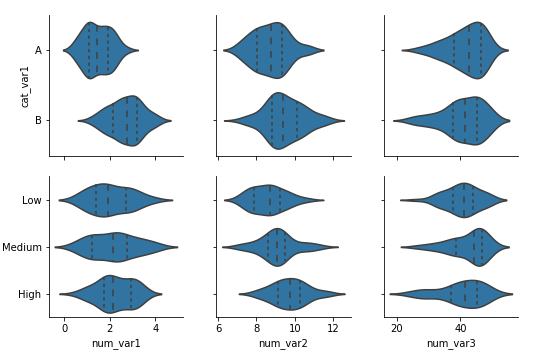

- The time it takes to render the plot depends on the number of data points you have and the number of variables you want to plot. Increasing the number of variables increases the number of plots that need to be rendered in a quadratic fashion.
- Increasing the number of variables means that the individual subplot size needs to be reduced in order to fit the matrix width on your screen.
- If you have a lot of data, it might be difficult to see the relationships between variables due to overplotting, and it will take a long time to complete. One recommended approach is to take a random subset of the data to plot in the plot matrix instead.
- Use the plot matrix to identify interesting variable pairs, and then follow it up with individual plots on the full data.

##### Correlation Matrices (Correlation HeatMap for numeric variables)

- It can be useful to create a correlation matrix as part of your exploration.
- While it's true that the `.corr` function is perfectly fine for computing and returning a matrix of correlation coefficients, it's not too much trouble to plot the matrix as a heat map to make it easier to see the strength of the relationships.

```py
sb.heatmap(df.corr(), annot = True, fmt = '.2f', cmap = 'vlag_r', center = 0)
```

- Instead of using the default sequential color map, a diverging color map is specified and its center is set to 0. That way, we can use hue to tell if a correlation is positive or negative, and see its strength from the hue's intensity.

  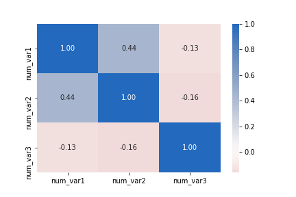

- Correlations are computed based on strength of linear relationship. Compare the correlation between "num_var2" and "num_var3" to the corresponding cell in the first plot matrix as an example of how a correlation statistic might be misleading.

### Visualization Techniques

#### Absolute vs. Relative Frequency

By default, seaborn's countplot function will summarize and plot the data in terms of absolute frequency, or pure counts. In certain cases, you might want to understand the distribution of data or want to compare levels in terms of proportions of the whole. In this case, you will want to plot the data in terms of relative frequency, where the height indicates the proportion of data taking each level, rather than the absolute count.

One method of plotting the data in terms of relative frequency on a bar chart is to just relabel the counts axis in terms of proportions. The underlying data will be the same, it will simply be the scale of the axis ticks that will be changed.

```py
# get proportion taken by most common group for derivation of tick marks
n_points = df.shape[0]
max_count = df['cat_var'].value_counts().max()
max_prop = max_count / n_points

# generate tick mark locations and names
tick_props = np.arange(0, max_prop, 0.05)
tick_names = ['{:0.2f}'.format(v) for v in tick_props]

# create the plot
base_color = sb.color_palette()[0]
sb.countplot(data = df, x = 'cat_var', color = base_color)
plt.yticks(tick_props * n_points, tick_names)
plt.ylabel('proportion')
```

Rather than plotting the data on a relative frequency scale, you might use text annotations to label the frequencies on bars instead. This requires writing a loop over the tick locations and labels and adding one text element for each bar.

```py
# create the plot
base_color = sb.color_palette()[0]
sb.countplot(data = df, x = 'cat_var', color = base_color)

# add annotations
n_points = df.shape[0]
cat_counts = df['cat_var'].value_counts()
locs, labels = plt.xticks() # get the current tick locations and labels

# loop through each pair of locations and labels
for loc, label in zip(locs, labels):

    # get the text property for the label to get the correct count
    count = cat_counts[label.get_text()]
    pct_string = '{:0.1f}%'.format(100*count/n_points)

    # print the annotation just below the top of the bar
    plt.text(loc, count-8, pct_string, ha = 'center', color = 'w')
```

I use the `.get_text()` method to obtain the category name, so I can get the count of each category level. At the end, I use the `text` function to print each percentage, with the x-position, y-position, and string as the three main parameters to the function.

#### Counting Missing Data

What if we want to visualize these missing value counts? We could treat the variable names as levels of a categorical variable, and create a resulting bar plot. However, since the data is not in its tidy, unsummarized form, we need to make use of a different plotting function. Seaborn's barplot function is built to depict a summary of one quantitative variable against levels of a second, qualitative variable, but can be used here.

```py
na_counts = df.isna().sum()
base_color = sb.color_palette()[0]
sb.barplot(na_counts.index.values, na_counts, color = base_color)
```

#### Descriptive Statistics, Outliers, and Axis Limits

As you create your plots and perform your exploration, make sure that you pay attention to what the plots tell you that go beyond just the basic descriptive statistics. Note any aspects of the data like number of modes and skew, and note the presence of outliers in the data for further investigation.

You might need to change the limits or scale of what is plotted to take a closer look at the underlying patterns in the data. In order to change a histogram's axis limits, you can add a Matplotlib `xlim` call to your code. The function takes a tuple of two numbers specifying the upper and lower bounds of the x-axis range. Alternatively, the `xlim` function can be called with two numeric arguments to the same result.

```py
plt.xlim(0, 35) # could also be called as plt.xlim((0, 35))
```

#### Scales and Transformations

Certain data distributions will find themselves amenable to scale transformations. The most common example of this is data that follows an approximately log-normal distribution. This is data that, in their natural units, can look highly skewed: lots of points with low values, with a very long tail of data points with large values. However, after applying a logarithmic transform to the data, the data will follow a normal distribution.

In a scale transformation, the gaps between values are based on the transformed scale, but you can interpret data in the variable's natural units. It is also a convenient approach since you won't need to engineer new features. Matplotlib's `xscale` function includes a few built-in transformations:

```py
# we'll use the 'log' scale here.
bin_edges = np.arange(0, data.max()+100, 100)
plt.hist(data, bins = bin_edges)
plt.xscale('log')
```

Even though the data is on a log scale, the bins are still linearly spaced. This means that they change size from wide on the left to thin on the right, as the values increase multiplicatively. Secondly, the default label settings are still somewhat tricky to interpret, and are sparse as well.

To address the bin size issue, we just need to change them so that they are evenly-spaced powers of 10. Depending on what you are plotting, a different base power like 2 might be useful instead. For the ticks, we can use xticks to specify locations and labels in their natural units. Remember: we aren't changing the values taken by the data, only how they're displayed. Between integer powers of 10, we don't have clean values for even markings, but we can still get close. Setting ticks in cycles of 1-3-10 or 1-2-5-10 are very useful for base-10 log transforms.

```py
bin_edges = 10 ** np.arange(0.8, np.log10(data.max())+0.1, 0.1)
plt.hist(data, bins = bin_edges)
plt.xscale('log')
tick_locs = [10, 30, 100, 300, 1000, 3000]
plt.xticks(tick_locs, tick_locs)
```

It is important that the `xticks` are specified after `xscale` since that function has its own built-in tick settings.

If you want to use a different transformation that's not available in xscale, then you'll have to perform some feature engineering. In cases like this, we want to be systematic by writing a function that applies both the transformation and its inverse. The inverse will be useful in cases where we specify values in their transformed units and need to get the natural units back. For the purposes of demonstration, let's say that we want to try plotting the above data on a square-root transformation. (Perhaps the numbers represent areas, and we think it makes sense to model the data on a rough estimation of radius, length, or some other 1-d dimension.) We can create a visualization on this transformed scale like this:

```py
def sqrt_trans(x, inverse = False):
    """ transformation helper function """
    if not inverse:
        return np.sqrt(x)
    else:
        return x ** 2

bin_edges = np.arange(0, sqrt_trans(data.max())+1, 1)
plt.hist(data.apply(sqrt_trans), bins = bin_edges)
tick_locs = np.arange(0, sqrt_trans(data.max())+10, 10)
plt.xticks(tick_locs, sqrt_trans(tick_locs, inverse = True).astype(int))
```

Note that data is a pandas Series, so we can use the `apply` method for the function. If it were a NumPy Array, we would need to apply the function like in the other cases. The tick locations could have also been specified with the natural values, where we apply the standard transformation function on the first argument of xticks instead.

#### Faceting

- Faceting technique is when using a univariate plot, to plot a bivariate plot, or using a bivariate plot to plot multivariate one.

- In faceting, the data is divided into disjoint subsets, most often by different levels of a categorical variable. For each of these subsets of the data, the same plot type is rendered on other variables.

- Faceting is a way of comparing distributions or relationships across levels of additional variables, especially when there are three or more variables of interest overall. While faceting is most useful in multivariate visualization, it is still valuable in bivariate plots.

- Bivariate Case Study:

  - For example, rather than depicting the relationship between one numeric variable and one categorical variable using a violin plot or box plot, we could use faceting to look at a histogram of the numeric variable for subsets of the data divided by categorical variable levels.
  - Seaborn's [FacetGrid](https://seaborn.pydata.org/generated/seaborn.FacetGrid.html) class facilitates the creation of faceted plots.
  - There are two steps involved in creating a faceted plot.
    - First, we need to create an instance of the FacetGrid object and specify the feature we want to facet by ("cat_var" in our example). 
    - Then we use the map method on the FacetGrid object to specify the plot type and variable(s) that will be plotted in each subset (in this case, histogram on "num_var").

    ```py
    g = sb.FacetGrid(data = df, col = 'cat_var')
    g.map(plt.hist, "num_var")
    ```

  - In the `map` call, just set the plotting function and variable to be plotted as positional arguments. Don't set them as keyword arguments, like `x = "num_var"`, or the mapping won't work properly.

  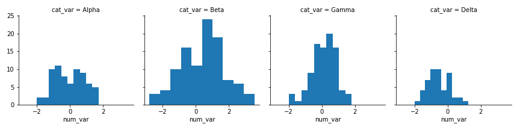

  Notice that each subset of the data is being plotted independently. Each uses the default of ten bins from hist to bin together the data, and each plot has a different bin size. Despite that, the axis limits on each facet are the same to allow clear and direct comparisons between groups. It's still worth cleaning things a little bit more by setting the same bin edges on all facets. Extra visualization parameters can be set as additional keyword arguments to the map function.

  ```py
  bin_edges = np.arange(-3, df['num_var'].max()+1/3, 1/3)
  g = sb.FacetGrid(data = df, col = 'cat_var')
  g.map(plt.hist, "num_var", bins = bin_edges)
  ```

  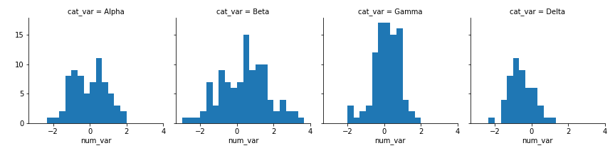

  If you have many categorical levels to plot, then you might want to add more arguments to the FacetGrid object initialization to facilitate clarity in conveyance of information. Setting `col_wrap = 5` means that the plots will be organized into rows of five facets each, rather than a single long row of fifteen plots.

  Other operations may be performed to increase the immediate readability of the plots: setting each facet height to 2 inches ("size"), sorting the facets by group mean ("col_order"), limiting the number of bin edges, and changing the titles of each facet to just the categorical level name using the `set_titles` method and {col_name} template variable.

  ```py
  group_means = df.groupby(['many_cat_var']).mean()
  group_order = group_means.sort_values(['num_var'], ascending = False).index

  g = sb.FacetGrid(data = df, col = 'many_cat_var', col_wrap = 5, size = 2,
                  col_order = group_order)
  g.map(plt.hist, 'num_var', bins = np.arange(5, 15+1, 1))
  g.set_titles('{col_name}')
  ```

  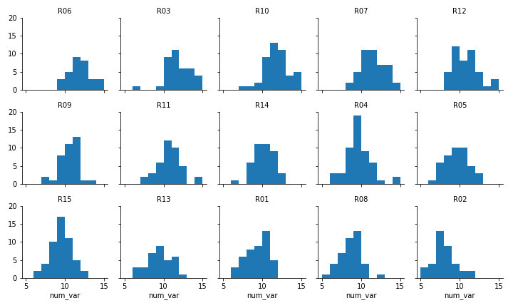

- Multivariate Case Study:
  - you can actually use any plot type, allowing you to facet bivariate plots to create a multivariate visualization.

  ```py
  g = sb.FacetGrid(data = df, col = 'cat_var1', size = 4)
  g.map(sb.boxplot, 'cat_var2', 'num_var2')
  ```

  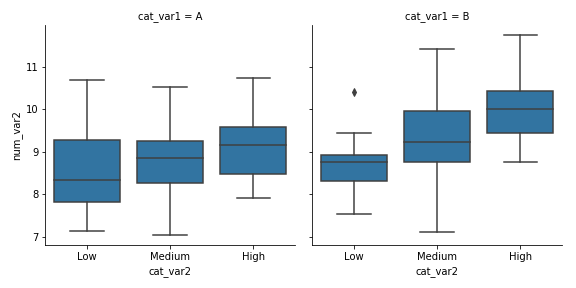

  - **FacetGrid** also allows for faceting a variable not just by columns, but also by rows. We can set one categorical variable on each of the two facet axes for one additional method of depicting multivariate trends.
  
  ```py
  g = sb.FacetGrid(data = df, col = 'cat_var2', row = 'cat_var1', size = 2.5, margin_titles = True)
  g.map(plt.scatter, 'num_var1', 'num_var2')
  ```

  Setting `margin_titles = True` means that instead of each facet being labeled with the combination of row and column variable, labels are placed separately on the top and right margins of the facet grid.

  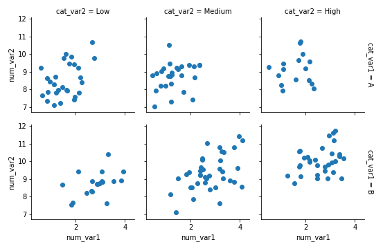

#### Feature Engineering

- Feature engineering is a tool that you can leverage as you explore and learn about your data
- As you explore a dataset, you might find that two variables are related in some way. Feature engineering is all about creating a new variable with a sum, difference, product, or ratio between those original variables that may lend a better insight into the research questions you seek to answer.
- For example, if you have one variable that gives a count of crime incidents, and a second one that gives population totals, then you may want to engineer a new variable by dividing the former by the latter, obtaining an incident rate.
- Another way that you can perform feature engineering is to use the cut function to divide a numeric variable into ordered bins. When we split a numeric variable into ordinal bins, it opens it up to more visual encodings.
- For example, we might facet plots by bins of a numeric variable, or use discrete color bins rather than a continuous color scale. This kind of discretization step might help in storytelling by clearing up noise, allowing the reader to concentrate on major trends in the data.
- Of course, the bins might also mislead if they're spaced improperly – check out this [PolicyViz post](https://policyviz.com/2017/11/02/choosing-map-bins/) if you'd like to see a deeper discussion in the context of map-based visualizations.

#### Polishing Plots

1. Choose an appropriate plot:
    - choice of plot will depend on the number of variables that you have and their types: nominal, ordinal, discrete numeric, or continuous.
    - Choice of plot also depends on the specific relationship that you want to convey.
    - For example, whether you choose a violin plot, box plot, or adapted bar chart depends on how much data you have and whether distributions are significant or important. You'll be more likely to use a violin plot if you have a lot of data and the distributions are meaningful, and more inclined to use a box plot or bar chart if you have less data, or the distributions are less reliable.
2. Choose appropriate encodings
    - if you have three numeric variables, you shouldn't just assign x-position, y-position, and color encodings randomly.
    - In many cases, the two variables that are most important should take the positional encodings; if one represents an outcome or dependent variable, then it should be plotted on the y-axis.
    - In other cases, it makes sense to plot the dependent measure with color, as though you are taking a top-down view of the plane defined by the two independent measures plotted on the axes.
3. Pay attention to design integrity
    - Make sure that you **minimize chart junk** and **maximize the data-ink ratio**, as far as it maintains good interpretability of the data.
    - When deciding whether or not to add **non-positional encodings**, make sure that they are **meaningful**.
      - For example, using color in a frequency bar chart may not be necessary on its own, but will be useful if those colors are used again later in the same presentation, matched with their original groups. By the same token, avoid using the same color scheme for different variables to minimize the chance of reader confusion.
    - You should also ensure that your plot **avoids lie factors** as much as possible.
4. Label axes and choose appropriate tick marks
    - Make sure you include axis labels.
      - When you add an axis label, make sure you also provide the units of measurement, if applicable (e.g., stating "Height (cm)" rather than just "Height").
    - At least three tick marks should be included on each axis.
      - This is especially important for data that has been transformed
      - If your values are very large or very small numbers, consider using abbreviations to relabel the ticks (e.g., use "250K" instead of "250000").
5. Provide legends for non-positional variables
    - Make sure that you add a legend for variables not depicted on the axes of your plot.
    - For color encoding, you can add a color bar to the side of the plot.
    - The most important new thing here is that you provide a descriptive label to your legend or color bar, just as you would the axes of your plot.
6. Title your plot and include descriptive comments
    - A descriptive title to the plot.
    - If this is a key plot that presents important findings to others, aim to create a title that draws attention to those main points, rather than just state what variables are plotted.
    - Realize that while a visualization might be the core mechanism by which you convey findings, it need not stand alone.
    - Comments in the text below or surrounding the plot can provide valuable context to help the reader understand your message, or reinforce the main points that they should have gotten.

##### Using Matplotlib to Polish Plots

- [figure](https://matplotlib.org/api/_as_gen/matplotlib.pyplot.figure.html) (Figure): Used to create a new figure. You'll use this first to initialize the figure, most often using the "figsize" parameter to set the figure dimensions.
- [xlabel](https://matplotlib.org/api/_as_gen/matplotlib.pyplot.xlabel.html) and [ylabel](https://matplotlib.org/api/_as_gen/matplotlib.pyplot.ylabel.html) (Axes): Used for setting axis labels.
- [xticks](https://matplotlib.org/api/_as_gen/matplotlib.pyplot.xticks.html) and [yticks](https://matplotlib.org/api/_as_gen/matplotlib.pyplot.yticks.html) (Axes): Used for setting tick marks.
- [legend](https://matplotlib.org/api/_as_gen/matplotlib.pyplot.legend.html) (Axes): Used to create and customize a legend. One key parameter to use is "title", which allows you to label what feature is being depicted in the legend. You might also need to make use of the "loc" and "ncol" parameters to move and shape the legend if it gets placed in an awkward location by default.
- [colorbar](https://matplotlib.org/api/_as_gen/matplotlib.pyplot.colorbar.html) (Axes): Used to add a colorbar to a plot. Use the "label" parameter to set the label on a colorbar.
- [title](https://matplotlib.org/api/_as_gen/matplotlib.pyplot.title.html) (Axes): Used for setting axis titles.
- [suptitle](https://matplotlib.org/api/_as_gen/matplotlib.pyplot.suptitle.html) (Figure): Used for setting figure titles. The main difference between `suptitle` and `title` is that the former sets a title for the Figure as a whole, and the latter for only a single Axes. This is an important distinction: if you're using faceting or subplotting, you'll want to use `suptitle` to set a title for the figure as a whole.

  ```py
  # loading in the data, sampling to reduce points plotted
  fuel_econ = pd.read_csv('./data/fuel_econ.csv')

  np.random.seed(2018)
  sample = np.random.choice(fuel_econ.shape[0], 200, replace = False)
  fuel_econ_subset = fuel_econ.loc[sample]

  # plotting the data
  plt.figure(figsize = [7,4])
  plt.scatter(data = fuel_econ_subset, x = 'displ', y = 'comb', c = 'co2',
              cmap = 'viridis_r')
  plt.title('Fuel Efficiency and CO2 Output by Engine Size')
  plt.xlabel('Displacement (l)')
  plt.ylabel('Combined Fuel Eff. (mpg)')
  plt.colorbar(label = 'CO2 (g/mi)');
  ```

  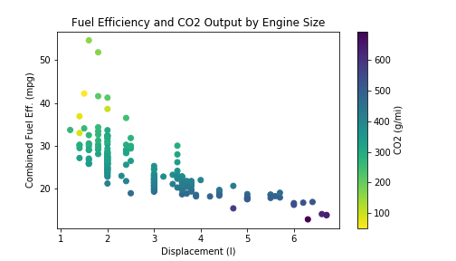

### Helpful resources

1. Visualization Mind Map


## Communicating with data (Explantory Visualization)

1. **Understand the context** - this means knowing your audience and conveying a clear message about what you want your audience to know or do with the information you are providing.

2. **Choose an appropriate visual display** - this was covered in the above section.

3. **Eliminate clutter** - you should only provide information to the user that helps convey your message.

4. **Focus attention where you want it** - build visualizations that pull attention to the message you want to highlight.

5. **Think like a designer** - you will learn a number of design principles in this lesson to assist as you start to put together your own data visualizations.

6. **Tell a story** - your visualizations should give the audience a story. The most powerful data visualizations move people to take action.

   1. Start with a Question
   2. Repetition is a Good Thing
   3. Highlight the Answer
   4. Call Your Audience To Action

### Visuals can be bad if

1. Don't convey the message.
2. Misleading.
3. **Chart Junk**: refers to all visual elements in charts and graphs that are not necessary to comprehend the information represented on the graph or that distract the viewer from this information.
   Examples:
   1. Heavy grid lines
   2. Unnecessary text
   3. Pictures surrounding the visual
   4. Shading or 3d components
   5. Ornamented chart axes
4. **Color hue changes** (as are unfortunately commonly used as an additional variable encoding in scatter plots)
5. **Area changes** (as we see in pie charts, which often makes them not the best plot choice).
6. **Lie Factor (Data integrity)**: It is key that when you build plots you maintain integrity for the underlying data. Lie factor depicts the degree to which a visualization distorts or misrepresents the data values being plotted. It is calculated in the following way:
  
The delta symbol (Δ) stands for difference or change. In words, the lie factor is the relative change shown in the graphic divided by the actual relative change in the data. Ideally, the lie factor should be 1: any other value means that there is some mismatch in the ratio of depicted change to actual change.  
[How to spot visualization lies](https://flowingdata.com/2017/02/09/how-to-spot-visualization-lies/).  
Case Study:  
The number of pixels related to the largest image is 79,000 and 16,500 for the smallest. The percentage change is 27% to 12%. So, the lie factor is calculated as:

$$ \text{lie factor} =\frac{(79000-16500)/16500}{(27-12)/12} = 3.03$$

This seems straightforward, but often visuals are created that do one or both of these unintentionally. There is an entire book that was published aimed at misleading visuals: [How to Lie with Statistics](http://faculty.neu.edu.cn/cc/zhangyf/papers/How-to-Lie-with-Statistics.pdf).

### Visuals can be good if

1. **Positional changes** (differences in x- and y- position as we see with scatter plots).
2. **Length changes** (differences in box heights as we see with bar charts and histograms).
3. **Higher data-ink ratio**, credited to Edward Tufte, is directly related to the idea of chart junk. The more of the ink in your visual that is related to conveying the message in the data, the better. Limiting chart junk increases the data-ink ratio.

### Visuals Encoding

We typically try to use position on the x- and y- axes to encode, or depict the value of variables. If we have more than two variables, however, we have to start considering other visual encodings for the additional variables.

In general, **color and shape** are best for **categorical** variables, while the **size of marker** can assist in adding additional **quantitative** data.

1. Coloring

   Color can both help and hurt a data visualization. Tips for using color effectively.
   1. Before adding color to a visualization, start with black and white.
   2. When using color, use less intense colors - not all the colors of the rainbow, which is the default in many software applications.
   3. Color for communication. Use color to highlight your message and separate groups of interest. Don't add color just to have color in your visualization.
   4. To be sensitive to those with colorblindness, you should use color palettes that do not move from **red to green** without using another element to distinguish this change like shape, position, or lightness.. Instead, use colors on a **blue to orange** palette.

2. Shapes

3. Size

Only use these additional encodings when absolutely necessary. Often these additional encodings suggest you are providing too much information in a single plot. **Instead, it might be better to break the information into multiple individual messages.**

## Tips

### Simpson's Paradox

- A Phenomenon that shows how powerful and dangerous statistics can be. Sometimes just grouping the data differently for analysis, can make conclusions disappear or even reversed.

### How much is too much

- It is so important to approach data exploration systematically, rather than just throw as many variables together as possible immediately. When you move from univariate visualizations to bivariate visualizations, you augment your previous understanding of individual distributions by seeing how they relate to one another. If you look at pairwise visualizations before putting together a trivariate plot, then you will have a clear view to how the interaction, if present, changes your previous understanding of the marginal pairwise relationship.
- When you move on to explanatory data visualizations, try to limit the number of variables that are introduced at the same time and make sure that the encoding choices convey the main findings to your reader in the clearest way possible. While it's good to keep a soft limit of about three or four variables in a single visualization, you can exceed this if the trends are clear or you introduce features to your reader in a systematic way.
