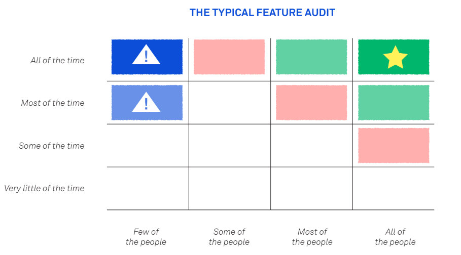
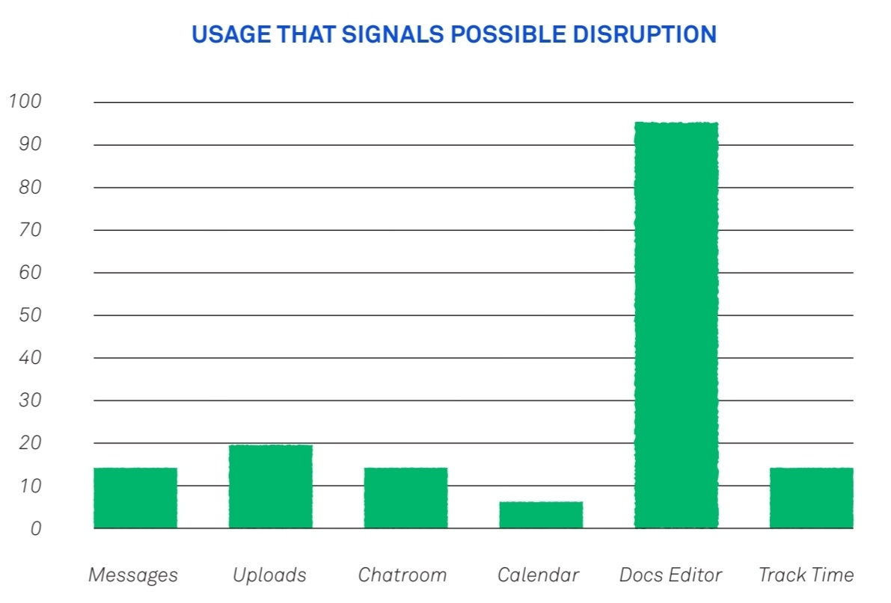
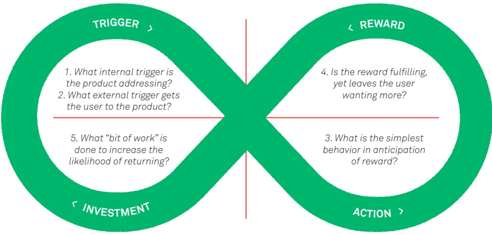
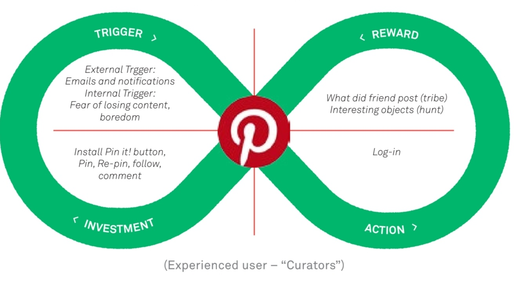
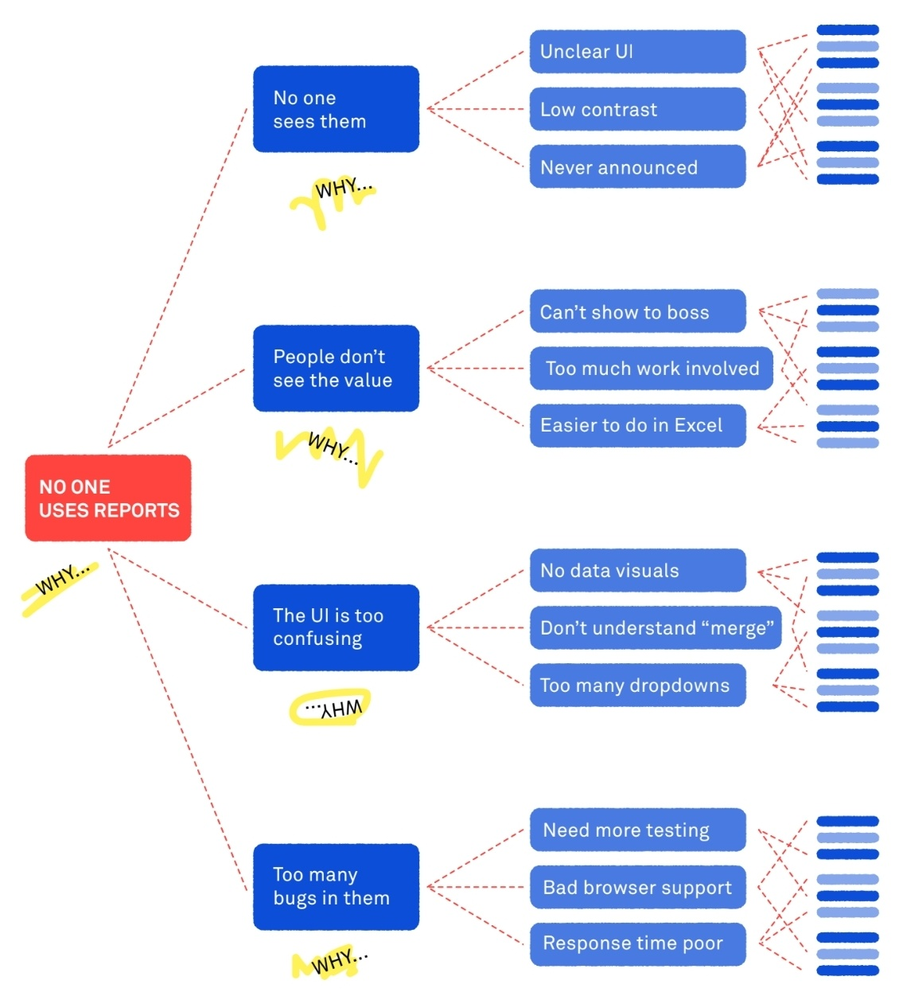
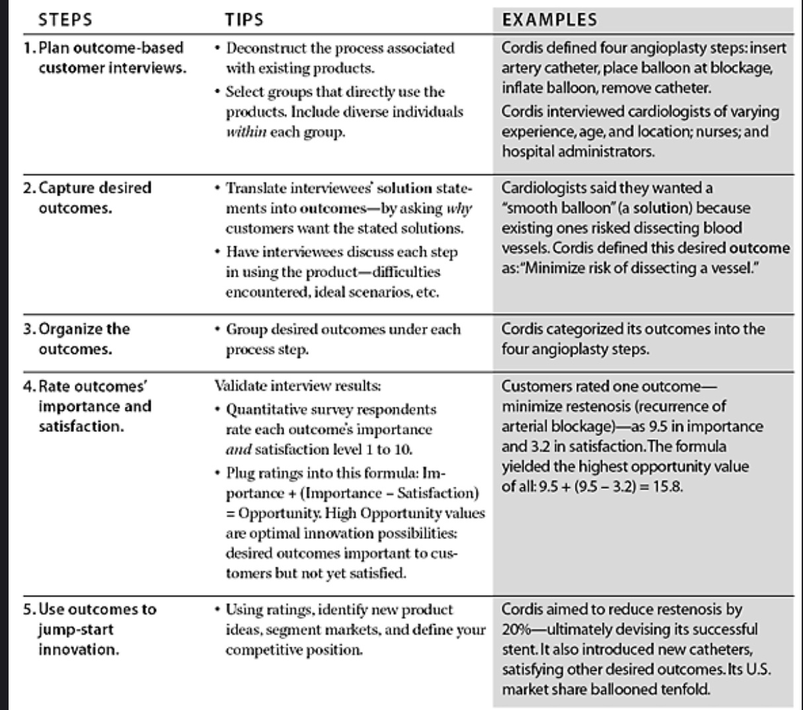
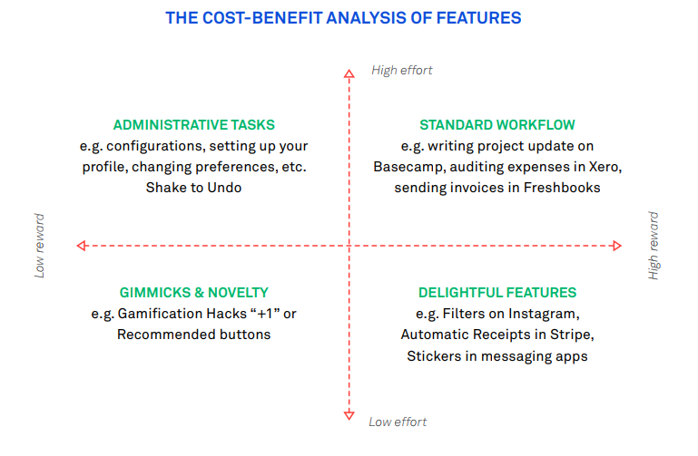
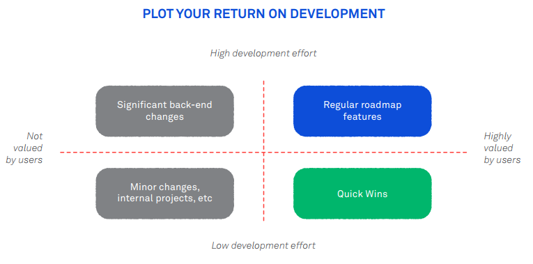

# Product Management

**<u>Product management</u>** - a job which has elements of engineering,
marketing, research, and project management – is key to building great
products. It requires a relentless focus on cohesion; ensuring that how
a product is designed, engineered, named, branded, and marketed are all
united under a single vision

## Chapter 1: Evaluating the current product

- Which parts of it are being used and what areas are ripe for
improvement:
- What are people actually doing in your product?
- How many people are actually using each of our product’s features?
- This can be answered using analysis tools and then visualized using the
below plot

> **Side note**: Exclude administrative features like account creation,
password reset, etc. from this exercise. They’re not relevant here.
Also, exclude features that only certain users (e.g. admin users) can
access. They should be evaluated separately.

If you have features in the top left, it’s a sign of features with poor
adoption. In other words, there are a small amount of customers
depending on this feature, but most rarely touch it.

An even simpler way to think about it is this: What percentage of your
customers or users have adopted each feature? You can do this with
simple bar charts.

While the below chart is for a product that is vulnerable to disruption.
It has only one feature that is very well adopted but all other features
are rarely used. This will lead to a struggle in competing because
you’re carrying all those other junk features around too.

For any given feature with limited adoption, you have four choices:

- Kill it: admit defeat and start to remove it from your product.
- Increase the adoption rate: get more people to use it.
- Increase the frequency: get people to use it more often.
- Deliberately improve it: make it quantifiably better for those who use it

### So, how to improve a product?

The two most popular ways to improve a product are to add new features, or to improve existing ones. First we are going to look at ways to improve existing features before moving on to new features in the next chapter.

#### Improving existing features

You can improve an existing feature in three different ways:

- You can make it better (deliberate improvement).
- You can change it, so customers use it more often (frequency improvement).
- Or you can change it so more people can use it (adoption improvement).

1.**Deliberate improvement**

Use deliberate improvements when there is a feature that all your customers use and like, and you see opportunity to add significant value to it. For example, making it faster or easier to use, or improving the design.

It’s worth noting that deliberately improving a well-adopted frequently used feature is high risk high reward. Get it right, and every single user gets the benefit every time they use it. Get it wrong and you’ve broken the workflow of your entire userbase.

2.**Frequency Improvements**

These are improvements that hope to get a customer to use the feature more often.

This type of improvement can turn a once-a-week feature into an everyday feature.

Use frequency improvements when there is a feature that the majority of your customers use infrequently, and you believe that using it more would be of benefit to them. It’s worth considering how your business will profit from this increased frequency.

Nir Eyal, author of Hooked, who says habits are formed from a repeated pattern with four key elements:

As an example, Nir points to Pinterest’s hook as the following

3.**Adoption Improvements**

Adoption improvements target those who don’t use a feature. To get more people using it, rank and resolve the issues that are stopping them from using it.

Use adoption improvements when: there is an important feature that a good chunk of your users has yet to adopt, and you see some obvious integrations or changes that will make it easier for them to get on
board.

This is where the five whys technique is genuinely useful. (e.g. You might have a situation around users not using your reports feature)

- Why? They don’t see the value.
- Why? They can’t show it to their boss.
- Why? They can’t get it into a suitable good format.
- Why? Because our export tools aren’t good enough?
- Why? Because our API doesn’t produce good data.

If you ask why enough times, eventually you’ll work it out and get to the root cause.

Sometimes it’s not about how the feature is designed or built, it’s about how it’s explained. Often users just need to know why or how to use a reporting feature. In those cases, better product marketing and customer communication is how you solve it, not product tweaks.

#### Continuous improvements

- The product manager’s challenge is two-fold:

  1. Firstly, finding improvements that will benefit the business and its customers.
  2. Secondly, ensuring that these improvements make it out the door.Because if there’s one thing that’s true for startup web products, it’s this: if you’re not shipping, you’re dead.

## Chapter 2: When to say no to new features

### Adding New Features

- New features expand the scope of the product. Typically, new features are the only improvements that outsiders (i.e., non-customers) will ever hear about.
- New features are risky. You have to be very confident they will be valued. So, when planning new features it’s important to understand the trade-offs at play.
- A roadmap is built out of hard decisions. The bugs you must fix will fight with the features you must finish, the features your customers want will compete with the ones you know they need.
- To improve a product, you focus on the parts that are <u>both important and disappointing</u> to customers.

#### Turn customer input into innovation

In his popular [article](https://hbr.org/2002/01/turn-customer-input-into-innovation), Turning Customer Input into Innovation, Anthony Ullwick proposes an
opportunity algorithm which offers a practical way to plan a roadmap.

*<u>Stop asking customers what they want. Start asking what they want your products to do for them</u>*

Steps to capture customers' desired outcomes

1. Plan outcome-based customer interviews
   - To be successful, outcome-based customer interviews must deconstruct, step by step, the underlying process or activity associated with the product or service.
   - Once you define the process, carefully select which customers will participate. It’s important to narrow interviewees to specific groups of people directly involved with the product. Open the interviews to too wide a group—distributors, retailers, stakeholders, salespeople, and so on—and you end up with extraneous information that can complicate the research effort and lead your company astray.
   - It’s also important to select the most diverse set of individuals within each customer type. The more diverse the group, the more complete the set of unique outcomes that is captured.

2. Capture desired outcomes
   - Capturing desired outcomes requires a moderator who can distinguish between outcomes and solutions and can weed out vague statements, anecdotes, and other irrelevant comments. The moderator digs beneath the surface of customers’ words— clarifying and validating the statements—and makes sure participants consider every aspect of the process or activity they go through when using a product or service. Whenever a customer comes up with something that sounds like a solution, the moderator redirects the question to force him or her to think about the underlying process.
   - After the moderator captures a handful of these statements and adjectives, he or she translates each one into a desired outcome. A well-formatted outcome contains both the type of improvement required (minimize, increase) and a unit of measure (time, number, frequency) so that the outcome statement can be used later in benchmarking, competitive analysis, and concept evaluation. The moderator addresses one statement at a time, rephrasing it to be free from solutions—words that inherently describe specifications or constraints—or ambiguities (words such as “easy,” “reliable,” and “comfortable”). Then the moderator confirms the translations with the participants to eliminate guesswork after the interview ends.

3. Organize the outcomes
   - Once the interviews are complete, researchers make a comprehensive list of the collected outcomes, removing duplicates and categorizing the outcomes into groups that correspond to each step in the process.

4. Rate outcomes for importance and satisfaction
   - Once you have a categorized list of outcomes, you must conduct a quantitative survey in which the desired outcomes are rated by different types of customers. Survey participants are asked to rate each outcome in terms of its importance and the degree to which the outcome is currently satisfied.
   - The ratings are fed into a mathematical formula, revealing the relative attractiveness of each opportunity.
     - *importance + (importance – satisfaction)*

      > **Side note**: The bracketed element bottoms out at zero, over-serving a job doesn’t reduce its opportunity

5. Use the outcomes to jump-start innovation
   - The final step entails using the data to uncover opportunity areas for product development, market segmentation, and better competitive analysis. The data are also used to formulate concepts and to evaluate the potential of alternative concepts.

#### Where the opportunities lie?

<u>A minor improvement on an important task is almost always a larger
opportunity than a big improvement on an ancillary one.</u>

- There’s no right way to prioritize a roadmap, but there are plenty of wrong ones. If there are opportunities in existing product areas, and your roadmap ignores them in favor of new features, then you’ll soon be that jack-of-all-jobs product.
- Address your product’s shortcomings, or someone else will.

### Why you don’t add new features

- Product managers, or founders fulfilling that role, have to be great at saying no. Not “maybe” or “later”. The only word is “No”.
- Real product decisions aren’t easy. They require you to look at a proposal and say “This is a really great idea; I can see why our customers would like it. Well done. But we’re not going to build it. Instead, here’s what we’re doing.”
- Building a great product isn’t about creating tons of tactically useful features which are tangentially related. It’s about delivering a cohesive product within well-defined parameters.
- Agreeing to features is deceptively easy. Coding them rarely is. Maintaining them can be a nightmare. When you’re striving for quality, there are no small changes.
- If you add a feature, you have to tell your team, to tell customer support, to then tell your customers.
- Once it’s there you’ll have to support queries from customers, you’ll have docs, how-tos, videos, all needing to be updated.

**<u>Here’s 12 arguments that are commonly used to sneak features into a
product:</u>**

1. BUT THE DATA LOOKS GOOD
   - “We’ve tried this feature with a small group and engagement is off the charts.” Often this approach suffers from selective data analysis.
   - Even when the data is solid, and the increase in engagement is good, you still have to <u>question whether it fits within the purview of the product.</u>
   - Add Tetris to your product and you’ll probably see a boost in engagement, but does that mean your product is better?

2. BUT IT’LL ONLY TAKE A FEW MINUTES
   - The main problem with this argument is that the scope of work should never be a reason to include a feature in a product.
   - Lots of bad ideas can be built quickly. There are no small changes. Even the tiniest additions add hidden complexity.
   - But product management is never that simple. Before you embark on any “small changes” to your product you need to ask some questions.
   - There are no tiny features when you’re doing things properly. This is why as a product manager you need a good understanding of what it takes to implement a feature before you nod your head and add it to the roadmap.
   - Often what seems like a two-minute job can often turn into a two-hour job when the bigger picture isn’t considered.

3. BUT THIS CUSTOMER IS ABOUT TO QUIT
   - No customer can be more important than a good product, and their loyalty now depends on you doing what they say. Delivering extra value to one customer comes at the cost of taking value away from many others.

4. BUT WE CAN JUST MAKE IT OPTIONAL
   - The visible cost of this is a messy interface with lots of conditional design and heaps of configuration. The hidden cost is that every optional feature weakens your product definition.

5. BUT MY COUSIN’S NEIGHBOUR SAID...
   - Extrapolating from a tiny sample is an easy way to bypass years of experience, research, data, and behavior to make a statement that sounds reasonable.

6. BUT WE’VE NOTHING ELSE PLANNED
   - The problem here is someone sees one or more engineers sitting idle and immediately rushes through a new feature to “keep ‘em busy”. Decisions are rushed and designs are cobbled together all in the name of avoiding idle time. This is a bad way to “improve” a product.
   - Idle time is best used fixing bugs, cleaning up test suites, refactoring, etc. rather than derailing a product vision just to “keep the team productive”.

7. BUT WE’RE SUPPOSED TO BE ALLOWED TO WORK ON WHATEVER WE WANT
   - It’s a lie told to attract engineers. This gets noticed quickly and falls apart. You can’t fake [culture](https://www.intercom.com/blog/you-cant-fake-culture/))
   - There’s a difference between encouraging engineers to build things internally (a good thing) and letting people add features to a product bypassing product management (a bad thing).

8. BUT 713,000 PEOPLE WANT IT
   - Any product with any amount of traction can make an emotive claim using numbers.
   - The question is “is this a valuable feature, within our purview, that all our customers will use?”.

9. BUT OUR COMPETITORS ALREADY HAVE IT
   - That doesn’t mean it’s a good idea. It’s a mistake to assume that your competitors are in any way smarter or more tactical than you. Obsessing about your competitor’s features relegates you to permanently delivering “yesterday’s technology tomorrow”.

10. BUT IF WE DON’T BUILD IT, SOMEONE ELSE WILL
    - That doesn’t mean it should be in your product. If someone else builds it, do customers no longer need your product? Will they all switch over?
    - Often, it’s the logic used to expand a product because you’re not willing to admit your product stops somewhere. You’re afraid to draw the [line](https://www.intercom.com/blog/where-to-draw-the-line/).

11. BUT THE BOSS REALLY WANTS IT
    - If the boss is also the product manager and has the necessary time and insight to make smart holistic decisions, then this is fine. However, if someone is trying to earn brownie points by focusing on pet projects that their manager has a penchant for, this inevitably leads to trouble.

12. BUT THIS COULD BE “THE ONE”
    - [Editing a product](https://andrewchen.com/why-companies-should-have-product-editors-not-product-managers/) requires some hard decisions about what to build. When you’re afraid to make hard decisions, you fall back on appealing to the unknown, and therefore building everything. You end up with a repository of features, not a product.

## Chapter 3: Which new features to build?

- People don’t buy a product because they fall into a particular group e.g., female, mid 30s, living in suburbia, working part-time. But they do buy a product to solve a problem.
- The features you choose to build should be the ones that will help them do the job that needs to be done.

### Making things people want

- The problems people encounter in their lives rarely change from generation to generation. The products they hire to solve these problems change all the time.
- A strong understanding of the outcome customers wants, and how they currently get it, is essential for you to succeed in product management.
- If the desired outcome is real, then they are already achieving it through some product in some way. Your job is to improve upon that.
- Focusing on outcome, rather than category, industry, or product type, lets you understand your real competitors. The second a company focuses on “the industry it’s in” rather than the “outcome it delivers”, it loses touch, and shortly after, loses customers.
- Newspapers, for example, believed they were in the “Newspaper Industry”, and as such struggled to work out why bored commuters had stopped buying their product.
- Had they instead focused on the outcome they deliver (bored commuters want to be entertained for short bursts of time with bite-sized articles), then their competitors (Twitter, Facebook, news apps) wouldn’t have been so oblique to them.

### Age old jobs, new solutions

- People wanted to store photos in a safe place, like the shoe box under the spare bed. People still want this so today they use Dropbox.
- People wanted to put their favorite photos in a prominent place, like their mantelpiece, so everyone could see them. People still want this so today they use Facebook.
- People wanted to collect scrapbooks of ideas, for home renovations or other projects. People still want this so today they use Pinterest.

#### Doing a better job

- Making things people want, involves understanding a long-standing human or business need and then using technology to:
  - take out steps.
  - make it possible for more people.
  - make it possible in more situations.
- The first approach, removing steps, is the most common for start-ups. Pick a need where the existing solutions are old, complex, and bloated, and find the simplest smallest set of steps possible to deliver the same outcome.
  - Arranging a taxi in a city used to involve calling many numbers until you found a company with availability.Today you press one button, and a car shows up.
- The second approach usually involves reducing the cost (in time or money), or barriers to using a product so that more people can use it, thus expanding the market.
  - Fourteen years ago, if someone wanted to get their writing online, they had to rent a Linux server and then configure it. Today this is two clicks in Medium.
- The third approach involves removing common situational limitations on a workflow. Accepting payment used to involve bulky machines with rolls of thermal paper, and batch transaction transfers run nightly.
  - Today you swipe a card through a phone, and you’re done.
- The problems that people and businesses encounter don’t change often. The ways they can be solved changes almost yearly. So, it stands to reason that making things people want should start with the “what people want” bit, and not the more tempting “things we can make”.

### An acid test for new features

Here’s a simple set of Yes/No questions that you can quickly answer before you add another feature to your product roadmap. A new feature must score straight yes’s on.

1. **DOES IT FIT YOUR VISION?**
   - Product decisions based on vision alone sometimes seem irrational because they’re tough decisions.
   - The more nuanced decisions are the ones where you meet resistance. Colleagues, customers, even other product managers and founders will push back.
   - Worse than being a hard decision, you’ll never truly know if you got it right. There is no right. There is no wrong. This is art, not science. It’s just you and your vision.

2. **WILL IT STILL MATTER IN 5 YEARS?**
   - It’s a hard and boring question to ask but will this still deliver value in five years’ time? You’ll feel like the curmudgeon of product planning.
   - If you’re going to spend the best years of your life on a product eschew the trendy and focus on the meaningful.

3. **WILL EVERYONE BENEFIT FROM IT?**
   - Beware the “fre-cently” bias. You never doubt the things you hear frequently or recently should be road-mapped.
   - The danger of the fre-cently bias is that it gives you the illusion of analysis. In reality you’ve made a lazy decision to satisfy the whims of a small sample of vocal users without taking a second to investigate how many people really want or need the feature.

4. **WILL IT IMPROVE, COMPLEMENT, OR INNOVATE ON THE EXISTING WORKFLOW?**
   - Adding a whole new workflow to your product should be a rare occurrence. The majority of your time should be invested in improving, complementing, or innovating upon existing ones, and for any given project you should know which of these you are doing.
   - If you’re improving the current solution, your metric will be customer satisfaction and/or maybe a decrease in tool time, or support requests.
   - If you’re complementing it, your metric will be an increased throughput for the workflow.
   - Innovation is the trickiest. It carries so much risk but offers so much reward. Your measure will likely be new customers acquired though often they come indirectly, as a result of the PR, marketing or awareness created.
   - Redesigns are fun. A good way to cut through the bullshit is to simply ask “Will more people use it? Will people use it more? If neither, then will it definitely be better for those who do use it?”

5. **DOES IT GROW THE BUSINESS?**
   - Can you join the dots between the impact this new feature will have and new revenue?
   - Note that reducing churn also grows the business; dollars don’t care where they come from. Often a feature is added to ensure stickiness of customers, or to widen the moat around a product. The key point in all cases is to understand how any work affects growth, after all everyone works on growth.

6. **WILL IT GENERATE NEW MEANINGFUL ENGAGEMENT?**
   - Most metrics ignore the system and focus on the isolated feature being added
   - So, if you add a metric to track one area of your product, you must also analyze the other areas that are likely to be impacted.

7. **IF IT SUCCEEDS, CAN WE SUPPORT AND AFFORD IT?**
   - One fallacy of “quick wins” and “easy hacks”, is they usually only evaluate effort required before shipping

8. **CAN WE DESIGN IT SO THAT REWARD IS GREATER THAN EFFORT?**
   - For any feature to be used the perceived benefit has to be greater than the perceived effort.
   - End users understood the benefit Google Plus could bring, but the overhead of dragging and dropping many copies of your contacts into various boxes, on a regular basis, was simply not worth it.
   - And we’re not talking about price. We’re talking about time, overhead, social capital, etc.
   - Product design is about cost-benefit analysis. How useful is something vs how hard is it to do.
      
   - It’s important to know which quadrant you’re building in and if you’re wise, you’ll steer clear of the upper left for all but the most essential of features.

9. **CAN WE DO IT WELL?**
   - Every product has its neglected corners, usually areas where the PM dabbled but conceded defeat. The problem here is when product teams tackle areas they don’t fully understand. At this point their design process breaks, and they need a new one.
   - Examples include:
     - Teams that don’t track time adding a time-tracking feature.
     - People who don’t manage calendars designing a calendar management option.
     - Designers who don’t close issues building an issue tracking system.
   - Note that none of the above are inherently wrong, what’s wrong is the design process. It needs to move beyond “works fine for me” into something much more activity focused. To build a feature well, you have to understand the job it does intimately. As a corollary to the old saying: if you can’t do it well, it ain’t worth doing.

10. **CAN WE SCOPE IT WELL?**
    - Starting with the [cupcake release](https://www.intercom.com/blog/start-with-a-cupcake/) for a feature is essential. Early usable releases provide the feedback necessary for an idea to flourish. A good sign that a feature isn’t well scoped is when it lacks specifics. e.g. “we should let people group their colleagues by department” vs “we just need an enterprise mode”.
    - Badly scoped features meet no one’s requirements, ship late, if at all, and add nothing to the product but confusion.

#### Slippery slopes & marginal calls

- It’s tempting to excuse occasional violations of this list, assuming that “as long as it’s right most of the time”, it’ll be fine. This is why we say that product strategy means saying no.
- Every good product manager needs a firm checklist for when they say yes, and when they say no. And they don’t make exceptions.
- Products get bloated one lazy decision at a time. 
- Bloat, complexity, and disruption can only be seen in the rear-view mirror, so always be mindful of the risk of saying yes

#### Features & physics envy

- Physics envy is a term that can be used to describe the desire of designers, developers, and product managers to enforce laws on a system that simply doesn’t obey them. We would love it if the return on investment was always perfectly proportional to the time spent. The problem is that you can spend five weeks working on a killer feature, only to see it go ignored by your users. Conversely you can add one sound effect, and all of a sudden everyone is talking about you.
- Rather than try to stare enviously at those who don’t work with such irrationality, let’s see how we can use this to our benefit. When you’re planning your next few months work, plot your features on this chart.
  
- Anything in the lower right corner is special. These are features where
the return is disproportionate to the effort.

#### When to use quick wins

- Customers won’t value all the development you do on a project. Some necessary tasks such as back-ups, re-factoring, optimization, improving infrastructure offer little immediate reward. The trick is to plan your roadmap so there’s never long periods where customers feel the application has been abandoned.
- This is precisely where quick wins are useful. You can schedule these quick wins to cover time periods where it would otherwise appear that nothing is happening.

### Rolling out new features

- Roll outs are make or break and they’re damn hard to get right. Doubly so if you’re changing your user’s workflows. There are thousands of people whose entire job is to use Intercom. So, when we are considering changing a behavior, we don’t do it lightly.
- We follow a series of steps to progressively release it using feature flags.
  - **Team testing**: The first step is to deploy it live with real data, but only visible to the team that built it. it avoids too many people reporting the same issues. The team themselves know how far they’ve gone, so they alone can tell what’s a bug versus what’s simply incomplete.
  - **Company testing**: When a team believes their feature is complete, it is released it to the entire company who immediately use it in their workflow. There are no elaborate explanations, tutorials, or excuses. This catches any confusions we might have created; if life-long Intercomrades don’t understand it, what chance do our customers have?
  - **Restricted beta**: The first public release is to a single digit percentage of users. We maintain a “Trusted Testers” group for this purpose. We communicate it as a beta, and specifically ask for feedback later once they have used it. Feedback on what it’s like to use a feature can only come from people who have used it. Not people who tested it or played around with it.
    - **What you’re looking for here is:**
      - Discoverability – are people finding this feature?- Engagement – are people using this feature?
      - Adoption – is it now being used as part of a workflow?
      - Use Cases – how is it being used? what use-cases are popular?
      - Barriers – Who isn’t using it? why? what’s preventing them?
    - During restricted beta you can ensure it’s discoverable for all users.
  - **Full roll out**:
    - This is when it’s available to everyone who is eligible for it, and you need to think about how you are going to tell them. Typically, not all features are available to all users – there’s some basic price discrimination at play – so at a minimum you split your message into the “haves” and “have-nots”. 
    - Feature announcements should be about “what you can do” as a user. If you want people to use your product, encourage them by showing them what they can use it to achieve.Those ineligibles should be sold on the feature as a reason to upgrade.
    - Often you can achieve this with a free trial (e.g., Try our premium plan for one month free).

#### Message schedule for the new feature

- Once a feature is launched it’s easy to forget about it and move on to the fun of designing the next one. But features without engagement are the seeds of bloatware. For any significant feature, you need to have plans for those who use it, and those who don’t.
- When people are using it well, you want to gather use cases, and marketing collateral from them for future use.
- When people aren’t using it, you want to encourage them, educate them, and engage them, the only acceptable outcome here is they’ll start using it, or they’ll tell you why not.
- There is no pride in having a “big” product with lots of features, only a highly engaged one. You should focus on growing usage of your product, not growing your product.

## Chapter 4: Getting that feature use

- Deciding what features you need to build and getting them built is really only the start of the process.
- Launching a successful feature demands the same skills as launching a successful product. The difference is that you also have to navigate around all of your legacy decisions and appease current customers too. It’s tricky. The majority of new features flop.
- You do months of research. You pull demographics, metrics, ethnographics, analytics, psychographics, you name it. You meet with customers for days, weeks, months. You do it all to understand what customers really need. Not what they say they need. Not what they think they want, or what they’re asking for. What they really need. And you go and build that! And it still flops. This is a tough racket.

### Why new features usually flop

- The thing is, unless customers use a feature it may as well not exist. So, before you ship that next feature, ask yourself these questions.

1. WILL EVERYONE SEE AND UNDERSTAND IT?
   - When you design the first version of a product, you don’t necessarily plan for expansion. As you add them you make space for them, hastily, causing discoverability problems for your users. If you find yourself constantly fielding questions about where a feature is, then you have a discoverability problem and all new features will flop, or at least require lots of training to find and adopt.
2. ARE YOU SHOWING USERS WHAT YOU DID, OR WHAT THEY CAN DO?
   - Your customers care about what they can do. Focus your message on what your users can now achieve with this feature, and you’ll get their attention.
3. ARE YOU ANNOUNCING IT IN CONTEXT?
   - Your goal should never be to “just get it launched”. The goal should be to “just get it used”. The right time to promote an improvement is when someone is in your product in a position to use it
4. HOW WILL TOMORROW’S SIGN UPS HEAR ABOUT IT?
   - As a product grows, it expands beyond what’s learnable in one sitting. That’s not a problem, not every feature makes sense up front. Features are only relevant when they solve problems.
   - There’s a right time to introduce features to customers, and this is where targeted messaging matters.
5. DO YOU PLAN TO FOLLOW UP WITH USERS & NON-USERS?
   - Once a feature is live, you should follow up with those who use it to understand how, why, and when it’s used. Look for ways to increase usage of it.
   - It’s equally, if not more, important to follow up with those who don’t use it and understand what’s stopping them. Often, you’ll find barriers that are easy to break down.

- These are all resolvable problems once you understand them.
- Your design process must acknowledge that you’ll get things wrong. So many roadmaps and sprints ignore this. Designers and product people get things wrong all the time and when they do, they improve it.

### Increase user engagement

- The definition of an “engaged user” varies from product to product. For a to-do app an engaged user should be logging in every day to add and complete items whereas for an invoicing app an engaged user might only log in once per month. There is no consistent quantifiable definition of engagement across different products.
- Unlike page views, visitors, returning visitors, and conversions, there’s also no analytics app that can instantly tell you what you need to know. But ignore engagement at your peril.
- Engagement is just one piece of the puzzle, but it is so frequently ignored that there’s lots of quick wins to be had.
- Here’s three ways to increase
user engagement:
  1. MAKE A STRONG FIRST IMPRESSION
     - Every day a potential customer is seeing your interface for the very first time. This can be forgotten within teams that are always designing for themselves.
     - The first screen your users see has three important jobs:
       - Explain how your application works.
       - Motivate your users to get started.
       - Let your users know how to get help, if and when they need it.
     - There are lots of great ways to welcome a user to your app and show them around. There are blank slates, tutorials, dummy data, etc.
     - Simply communicating with your users is a great way to encourage them to ask questions, try out features, and stick around.
     - At best you’ll win yourself more customers, and at worst you learn what’s missing or misunderstood in your application.
  2. GRADUALLY EXPOSE THE DEPTH OF YOUR PRODUCT
     - Every worthwhile application has features that aren’t immediately apparent or useful.
     - These deeper benefits can’t be called out immediately. After all, who cares about data export before they have data, or keyboard shortcuts before they’ve used any features? it’s just a matter of timely communication.
       - Here’s an example engagement routine from one of our customers: Always end each message by letting your customers know that you’re there to help if they have any questions. This is key to getting feedback, which helps you tweak your engagement routine.
  3. ANNOUNCE FEATURES AND IMPROVEMENTS IN-APP
     - Users don’t notice when your product development slows down. However, if things go quiet for long enough, they’ll be easily distracted when a competitor releases a new feature, whether valuable or frivolous.
     - The only time your users care about features or improvements is in your application, so that’s exactly where you should be announcing them. We see a 10x increase in communications (as do our customers) from in-app messages over email announcements

### Develop your message schedule

**Scenario**:

- You’re a product manager who wants to get your customers engaging with your product more often, when they’re outside the office.
To achieve this you’ve developed a mobile version of your app. Now you need to tell your customers about it.
- The zero points method here is a blanket email shot, to all registered users, right now, with a link to the mobile app. What happens next?
- Your reporting tool tells you that you had a 4.43% click-through rate and you’ll be disappointed as this was a huge stressful effort. The worst response is to say “5% clicked?

**Alternative approaches**:

- You could split the customers into two groups: those who’ve previously logged in to the product from their phone, and those who haven’t. That would let you target a better message to each group.
- You could create a permanent message in the app for anyone using it on a mobile device, so they know what they’re missing. You could email everyone after they next log out, so you know that they’ve recently used the app, and it will be fresh in their minds. You could write a hilarious message, poking fun at competitors, and include a funny graphic. That’ll get people talking which helps spread the word.
- All of these are options that go beyond the default “Let’s just mail everyone loads” approach that most companies pick.

### Be comfortable killing a feature

- When you think about feature creep and bloated products what comes to mind? Endless tabs, toolbars, settings, and preferences, right?
- Poor user interface like that highlights the cost of feature creep, which is why you need to be comfortable killing a feature. There is simply too much stuff for users to comprehend.
- To solve feature creep you need to identify which features are being adopted by everyone, and which ones are struggling to gain traction. It’s time again to run the feature audit, explained in Chapter 1.
- When you have any type of long tail of features that have little usage, you’ve gone off course. If you want a well-defined product, you must be comfortable killing features.

### Fish or cut bait

- Features struggle for adoption for lots of reasons:
  - Users don’t see the value in using it
  - They find it too complicated
  - It’s hidden somewhere clever in your product
  - They’re the wrong type of users
  - and dozens more.
- This is why it’s important to say no. When you’re faced with a feature that only 8% of your user base are using, you have to make a call: Kill it or Keep it.
- Killing a feature can take many forms:
  - You can hide it from new users
  - Message current users to explain your decision and give them time to prepare.
  - Or just tear it out of the UI and never mention it again.
- Keeping a feature that has no adoption requires design and communication. You need to target the users who are using it, and work out why.
- Good product owners let in very few dud features. Great ones kill them on sight.
