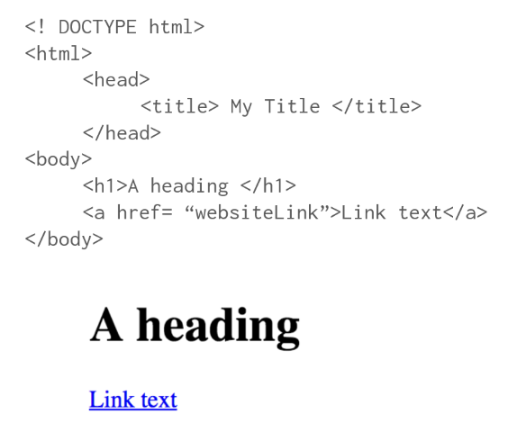

# DOM

- [DOM](#dom)
  - [DOM attributes](#dom-attributes)
  - [DOM methods](#dom-methods)
  - [Interaction](#interaction)
  - [Event Listener](#event-listener)
  - [Reference](#reference)

- DOM (Document Object Model) has a tree structure of each HTML element and for each piece of text, and image, and other object inside the webpage.
  - Tree rules.
    1. A tree has a root node.
    2. Each node can have branches that lead to other nodes (its children).
    3. Each node has exactly one parent (except the root).
- The DOM allows to interface Javascript code to interact with HTML and CSS
- Browsers will construct the DOM, which basically means storing all the HTML tags as Javascript objects.
- Document, DOM and Viewport:
  - The `document` is another name for the entire DOM.  
    - The document is a reference to the DOM. The document is the entire page, from top to bottom, header to footer, as far as you can scroll.
  - The `window` is the visible portion of the DOM.
  - The `viewport` meta tag is the portion of the DOM that is currently visible inside the browser window. The viewport’s size depends on the browser dimensions, and as such will change depending on factors like screen resolution, window size, device orientation (landscape vs. portrait views on phones and tablets) and device pixel ratio.
- For example the below HTML code is loaded in the DOM as below.
    
    

## DOM attributes

- `document.URL`: This returns the webpage URL
- `document.body`: This returns the webpage body as JS object.
- `document.head`: This returns the webpage header as JS object.
- `document.links`: This returns all links stated in the webpage.

## DOM methods

- `document.getElementById()`: returns HTML element by its ID.
- `document.getElementByClassName()`: returns HTML element by its Class.
- `document.getElementsByTagName()`: returns HTML element by its Tag.
- `document.querySelector()`: returns the first found HTML element by its Tag, Class, or ID.
- `document.querySelectorAll()`: returns all HTML elements by their Tag, Class, or ID.

```js
var x = document.querySelector("p")

// Show Text
x.textContent

// Reassign Text
x.textContent = "new"

// Refresh the page
// Show actual HTML
x.innerHTML

// Edit HTML
// Can't do that with just textContent
x.innerHTML = "This is <strong>BOLD</strong>"

// EX2
var special = document.querySelector("#special")
var specialA = y.querySelector("a")
specialA.getAttribute("href")
specialA.setAttribute("href","https://www.amazon.com")
```

## Interaction

- Using Javascript to interact with DOM elements.
- `myvariable.style.color (Many CSS options)`
- `myvariable.textContent`
- `myvariable.innerHTML`
- `myvariable.getAttribute()`
- `myvariable.setAttribute()`

## Event Listener

- Event Listener is used when the interaction with the HTML element is needed to occur on a particular event, such as a click or a hover.
- The javascript will be “listening” for an event to occur and then execute a function when it happens.
  - Ex: `myvariable.addEventListener(event,func);`
- Events examples:
  - Clicks
  - Hovers
  - Double Clicks
  - Drags
  - [More on MDN](https://developer.mozilla.org/en-US/docs/Web/Events)

```js
var headOne = document.querySelector('#one')
var headTwo = document.querySelector('#two')
var headThree = document.querySelector('#three')

// Hover (mouseover and mouseout)
headOne.addEventListener('mouseover',function(){
  headOne.textContent = "Mouse currently Over";
  headOne.style.color = 'red';
})

headOne.addEventListener('mouseout',function(){
  headOne.textContent = "Mouse Not On me."
  headOne.style.color = 'blue';
})


// On Click
headTwo.addEventListener("click",function(){
  headTwo.textContent = "Clicked On";
  headTwo.style.color = 'blue';
})

// Double Click
headThree.addEventListener("dblclick",function(){
  headThree.textContent = "Double Clicked!";
  headThree.style.color = 'red';
})
```

## Reference

- [Udemy - Python and Django Full Stack Web Developer Bootcamp](https://www.udemy.com/course/python-and-django-full-stack-web-developer-bootcamp)
